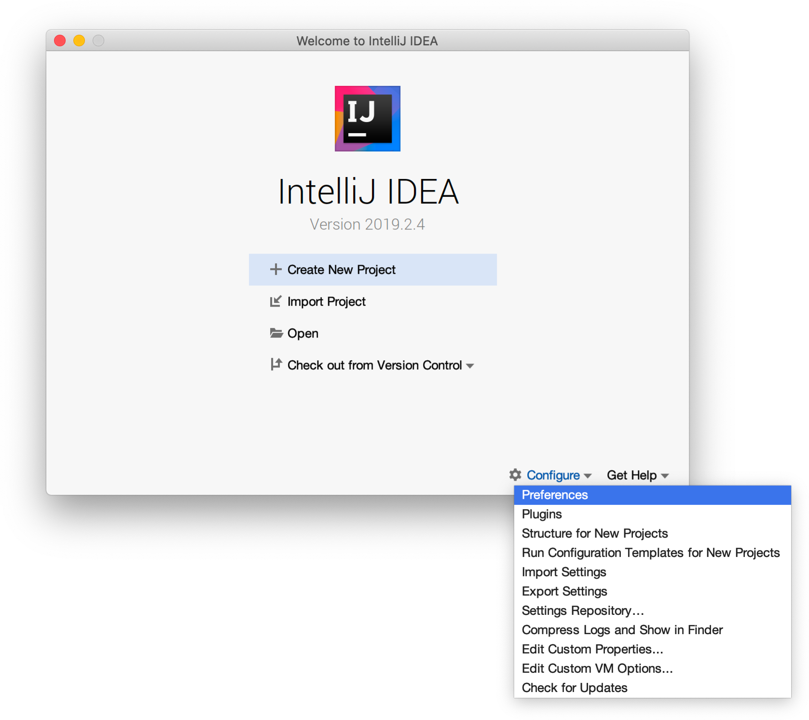
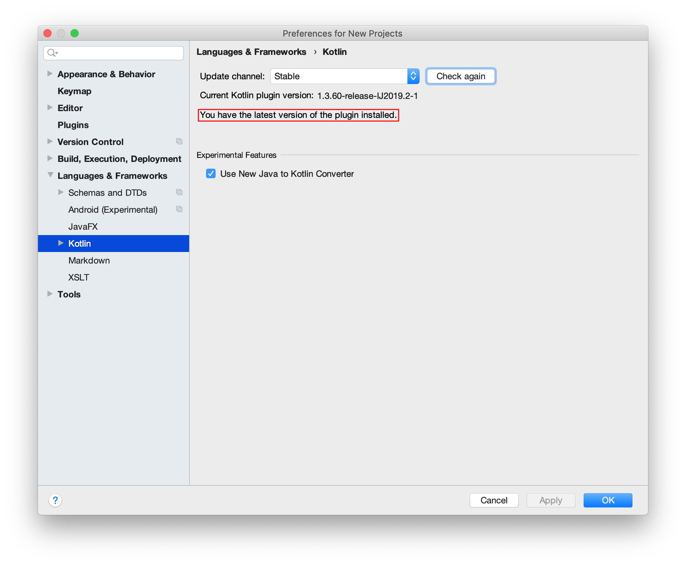

= Introduction
:toc:
:icons: font

Welcome to the Mobile Multiplatform Kotlin Workshop.

Learning to develop with Kotlin multiplatform is exactly like learning for any other technology: it is a set of skills that can be divided into three categories:

* The technology: how it works.
* The architectures and best practices: how to take the most advantage of it.
* The ecosystem: how to focus on your business

This workshop proposes to learn the technology & the associated best practices intertwined.
The ecosystem discovery, however, is treated in its own set of chapters, at the end of this workshop.

== Definition
=== Goals

The goals of this workshop are:

* to make you understand how the Kotlin/Multiplatform infrastructure works,
* to make you able to easily create a mobile Kotlin/Multiplatform project,
* to give you the tools to write multi-platform code that can be deployed on different platforms,
** Android, iOS and the Web
* to make you able to deploy it on at least one platform,
* and of course, to test it all once!

[CAUTION]
====
It is important to understand what this workshop is NOT:

* *It is not* meant to teach you the Kotlin language.
* *It is not* meant to teach in depth the three mobile platforms that we are targeting.
====

=== Pre-requisites

The only pre-requisite for this workshop is *basic Knowledge and experience of regular Kotlin*, whatever the target (yes, server side kotlin does count!).

Basic understanding of at least one of the mobile targets (Android, iOS, Web) is better, though not formally required.

=== Admonitions

NOTE: This is a note that gives *more information* or context on what is being developed.

TIP: This is a *complimentary tip*.

CAUTION: Act carefully, this *could* result into *unwanted behaviour*.

WARNING: Warning! This *could* lead to *runtime crash*.

IMPORTANT: This is important: if not taken care of, it *will* result into *unwanted behaviour or runtime crash*.

== What? How?

During this workshop, we are going to build a multi-platform *kAddress Book*.

By the end of the day, _if everything goes well_, you *may* have:

* a multi-platform library, handling any business behavior of your application
* a native Android application, with only UI code, business will be delegated to the library
* a native iOS application, with only UI code, business will be delegated to the library
* a Web application, with only UI code, business will be delegated to the library

== Install

Do you have what it takes to develop with Kotlin/Multiplatform?

Before starting this workshop, you need:

* a *JDK* installed (no vendor required, 1.8 minimum)
* https://www.jetbrains.com/idea/[IntelliJ IDEA], either Community or Ultimate (We recommend installing it via https://www.jetbrains.com/toolbox-app/[Jetbrains Toolbox]).
+
Everyone should benefit from the same experience of this workshop. So, you must check if you Kotlin Plugin is up-to-date.

[cols="^65%,<.^35%a",grid="none",frame="none"]
|===
|
| Open the _IntelliJ IDEA_ *preferences* dialog
|
|
Go to *Languages & Frameworks* > *Kotlin* and check that:

*You have the latest version of the plugin installed*

If not, upgrade it now!
|===
* If you intend to target Android: https://developer.android.com/studio[Android Studio] (which you can also install via https://www.jetbrains.com/toolbox-app/[Jetbrains Toolbox]) with the Android SDK & emulator installed.
* If you intend to target iOS: https://developer.apple.com/xcode/[Xcode] with the iOS SDK & simulator installed.

[IMPORTANT]
====
If you are using a Linux or MacOS X computer you'll need extra installation to work with the *Kotlin/Native* compiler

* For MacOS: the installation of https://developer.apple.com/xcode/[Xcode] is necessary
* For Linux: You'll need to install the `ncurses` package
** on Fedora 26+ `yum install ncurses-compat-libs`
** on recent Ubuntu `apt install libncurses5`
====

NOTE: You can only compile Kotlin/Native code for iOS on a MacOS X computer.

TIP: You can develop on a non-Mac computer and just compile for iOS on a Mac.

