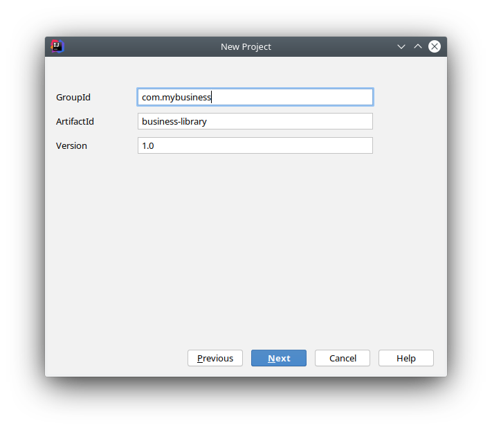
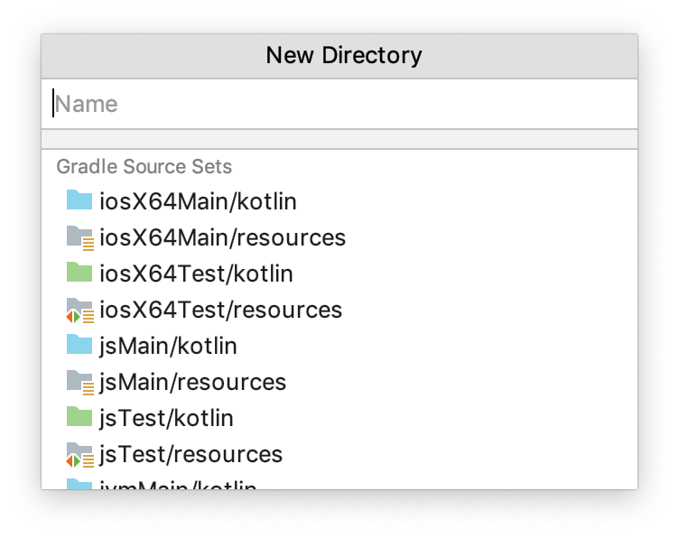

= Create a project
Salomon BRYS
:toc:
:icons: font

The first thing to do is to create a new Kotlin/Multiplatform project.
Easy, you think: there's a handy `Kotlin | Mobile Android/iOS | Gradle` template in the IDEA's new project wizard. +
Well, we're not going to use it.

Take a deep breath, stay with us. +
This templates...

* ...gives you everything on a golden platter ; you need to learn how it is done.
* ...creates a project where the Android app and the multiplatform code is all in one place.

== The creation wizard

We are going to create a new Gradle project. +
While we're at it, we'll be using the Gradle Kotlin DSL (if you haven't used it already, now's your chance!).

TIP: The Gradle Kotlin DSL allows you to bring type safety as well as IDE completion & API exploration into your build script.

In IntelliJ's new project wizard, create a new project, and select `Gradle` > `Kotlin/Multiplatform`. +
Don't forget to check the `Kotlin DSL nuild script` checkbox.

image:1-0.png[New project type wizard]

Then, give your project a group ID, and name the artifact `business-library`.

Finally, select where the code rests, click finish, and enjoy you're newly created multiplatform project :)

== Targets & compilers

The Kotlin infrastructure provides 3 compilers:

* The *Kotlin/JVM* compiler, that compiles to JVM bytecode, which can be used on a JVM, as Android.
* The *Kotlin/JS* compiler, that compiles to machine JavaScript (not human-readable), which can be used in a browser, or on NodeJS.
* The *Kotlin/Native* compiler, that compiles to specific machine binary code, which can be run on this specific machine.

Each compiler can support one to multiple targets:

* The *Kotlin/JVM* compiler supports only one target: the `JVM`
* The *Kotlin/JS* compiler supports only one target: `JavaScript`

However:

* The *Kotlin/Native* compiler supports multiple targets: `linuxX64`, `macosX64`, `mingw64`, `iosX64`, `iosArm32`, `iosArm64`, and many others.

When using Kotlin/Multiplatform to compile for multiple targets, it helps to understand which compiler is compiling for which target, as each of them get their specific configuration.

== Gradle configuration

Let's have a look at the generated `build.gradle.kts` file.

The first few lines are applying the Kotlin Gradle plugin:

.build.gradle.kts
[source,kotlin]
----
plugins {
    kotlin("multiplatform") version "1.3.50"
}
----

This is the simplest way to apply a Gradle plugin, provided that it is registered in the https://plugins.gradle.org/[Gradle plugin repository].

The next few lines are easily understood as they are common to every Kotlin project:

.build.gradle.kts
[source,kotlin]
----
group = "com.mybusiness"
version = "1.0"

repositories {
    mavenCentral()
}
----

=== Target Configuration

Next, we see the `kotlin` block, in which the entire compilation configuration happens.

First we'll replace the following lines...

.build.gradle.kts > kotlin
[source,kotlin]
----
kotlin {
    ...
    /* Targets configuration omitted.
    *  To find out how to configure the targets, please follow the link:
    *  https://kotlinlang.org/docs/reference/building-mpp-with-gradle.html#setting-up-targets */
    ...
}
----

...with the list of targets we intend to support. +

.build.gradle.kts > kotlin
[source,kotlin]
----
kotlin {
    ...
    jvm()             // JVM & Android

    js { browser() }  // Browser JS

    iosX64()          // iOS simulator
    ...
}
----

NOTE: We will see later how to also target regular iPhones

We also need to add our host native target, so we can test native code directly while coding.

.build.gradle.kts > kotlin
[source,kotlin]
----
kotlin {
    ...
    val os = org.gradle.internal.os.OperatingSystem.current()
    val hostTarget = when {
        os.isLinux -> linuxX64("linux")
        os.isMacOsX -> macosX64("macos")
        os.isWindows -> mingwX64("mingw")
        else -> throw IllegalStateException("Your OS [$os] is not supported!")
    }
    ...
}
----

This code adds the native target corresponding to your host OS, and configure its source set to use the same source directory (`src/hostMain/kotlin`) whatever the target.

=== Understanding source sets

A source set is a directory containing sources and/or resources.

When compiling for multiple targets, in essence, each Kotlin compilers will read from different source sets.

In a Kotlin/Multiplatform, by default, there are `targets + 1` source sets :

* One named "common" which contains code that is common to all targets.
* One for each targets that bears the name of the target.

Each source set is itself divided into "Main" where the regular code lives, and "Test"

These are the source sets we have defined for our project :

NOTE: If you are not using linux, then you have created instead either `macosMain` & `macosTest`, or `mingwMain` & `mingwTest`.

[graphviz, "source-sets-1"]
....
digraph G {
    rankdir = LR

    node [shape = box]

    commonTest, jvmTest, jsTest, linuxTest, iosX64Test [style = filled, color = "#c0ffc5"]

    {rank = same commonMain commonTest}

    commonMain -> commonTest

    subgraph cluster_jvm {
        color = red
        {rank = same jvmMain jvmTest}
        jvmMain -> jvmTest
    }
    commonMain -> jvmMain
    commonTest -> jvmTest

    subgraph cluster_js {
        color = red
        {rank = same jsMain jsTest}
        jsMain -> jsTest
    }
    commonMain -> jsMain
    commonTest -> jsTest

    subgraph cluster_linux {
        color = red
        {rank = same linuxMain linuxTest}
        linuxMain -> linuxTest
    }
    commonMain -> linuxMain
    commonTest -> linuxTest

    subgraph cluster_iosX64 {
        color = red
        {rank = same iosX64Main iosX64Test}
        iosX64Main -> iosX64Test
    }
    commonMain -> iosX64Main
    commonTest -> iosX64Test
}
....

=== Source sets configuration

What happens next is the configuration of each source set, and particularly their dependencies.

By default, the creation wizard has already configured our main common source set to depend on the common standard library, and our test common source set to depend on the common test utils.

Let's add the configuration of the source set we've created:

.build.gradle.kts > kotlin > sourceSets
[source,kotlin]
----
    sourceSets {
        val commonMain by getting {
            dependencies {
                implementation(kotlin("stdlib-common"))
            }
        }
        val commonTest by getting {
            dependencies {
                implementation(kotlin("test-common"))
                implementation(kotlin("test-annotations-common"))
            }
        }

        val jvmMain by getting {
            dependencies {
                implementation(kotlin("stdlib"))
            }
        }
        val jvmTest by getting {
            dependencies {
                implementation(kotlin("test"))
                implementation(kotlin("test-junit"))
            }
        }

        val jsMain by getting {
            dependencies {
                implementation(kotlin("stdlib-js"))
            }
        }
        val jsTest by getting {
            dependencies {
                implementation(kotlin("test-js"))
            }
        }
    }
----

NOTE: We have not configured the native target source sets because there's no need right now.
      Both the standard library & the test utils are included by the native compiler.

== Source sets directories

Before starting to code, we need the directories in which we are going to put that code ;)

Create the following directories:

* `src/commonMain/kotlin` & `src/commonTest/kotlin`
* `src/jvmMain/kotlin` & `src/jvmTest/kotlin`
* `src/jsMain/kotlin` & `src/jsTest/kotlin`
* `src/linuxMain/kotlin` & `src/linuxTest/kotlin` (or whatever your host os is)
* `src/iosX64Main/kotlin` & `src/iosX64Test/kotlin` (if you are targetting iOS)

[TIP]
====
If your using IntelliJ IDEA 2019.3 EAP or superior, it will suggest you the right folder creating regarding of your build script.

Select all and type RETURN
====

image:1-3.png[source directory structure]

Are you ready to write some code?
