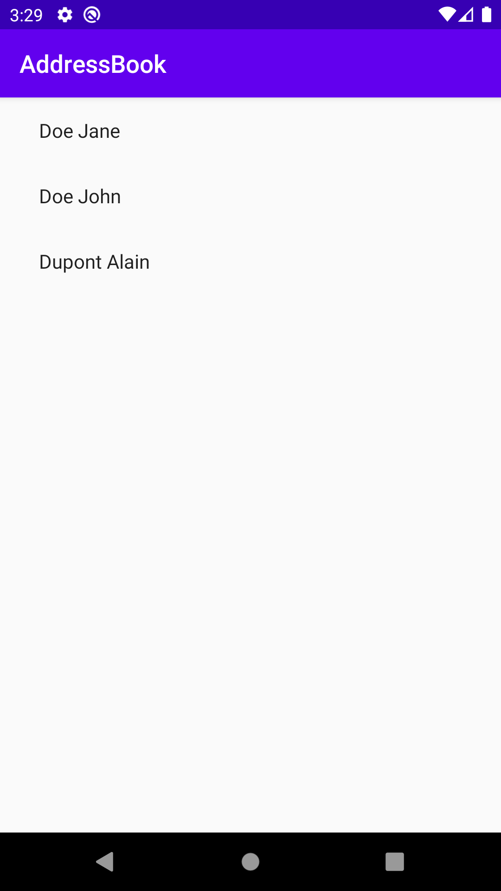

= Address book - Android Application
:toc:
:icons: font

As said in the first chapter, we are not here to take a deep dive into the different targeted platform.
So, to stay focused on Kotlin multi-platform development, we will provide empty projects, ready to run for each platform.
Of course, those projects need to be modified.

Starting with *_Android_*, we will be modifying an existing project to use our Kotlin multi-platform library.

== Cloning the starter project

You can find the *_Android_* starter project on https://github.com/romainbsl/mpp-workshop-android-starter[GitHub].

Open a terminal and run the following *Git* command:

.Cloning the starter project
[source,shell script]
----
git clone https://github.com/romainbsl/mpp-workshop-android-starter
----

[cols="^40%,<.^60%a",grid="none",frame="none"]
|===
|image:res/10-1.png[open AS project]
|Now, open the project with _Android Studio_, by clicking on *Open an existing Android Studio project*.
|===

== Configuration

=== Gradle

WARNING: *_Android Studio_* generates the `build.gradle` files, in Groovy, not Kotlin.

NOTE: Here the Gradle configuration as been generated and prepared to avoid any issues.

Normally, you have published your Kotlin multi-platform library on your local Maven repository, with the version `1.0.0`.
So, we just have to add it to the gradle configuration to be able to use our Kotlin multi-platform library as a project dependency.

.app > build.gradle
[source,groovy]
----
//...
repositories {
    mavenLocal()
}
//...
----

Then, add the following dependencies to your `build.gradle` into the `app` module

.app > build.gradle
[source,groovy]
----
//...
dependencies {
    //...
    implementation 'com.mybusiness:addressbook-common-android:1.0.0' // <1>
    implementation 'org.jetbrains.kotlinx:kotlinx-coroutines-android:1.3.2' // <2>
    //...
}
----
<1> The dependency is named `addressbook-common-android` because we have defined `android` as our target
<2> Provides `Dispatchers.Main` context for Android applications

TIP: We will see in a later chapter how to avoid target naming when building a Kotlin multi-platform project.

=== Android Manifest

Our application needs to access a backend API to retrieve the contacts.
This means that the application must have internet privilege, otherwise we will get a permission exception from the *_Android_* system

Go to the file `app/src/main/AndroidManifest.xml` and add the following permission:

.AndroidManifest.xml
[source,xml]
----
<manifest>
    <!-- ... -->
    <uses-permission android:name="android.permission.INTERNET"/>
    <!-- ... -->
</manifest>
----

== Retrieve and display the contact list

=== Change the `RecyclerView` adapter

The most popular way to display items in a list on *_Android_* is using a `RecyclerView`.
We already have defined an adapter for the `RecyclerView`, but we need to configure it.

Go to the Kotlin source file `SimpleItemRecyclerViewAdapter.kt`

Then, remove the class `EmptyContact`, leading to an issue `Unresolved reference: EmptyContact`.

To fix this, change the constructor's second parameter `values`, to be type of `List<Contact>` instead of List<EmptyContact>.

.SimpleItemRecyclerViewAdapter.kt
[source,kotlin]
----
class SimpleItemRecyclerViewAdapter(private val parentActivity: ItemListActivity,
                                    private val values: List<Contact>)
----

Afterwards, we need to do two things onto this class:

1. change the event `onClickListener`, to launch a new activity that will display the details of the clicked contact.
+
Go to the `init` block and change the `View.OnClickListener` behavior
+
.SimpleItemRecyclerViewAdapter.kt
[source,kotlin]
----
//...
    init {
        onClickListener = View.OnClickListener { v ->
            val contact = v.tag as Contact // <1>
            val intent = Intent(v.context, ItemDetailActivity::class.java).apply { // <2>
                putExtra(ItemDetailFragment.CONTACT_ID, contact.id) // <3>
            }
            v.context.startActivity(intent) // <4>
        }
    }
//...
----
<1> Get the contact clicked from the `RecyclerView`
<2> Create a new screen that will be responsible to show the contact details
<3> Set the contact Id into the new screen extra data to be able to get the contact details
<4> Launch the new screen

2. override the function `onBindViewHolder`, to set the `RecyclerView` item behavior
+
Add the following overriding function into the class `SimpleItemRecyclerViewAdapter`.
This will define the behavior of each item into the `RecyclerView`.
+
.SimpleItemRecyclerViewAdapter.kt
[source,kotlin]
----
override fun onBindViewHolder(holder: ViewHolder, position: Int) {
    val contact = values[position] // <1>

    holder.contentView.text = contact.fullName // <2>

    with(holder.itemView) {
        tag = contact // <3>
        setOnClickListener(onClickListener) // <4>
    }
}
----
<1> Get the contact for a given `RecyclerView` item position
<2> Define what is shown into the `RecyclerView` item
<3> Add the contact as meta data of the `RecyclerView` item
<4> Set the on click event for the current `RecyclerView` item

=== Call the common library from the View

We just finished the configuration of our `RecyclerView` adapter, that will help display our contact list.
Now, we should be able to call our business logic, defined into our Kotlin multi-platform library,
to give life to our application.

The view that will show the contact list is `ItemListActivity`.
This is the last class that we need to change to display our contact list. Open it.

_Remember the MVP pattern._ We already have wrote the *Model* and the *Presenter* into our Kotlin multi-platform library.
Here we are working on the *View*. So, the View needs to implement the contract that we have defined and to be bound to the right *Presenter*.

* Respect the contract from `ContactList.View`
+
.ItemListActivity.kt
[source,kotlin]
----
class ItemListActivity : AppCompatActivity(), ContactList.View { // <1>
    override fun displayContactList(contactList: List<Contact>) { // <2>
        item_list.adapter = SimpleItemRecyclerViewAdapter(this, contactList) // <3>
    }
}
----
<1> Implements the interface `ContactList.View`, defined into the common library
<2> Overrides the function `displayContactList`, defined by the interface
<3> Setting up the `RecyclerView` adapter, by giving it the contact list that need to be displayed on screen
+
Finally, the function `displayContactList` would be called by the *Presenter* when the data will be ready to display.

* Bind the view to the presenter `ContactListPresenter`
+
To bind our view with the presenter, surely we will need to provide a `ContactListPresenter` to `ItemListActivity`, and we must attached them while the view starts.
+
Also, as we want to avoid memory leaks, we have to detach the view from the presenter when the view is destroyed.
+
.ItemListActivity.kt
[source,kotlin]
----
// ...
private val presenter = CommonInjector.contactListPresenter() // <1>
// ...
override fun onStart() {
    super.onStart()
    presenter.attachView(this) // <2>
}
// ...
override fun onDestroy() {
    super.onDestroy()
    presenter.detachView() // <3>
}
----
<1> Retrieve a `ContactListPresenter` instance from the dependency injection object `CommonInjector`.
<2> When the view starts, attach the view to the presenter.
<3> When the view is destroyed, detach the view from the presenter.

Remember, in the common library, into the ContactListPresenter, when the view is attached to the presenter,
the function `ContactListPresenter#getContactList` is triggered, thus the backend API is called to retrieve the contact list.

You can run the application onto an *Android Emulator* by clicking the button image:res/run-android.png[run,16] in *Android Studio*.

[cols="^40%,<.^60%a",grid="none",frame="none"]
|===
|
|Here are the contacts retrieved from our backend API
|===

NOTE: If you are curious and have clicked on an item from the list, you should see that nothing is shown, except static values.
This is our next part, showing the contact details.

== Retrieve and display the contact details

In the previous part, we have worked on displaying the contacts into a `RecyclerView`. While configuring this `RecyclerView`,
we have wrote that when clicking onto an item of the list we should run an another view, by giving it the contact Id.

Now, we are able to change this details view by binding it to the presenter `ContactDetailPresenter` and implementing the contract interface `ContactDetail.View`.

The view is divided into two parts, the `ItemDetailActivity` that will handle the state of the view,
and the `ItemDetailFragment` that is responsible on displaying data to the sceen.

When the `ItemDetailActivity` is created, it receives the Id of the contact that we need to display the details.
As we will be binding the view (Fragment) with the presenter, we have to pass this reference to the fragment as well.
For that, we should update the function `onCreate` of `ItemDetailActivity`:

.ItemDetailActivity
[source,kotlin]
----
override fun onCreate(savedInstanceState: Bundle?) {
    // ...
    if (savedInstanceState == null) {
        val fragment = ItemDetailFragment().apply {
            arguments = Bundle().apply { // <1>
                putString(
                    ItemDetailFragment.CONTACT_ID,
                    intent.getStringExtra(ItemDetailFragment.CONTACT_ID) // <2>
                )
            }
        }
      // ...
    }
}
----
<1> Add extra data as arguments after creating the new fragment
<2> Add the contact Id, already passed to the `Activity` by the `RecyclerView`

* Respect the contract from `ContactDetail.View`

.ItemDetailFragment
[source,kotlin]
----
class ItemDetailFragment : Fragment() , ContactDetail.View { // <1>
    override fun displayContact(contact: Contact) { // <2>
        val toolbarLayout: CollapsingToolbarLayout? = activity?.toolbar_layout
        if (toolbarLayout != null) toolbarLayout.title = contact.fullName // <3>

        phonesTextView.text = if (contact.phones.isNotEmpty()) { // <4>
            contact.phones.map {
                "${it.type}: ${it.number}"
            }.joinToString (separator = "\n")
        } else "_"

        addressesTextView.text = if (contact.addresses.isNotEmpty()) { // <5>
            contact.addresses.map {
                """
                |${it.type}:${it.street}
                |             ${it.postalCode} ${it.country}
                |             ${it.country}
                """.trimMargin()
            }.joinToString (separator = "\n------------------------------------------------------------\n")
        } else "_"
    }
}
----
<1> Implements the interface `ContactDetail.View`, defined into the common library.
<2> Overrides the function `displayContact`, defined by the interface and called by the presenter.
<3> Display the contact name in the header of the screen.
<4> Show the phone list as a text in the body of the screen.
<5> Show the address list as a text in the body of the screen.

* Bind the view to the presenter `ContactListPresenter`

.ItemDetailFragment
[source,kotlin]
----
// ...
private val presenter =CommonInjector.contactDetailPresenter() // <1>
// ...
override fun onCreateView(
    inflater: LayoutInflater, container: ViewGroup?,
    savedInstanceState: Bundle?
): View? {
    presenter.attachView(this) // <2>

    arguments?.let {
        if (it.containsKey(CONTACT_ID)) {
            presenter.getContact(it.getString(CONTACT_ID) as String) // <3>
        }
    }

    return inflater.inflate(R.layout.item_detail, container, false)
}
// ...
override fun onDestroy() {
    super.onDestroy()
    presenter.detachView() // <4>
}
// ...
----
<1> Retrieve a `ContactListPresenter` instance from the dependency injection object `CommonInjector`.
<2> When the view is created, attach it to the presenter.
<3> Call the presenter to retrieve the contact details for a given contact Id. The contact Id found in the arguments passed at the `Fragment` instantiation.
<4> When the view is destroyed, detach it from the presenter.

You can run the application onto an *Android Emulator* by clicking the button image:res/run-android.png[run,16] in *Android Studio*.

[cols="^40%,<.^60%a",grid="none",frame="none"]
|===
|image:res/10-3.png[contact list,300]
|Here is the contact details retrieved from our backend API
|===

== What's next ?

In the next chapter, we will see how to use our Kotlin multi-platform library with iOS!