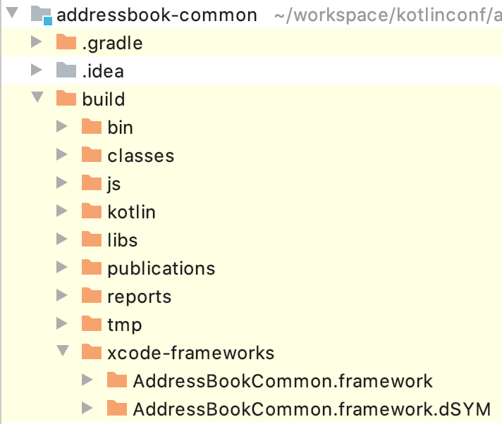
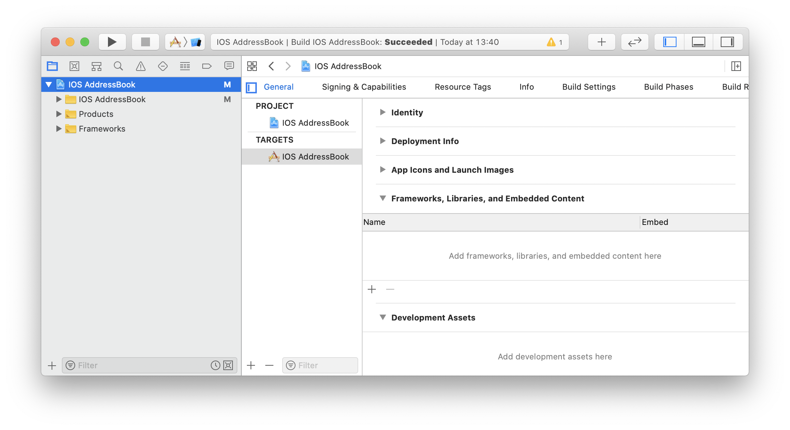
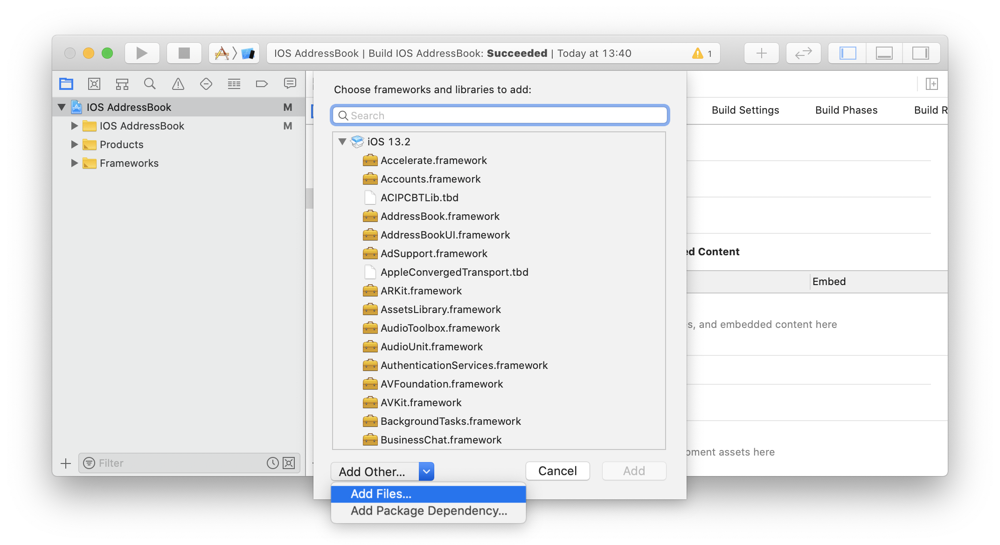
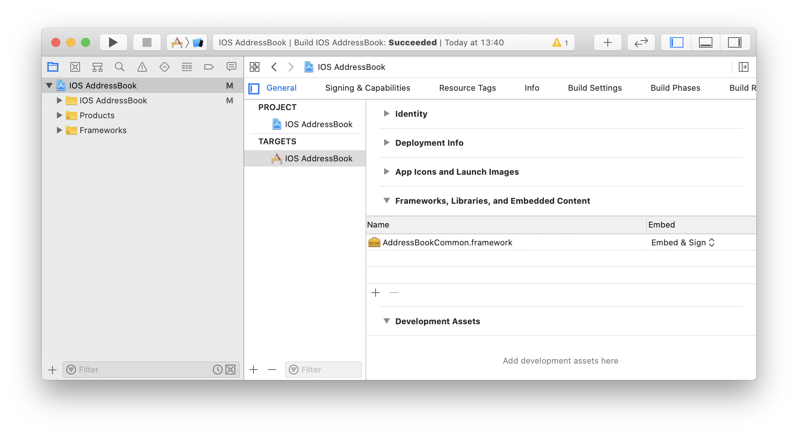
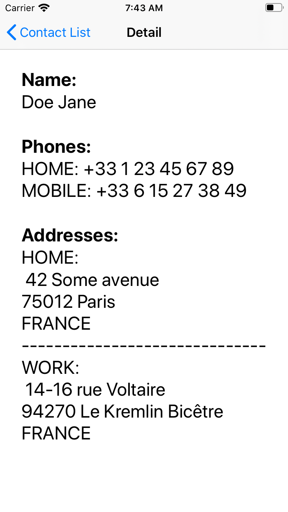

= Address book - iOS Application
:toc:
:icons: font

NOTE: As said in the first chapter, we are not here to take a deep dive into the different targeted platforms.
So, to stay focused on Kotlin multi-platform development, we will provide empty projects, ready to run for each platform.
Of course, those projects need to be modified.

== Cloning the starter project

You can find the *_iOS_* starter project on https://github.com/romainbsl/mpp-workshop-ios-starter[GitHub].

Open a terminal and run the following *Git* command:

.Cloning the starter project
[source,shell script]
----
git clone https://github.com/romainbsl/mpp-workshop-ios-starter.git
----

[cols="^40%,<.^60%a",grid="none",frame="none"]
|===
|image:res/11-1.png[open Xcode project]
|Now, open the project with _Xcode_, by clicking on *Open another project...*, in the right panel.
|===

== Configuration

_Remember_, while we were building our Kotlin multi-platform library, we added a build step named `packForXcode`.
This task should have built and published the `framework` needed by *_Xcode_* to consume our library with *_iOS_* in a specific directory.

.Kotlin multi-platform library build directory.

To be able to use the `framework` file into our *Xcode* project, we need to add it manually to the configuration.

[cols="65%,<.^35%a",grid="none",frame="none"]
|===
|
|Open your project settings, on the *General* tab. Then, in *Framework, Libraries and Embedded Content* click the `+` button
|
|We need to find our `framework`, so click on *Add Other...*, then *Add Files...*
|image:res/11-5.png[broswe files]
|Browse to your `framework` and click *Open*
|
|You now see your `framework`, added to the configuration
|===

Right now, if you try to build your application, it will fail. You also need to tell to *_Xcode_* where to look for the `framework`.

[grid="none",frame="none"]
|===
|Open your project settings, on the *Build Settings* tab, with the filters *All* and *Combined* activated.

Then find the *Search Paths* section
|image:res/11-7.png[project build settings]
|Add the directory that contains your built `framework` to *Framework Search Paths*.
|image:res/11-8.png[add search path]
|===

Now that we have configured our project we will be able to use our Kotlin multi-platform library directly in _Swift_.

== Displaying the contact list

For displaying a list of contacts, all our modifications will appear in the class `MasterViewController`. So, open it in *Xcode*.

[NOTE]
====
.Reminder

In our Kotlin multi-platform library we have defined the iOS target to be built as a `framework` named *_AddressBookCommon_*
[source,kotlin]
.build.gradle.kts
----
kotlin {
    iosX64("ios") {
        binaries {
            framework {
                baseName = "AddressBookCommon"
            }
        }
    }
}
----
====

First of all, add the import onto our common library.

.MasterViewController.swift
[source,swift]
----
import UIKit
import AddressBookCommon // <1>

class MasterViewController: UITableViewController {
    // ...
}
----
<1> Imports the common library

=== Preparing the view to display the contacts

Before using our shared business logic to display the contact list,
we will wrote some code to prepare the UI interactions.

* Setting the flow interaction between the _Master_ and _Detail_ views
+
When the list of contacts will be displayed,
we would like to click on the items to be able to see the details information for each contact.
To do that, we will configure an existing _Segue_, `showDetail`.
+
TIP: For those who are not familiar with `iOS`, a _Segue_ represents a navigation flow between two screens
+
.MasterViewController.swift
[source,swift]
----
class MasterViewController: UITableViewController {
    private var contactList = [Contact]() // <1>
    // ...
    override func prepare(for segue: UIStoryboardSegue, sender: Any?) {
        if segue.identifier == "showDetail" {
            if let indexPath = tableView.indexPathForSelectedRow {
                let contact = contactList[indexPath.row] // <2>
                let controller = (segue.destination as! UINavigationController).topViewController as! DetailViewController
                controller.contactId = contact.id // <3>
            }
        }
    }
    // ...
}
----
<1> Declares a global variable, a list of contacts, that will be used to update our view.
<2> Retrieves the contact in `contactList`, based on the index of the clicked element of the TableView.
<3> The contact `id` for which we want to show the details on the next screen.

* Configuring what and how the _TableView_ is display
+
As our class is implementing `UITableViewController`, we need to implement `tableView(...)` functions to configure its behavior.
+
.MasterViewController.swift
[source,swift]
----
class MasterViewController: UITableViewController {
    // ...
    override func tableView(_ tableView: UITableView, numberOfRowsInSection section: Int) -> Int {
        return contactList.count // <1>
    }
    override func tableView(_ tableView: UITableView, cellForRowAt indexPath: IndexPath) -> UITableViewCell { // <2>
        let cell = tableView.dequeueReusableCell(withIdentifier: "Cell", for: indexPath)
        let contact = contactList[indexPath.row] // <3>
        cell.textLabel!.text = contact.fullName // <4>
        return cell
    }
    // ...
}
----
<1> Creates the _TableView_ with the correct dimensions.
<2> Configures the cells for each element of the _TableView_.
<3> Gets the contact from the shared variable `contactList`, based on the current cell index.
<4> Sets what to display for each element of the _TableView_.

=== Consuming the common library

As for the *_Android_* application, we have two steps that we need to fulfill to consume our shared library.
First, we should implement the contract defined for the view, then declare and bind the presenter to it.

1. Implementing the `ContactList.View` interface
+
IMPORTANT: In our Kotlin multi-platform library we defined our interface as part of a class, giving us something like `ContactList.View`.
In Kotlin/Native, `ContactList.View` has been renamed `ContactListView`.
+
Our first task is to implement the view, with some extras, to be able to display contacts in the existing _TableView_.
+
.MasterViewController.swift
[source,swift]
----
class MasterViewController: UITableViewController, ContactListView { // <1>
    // ...
    func displayContactList(contactList: [Contact]) { // <2>
        self.contactList = contactList // <3>
        self.tableView.reloadData() // <4>
    }
    // ...
}
----
<1> Implements the interface `ContactListView`.
<2> Implements the function `displayContactList`, defined by the interface.
<3> Updates the global variable with new data.
<4> Reloads the Table View to display new data.

2. Binding the `ContactListPresenter` to the view
+
[cols=">.^35%,<.^75%a",grid="none",frame="none"]
|===
|Firstly, we need to declare the presenter in our class.
|
[source,swift]
----
// ...
private var presenter: ContactListPresenter!
// ...
----
|||Initialize the presenter while the view is created, by calling our manual dependency injection object `CommonInjector`.
|
[source,swift]
----
// ...
override func viewDidLoad() {
    super.viewDidLoad()
    presenter = CommonInjector.init().contactListPresenter()
}
// ...
----
|||Attach *_(1)_* and detach *_(2)_* the view to the presenter when it is shown or concealed.

_In this case, attaching the view to the presenter also trigger the function call to get the contact list._
|
[source,swift]
----
// ...
override func viewWillAppear(_ animated: Bool) {
    super.viewWillAppear(animated)
    presenter.attachView(view: self) // <1>
}
override func viewWillDisappear(_ animated: Bool) {
    super.viewWillDisappear(animated)
    presenter.detachView() // <2>
}
// ...
----
|===

=== Running the application

Now, you can run the application onto an *iOS Simulator* by clicking the button image:res/run-ios.png[run,16] in *Xcode*.

[cols="^40%,<.^60%a",grid="none",frame="none"]
|===
|image:res/11-9.png[contact list,300]
|Here are the contacts retrieved from our backend API
|===

NOTE: As for *_Android_*, if you have clicked on an item from the list, you should see that nothing is shown, except static values.
This is our next part, showing the contact's details.

== Displaying the contact's details

While we were displaying the contact list, we also prepared the transition between the _Master_ and _Detail_ screens,
by giving to the _Detail_ view the contact `id` for which we need to display the contact's details.

Like for the _Master_ view we must implement a contract and bind to a presenter.

1. Implementing the `ContactDetail.View` interface
+
IMPORTANT: In our Kotlin multi-platform library we defined our interface as part of a class, giving us something like `ContactDetail.View`.
In Kotlin/Native, `ContactDetail.View` has been renamed `ContactDetailView`.
+
.DetailViewController.swift
[source,swift]
----
class DetailViewController: UIViewController, ContactDetailView { // <1>
    // ...
    // <2>
    @IBOutlet weak var nameLabel: UILabel!
    @IBOutlet weak var phonesLabel: UILabel!
    @IBOutlet weak var addressesLabel: UILabel!
    // ...
    func displayContact(contact: Contact) { // <3>
        nameLabel.text = contact.fullName // <4>

        for (index,phone) in contact.phones.enumerated() { // <5>
            phonesLabel.text! += phone.type.displayedName + ": "
                                + phone.number

            if index < contact.phones.count-1 { phonesLabel.text! += "\n" }
        }

        for (index, address) in contact.addresses.enumerated() { // <6>
            addressesLabel.text! += address.type.displayedName + ":\n "
                            + address.street + "\n"
                            + address.postalCode + " " + address.city + "\n"
                            + address.country

            if index < contact.addresses.count - 1 {
                addressesLabel.text! += "\n------------------------------\n"
            }
        }
    }
    // ...
}
----
<1> Implements the interface `ContactDetailView`
<2> Screen objects that will be used to display the contact's details
<3> Implements the function `displayContact`
<4> Displays the contact's name
<5> Displays the contact's phones
<6> Displays the contact's addresses

2. Binding the `ContactDetailPresenter` to the view

+
[cols=">.^35%,<.^75%a",grid="none",frame="none"]
|===
|Firstly, we need to declare the presenter in our class.
|
[source,swift]
----
// ...
private var presenter: ContactDetailPresenter!
// ...
----
|||Initialize the presenter while the view is created, by calling our manual dependency injection object `CommonInjector`.
|
[source,swift]
----
// ...
override func viewDidLoad() {
    super.viewDidLoad()
    presenter = CommonInjector.init().contactDetailPresenter()
}
// ...
----
|||Attach *_(1)_* and detach *_(3)_* the view to the presenter when it is shown or concealed.

In this case, attaching the view to the presenter doesn't trigger anything.
We must call the presenter ourselves to retrieve the contact's details, giving a contact `id` *_(2)_*.

|
[source,swift]
----
// ...
override func viewWillAppear(_ animated: Bool) {
    super.viewWillAppear(animated)
    presenter.attachView(view: self) // <1>
    presenter.getContact(contactId: contactId!) // <2>
}
override func viewWillDisappear(_ animated: Bool) {
    super.viewWillDisappear(animated)
    presenter.detachView() // <3>
}
// ...
----
|===

=== Running the application

Now, you can run the application onto an *iOS Simulator* by clicking the button image:res/run-ios.png[run,16] in *Xcode*.

[cols="^40%,<.^60%a",grid="none",frame="none"]
|===
|image:res/11-9.png[contact list,300]
|
|===

== What's next ?

In the next chapter, we will see how to use our Kotlin multi-platform library on a Web application!