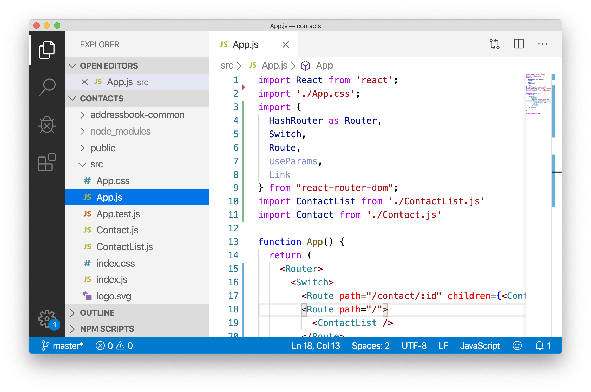
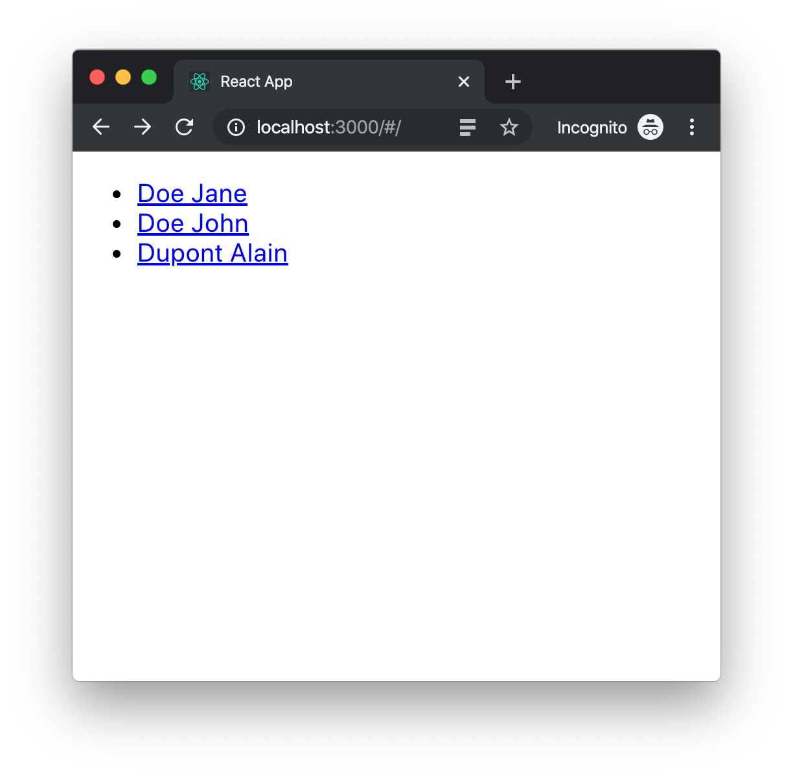

= Address book - Web Application
:toc:
:icons: font

In the first chapters of this workshop we have used a Kotlin multi-platform library with pure *_JavaScript_*.
As we attend to prove that we can define a whole architecture with Kotlin/Multiplatform projects,
in this exercise we will be using a *React* application.

Do not worry, you do not need to know about it, we will give you everything to succeed.

== Cloning the starter project

You can find the *_Web Application_* starter project on https://github.com/romainbsl/mpp-workshop-webapp-starter[GitHub].

Open a terminal and run the following *Git* command:

.Cloning the starter project
[source,shell script]
----
git clone https://github.com/romainbsl/mpp-workshop-webapp-starter.git
----

[cols="^60%,<.^40%a",grid="none",frame="none"]
|===
|
|Now, open the project with any IDE, here we are using *_Visual Studio Code_*.
|===

== Configuration

=== Installing Node/npm and yarn

In order to use the previously clone *React* project you need to install *Node/npm* and *yarn*.
If you already have them installed, jump to the next section.

* *Node/npm*
- For Linux use the https://github.com/nodesource/distributions[source installer]
- For MacOS or Windows use the https://nodejs.org/en/download/[Node.js installer]

.Check Node and npm versions
[source,shell script]
----
node -v
npm -v
----

* *yarn*

To install yarn follow the guide depending on your OS: https://yarnpkg.com/lang/en/docs/install/.

.Check yarn version
[source,shell script]
----
yarn --version
----

If you want to fully check your configuration, open a terminal and run the following commands:

.
[source,shell script]
----
cd mpp-workshop-webapp-starter
yarn install
yarn start
----

Then you should see in your browser something like the following page:
image:res/12-2.png[webapp,500]

=== Copying the generated package as dependency

When we have built our Kotlin multi-platform library, the build task has also built a package for a Node web application.

.Kotlin multi-platform library build directory.
image:res/12-3.png[build directory,250]

To be able to use it in our Web application we need to copy the package into our React project.

* Copy the `build/js` directory from the Kotlin multi-platform library project

[cols="^.^55%a,^.^40%a",grid="none",frame="none"]
|===
|*From...*
|*...to*
|image:res/12-4.png[from]
|image:res/12-5.png[tob]
|===

* Rename the directory `js` to `addressbook-common`
image:res/12-6.png[renamed package,500]

=== Adding the dependency to the project

We are almost there!

.package.json
[source,json]
----
{
  "name": "contacts",
  "version": "0.1.0",
  "private": true,
  "dependencies": {
    "addressbook-common": "file:./addressbook-common", // <1>
    "react": "^16.12.0",
    "react-dom": "^16.12.0",
    "react-router-dom": "^5.1.2",
    "react-scripts": "3.2.0",
    "text-encoding": "0.7.0"
  }
}
----
<1> Add a reference to the manually added Node module `addressbook-common`.

Finally, run the command `yarn install`, you should see something like that:

     $ yarn install
    yarn install v1.19.2
    [1/4] 🔍  Resolving packages...
    [2/4] 🚚  Fetching packages...
    [3/4] 🔗  Linking dependencies...
    warning "react-scripts > @typescript-eslint/eslint-plugin > tsutils@3.17.1" has unmet peer dependency "typescript@>=2.8.0 || >= 3.2.0-dev || >= 3.3.0-dev || >= 3.4.0-dev || >= 3.5.0-dev || >= 3.6.0-dev || >= 3.6.0-beta || >= 3.7.0-dev || >= 3.7.0-beta".
    [4/4] 🔨  Building fresh packages...
    success Saved lockfile.
    ✨  Done in 4.16s.

Now let's code our UI!

== Retrieve and display the contact list

Create a new file in `src`, named `ContactList.js`.
Add imports and create the React component

.ContactList.js
[source,js]
----
import React, { useState, useEffect } from 'react'; // <1>
import { Link } from "react-router-dom"; // <1>
import AddressBook from 'addressbook-common/packages/addressbook-common'; // <2>

export default function ContactList() { } // <3>
----
<1> React's dependencies
<2> Our Kotlin multi-platform library dependency
<3> Create our React component for the contact list

Set the presenter and bind it to the view

.ContactList.js
[source,js]
----
export default function ContactList() {
    let [presenter] = useState(() => addressBook.com.mybusiness.di.CommonInjector.contactListPresenter()); // <1>
    let [contacts, setContacts] = useState([]) // <2>

    useEffect(() => {
      presenter.attachView({ // <3>
        displayContactList: function(contacts) { // <4>
          setContacts(contacts.toArray()) // <5>
        }
      });
    }, []);
}
----
<1> Initialize the presenter while the component is created, by calling our manual dependency injection object `CommonInjector`.
<2> Define a local variable, a list of contacts, that will be used to update our view.
<3> Attach the presenter to the view
<4> Override the function `displayContactList`
<5> Update the contact list

.ContactList.js
[source]
----
export default function ContactList() {
    // ...
    return (
      <ul>
        {contacts.map(contact => { // <1>
          return (
            <li>
                <Link to={`/contact/${contact.id}`}> // <2>
                    {contact.fullName}
                </Link>
            </li>)
        })}
      </ul>
    );
}
----
<1> For each contact, display its name and...
<2> ...set a link to go to its details view.

Then you should see in your browser something like the following page:

== Retrieve and display the contact details

Create a new file in `src`, named `Contact.js`.
Add imports and create the React component

.Contact.js
[source,js]
----
import React, { useState, useEffect } from 'react'; // <1>
import { useParams } from "react-router-dom"; // <1>
import AddressBook from 'addressbook-common/packages/addressbook-common'; // <2>

export default function Contact() { } // <3>
----
<1> React's dependencies
<2> Our Kotlin multi-platform library dependency
<3> Create our React component for the contact list

Set the presenter and bind it to the view

.Contact.js
[source,js]
----
export default function Contact() {
    let { id } = useParams();
    let [presenter] = useState(() => AddressBook.com.mybusiness.di.CommonInjector.contactDetailPresenter());
    let [contact, setContact] = useState(null)

    useEffect(() => {
        presenter.attachView({
            displayContact: function(c) {
                setContact(c)
            }
        });
        presenter.getContact(id);
    }, []);
}
----

.Contact.js
[source]
----
export default function Contact() {
    // ...
    if (contact == null) return (

);

    return (

      
First name: {contact.name.firstName}

      
Last name: {contact.name.lastName}

      

          Phones:
          <ul>
              {contact.phones.toArray().map(phone => (
                  <li>
                      {phone.type.displayedName}: {phone.number}
                  </li>
              ))}
          </ul>
      

      

          Addresses:
          <ul>
              {contact.addresses.toArray().map(address => (
                  <li>
                      {address.type.displayedName}:
                      {address.street} {address.type.displayedName},
                      {address.postalCode} {address.city}, {address.country}
                  </li>
              ))}
          </ul>
      

    
)
}
----