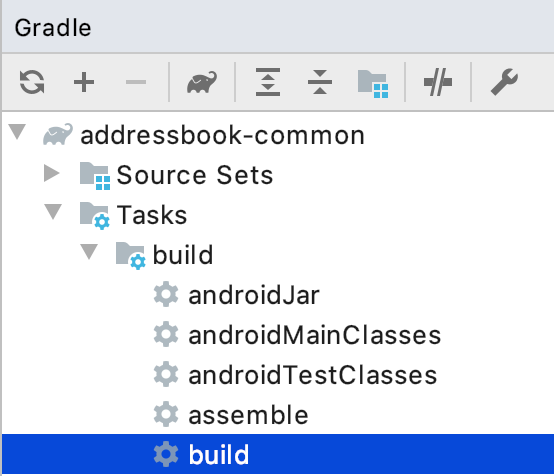
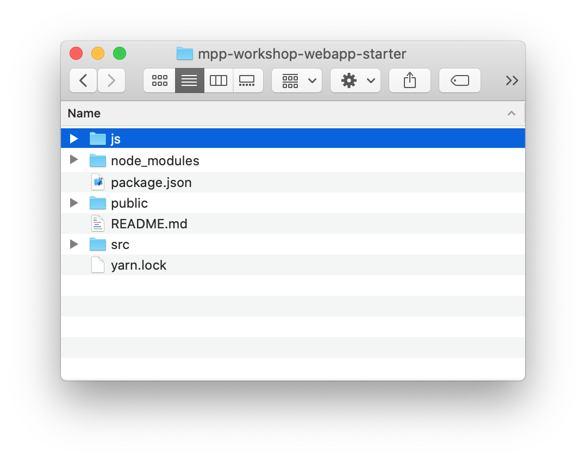

= Kotlin multi-platform libraries: Kodein-DI
:toc:
:icons: font

Well, now that we have a working Kotlin multi-platform library, and 3 three applications on top of that,
we need to go a little bit further by exploring the Kotlin/Multiplatform ecosystem.

To fulfill this journey, we will start by replacing our manual Dependency Injection mechanism by a Kotlin/Multiplatform library: *Kodein-DI*.

== Enhancing the common library

Let's re-open our `addressbook-common` project to improve it :)

=== Dependencies

As we are adding a new library to our Kotlin multi-platform project, get your `build.gradle.kts`
file and add the following dependency in your `commonMain` group.

.build.gradle.kts
[source,kotlin]
----
kotlin {
  sourceSets {
    val commonMain by getting {
      dependencies {
        // ...
        implementation("org.kodein.di:kodein-di-erased:6.5.0") // <1>
      }
    }
  }
}
----
<1> Adds the latest version of `kodein-di`, based on Kotlin `1.3.61`

[NOTE]
====
In one of the previous chapters we defined that our Gradle build enables an experimental feature by adding the following configuration:

.settings.gradle.kts
[source,kotlin]
----
enableFeaturePreview("GRADLE_METADATA")
----

This allows us to only define the dependency on `kodein-di-erased` into the common dependencies.
This is because the Gradle metadata give enough information to the Kotlin plugin
to be able to retrieve the right dependencies depending on the targeted platforms.
====

NOTE: The `kodein-di` libraries are available on *jcenter*

=== Usage

[CAUTION]
====
If you have some issues to get your imports for the newly imported dependency, refresh your gradle project

image:res/13-1.png[refresh gradle,250]
====

Now that our dependencies are well imported we should go to the package `com.mybusiness.di` and add some code.

Create a new Kotlin source file `addressBookModule.kt` and add the following lines:

.addressBookModule.kt
[source,kotlin]
----
package com.mybusiness.di

val addressBookModule = Kodein.Module("addressBookModule") { // <1>
    bind() from singleton { ContactApi() } // <2>
//    bind() from singleton { ContactListPresenter(instance()) } // <3>
//    bind() from singleton { ContactDetailPresenter(instance()) } // <3>
//    bind() from singleton { ContactCreationUpdatePresenter(instance()) } // <3>
}
----
<1> Creates a *_Kodein-DI_* module that could be imported later, in a *_Kodein-DI_* container.
<2> Binds the interface for our backend API, as a singleton.
<3> Binds every presenters, a singletons. As each of the presenters needs a `ContactApi` as parameter,
the `instance()` function have the responsibility to retrieve the right `ContactApi` instance from the *_Kodein-DI_* container.

Now that we have a code dependency defined for `ContactApi` we could change our presenters to inject it instead of having it as a constructor parameter.

.ContactListPresenter.kt
[source,kotlin]
----
class ContactListPresenter(
    override val kodein: Kodein, // <2>
    coroutineContext: CoroutineContext = ApplicationDispatcher
) : ContactList.Presenter, BasePresenter<ContactList.View>(coroutineContext), KodeinAware { // <1>

    private val contactApi: ContactApi by instance() // <3>
    //...
}
----
<1> Implements the `KodeinAware` interface to be able to use *_Kodein-DI_* functions without calling a *_Kodein-DI_* container everytime
<2> Overrides the `kodein` property to respect the contract from `KodeinAware`
<3> Inject the `ContactApi` in the presenter by using the function `instance()` from _Kodein-DI_. It will retrieve the right instance of `ContractApi` depending on its type and the current context.

.ContactDetailPresenter.kt
[source,kotlin]
----
class ContactDetailPresenter(
    override val kodein: Kodein, // <2>
    coroutineContext: CoroutineContext = ApplicationDispatcher
) : ContactDetail.Presenter, BasePresenter<ContactDetail.View>(coroutineContext), KodeinAware { // <1>

    private val contactApi: ContactApi by instance() // <3>
    //...
}
----
<1> Implements the `KodeinAware` interface to be able to use *_Kodein-DI_* functions without calling a *_Kodein-DI_* container everytime
<2> Overrides the `kodein` property to respect the contract from `KodeinAware`
<3> Inject the `ContactApi` in the presenter by using the function `instance()` from _Kodein-DI_. It will retrieve the right instance of `ContractApi` depending on its type and the current context.

.ContactCreationUpdatePresenter.kt
[source,kotlin]
----
class ContactCreationUpdatePresenter(
    override val kodein: Kodein, // <2>
    coroutineContext: CoroutineContext = ApplicationDispatcher
) : ContactCreationUpdate.Presenter, BasePresenter<ContactCreationUpdate.View>(coroutineContext), KodeinAware { // <1>

    private val contactApi: ContactApi by instance() // <3>
    //...
}
----
<1> Implements the `KodeinAware` interface to be able to use *_Kodein-DI_* functions without calling a *_Kodein-DI_* container everytime
<2> Overrides the `kodein` property to respect the contract from `KodeinAware`
<3> Inject the `ContactApi` in the presenter by using the function `instance()` from _Kodein-DI_. It will retrieve the right instance of `ContractApi` depending on its type and the current context.

We are now able to add the presenters to the *_Kodein-DI_* bindings. Let's get back to `addressBookModule.kt` and add the following lines:

.addressBookModule.kt
[source,kotlin]
----
package com.mybusiness.di

val addressBookModule = Kodein.Module("addressBookModule") {
    // ...
    bind<Kodein>() with singleton { this.kodein } // <1>
    bind() from singleton { ContactListPresenter(instance()) } // <2>
    bind() from singleton { ContactDetailPresenter(instance()) } // <2>
    bind() from singleton { ContactCreationUpdatePresenter(instance()) } // <2>
}
----
<1> Binds the current *_Kodein-DI_* container, thus we are able to inject it in our presenters
<2> Binds every presenters, a singletons. As each of the presenters needs a `Kodein` object as parameter,
the `instance()` function have the responsibility to retrieve the right `Kodein` instance from the *_Kodein-DI_* container.

We have defined and used the code dependencies of our Kotlin multi-platform library. Now we should be able to change our `CommonInjector` before using it in the applications.

So, open `CommonInjector.kt` and replace its content.

.CommonInjector.kt
[source,kotlin]
----
package com.mybusiness.di

@ThreadLocal
object CommonInjector {
    val kodein = Kodein.lazy { // <1>
        import(addressBookModule) // <2>
    }

    //    Presenters
    fun contactListPresenter(): ContactListPresenter {  // <3>
        val presenter = kodein.direct.instance<ContactListPresenter>()
        println("ContactListPresenter instance: $presenter") // <4>
        return presenter
    }
    fun contactDetailPresenter() = kodein.direct.instance<ContactDetailPresenter>() // <3>
    fun contactCreationUpdatePresenter() = kodein.direct.instance<ContactCreationUpdatePresenter>() // <3>
}
----
<1> Creates the *_Kodein-DI_* container
<2> Imports our previously created *_Kodein-DI_* module `addressBookModule`
<3> Uses the *_Kodein-DI_* container to retrieve each of the presenters
<4> Let's print our `ContactListPresenter` instance to see the changes on the applications.

That's it for the common library part. You may have noticed that there will be no direct impact for our three different applications.
We could call that mechanism a 'bridge' for our Kotlin multi-platform library to be used on every platforms.
But, even if you do not any changes to do on your applications, Dependency Injection may help you to decouple your code, and make the unit tests easier.

NOTE: _Spoiler Alert_: this won't be that simple for *_Android_*, as we will fully use the power of *_Kodein-DI_* 

=== Building and publishing a new release

As always, once we have improve our library, we should build it and publish it to use it on our applications.

In the Gradle script change the version from `1.0.0` to `2.0.0`!

* For the *JVM* target

Go to the Gradle pane, in `Tasks` > `publishing`, double click on `publishToMavenLocal` to run this Gradle task.

image:res/13-2.png[gradle build, 200]

* For all the other platforms

To build your Kotlin multi-platform library go to the Gradle pane and run the task `build` in the `build` group.

Done! Now we just have to use the new release on every platforms!

== Using the new version of our Kotlin multi-platform library

We are going backward, from the *_Web_* to *_Android_*,
as the *_Android_* part will bring some nice highlights on what could/should be Kotlin multi-platform libraries in the future.

=== On our Web application

Open your Web application project.

==== Re-import the JS module

As we didn't manage publishing libraries for _Kotlin/JS_ projects we must import the new version of our Kotlin multi-platform library manually, again.

In your Web application project, remove the `addressbook-common` and `node_modules` directories.

.Kotlin multi-platform library build directory.
image:res/13-4.png[build directory,250]

To empower our web application with the Kotlin multi-platform library, we need to copy the generated *Node* module into our *React* project.

[cols="^.^55%a,^.^40%a",grid="none",frame="none"]
|===
|*From...*
|*...to*
|image:res/13-5.png[from]
|
|===

[cols="<.^45%a,<.^55%a",grid="none",frame="none"]
|===
|image:res/13-7.png[renamed package]
|Then, rename the directory `js` to `addressbook-common`, to distinguish it from other modules.
|===

Finally, open a terminal in the directory of the web application  and run the command `yarn install`, you should see something like that:

     $ yarn install
    yarn install v1.19.2
    [1/4] 🔍  Resolving packages...
    [2/4] 🚚  Fetching packages...
    [3/4] 🔗  Linking dependencies...
    [4/4] 🔨  Building fresh packages...
    ✨  Done in 16.98s.

==== Running the application

You can now run the Web application by using `yarn start` in your terminal.

[cols="50%,50%",grid="none",frame="none"]
|===
|image:res/12-7.png[contact list]
|image:res/12-8.png[contact details]
|===

Obviously, nothing has changed, but its working right ?

[NOTE]
====
We have wrote that when we retrieve the `ContactListPresenter` with *_Kodein-DI_* we print the instance to the standard output.
So, if you open the console in the _Developer Tools_ (`F12` key), you should see something like:

    ContactListPresenter instance: [object Object]
====

Let's get to the iOS part.

=== On our iOS application

Open your *_Xcode_* project, _iOS AddressBook_.

We have done a little bit of cheating here.
Indeed, previously we have configured our *_Xcode_* project to get the `addressbook-common.framework`
file directly into the build directory of our Kotlin multi-platform project, thus at every build we change our *_iOS_* dependency.

So, just run the application to see that everything is working properly!

[NOTE]
====
We have wrote that when we retrieve the `ContactListPresenter` with *_Kodein-DI_* we print the instance to the standard output.
So, if you open the console in *_Xcode_*, you should see something like

    ContactListPresenter instance: com.mybusiness.presentation.ContactListPresenter@25bfd08
====

=== On our Android application

Here come the fun part. In the first place *_Kodein-DI_* was targeting the *_JVM_*,
and had a special treatment to be a real asset on *_Android_*.
That's why today its the most advanced part for the Kotlin/Multiplatform integration in *_Kodein-DI_*.

So, let's re-open *_Android Studio_* on our `AddressBook` project.

==== Adding dependencies

Open the Gradle script `build.gradle` in the `app` module, change the version of our Kotlin multi-platform library
and add a new dependency on `Kodein-DI`.

.app > build.gradle
[source,groovy]
----
dependencies {
    implementation 'com.mybusiness:addressbook-common:2.0.0' // <1>

    implementation 'org.kodein.di:kodein-di-generic-jvm:6.4.1' // <2>
    implementation 'org.kodein.di:kodein-di-framework-android-x:6.4.1' // <3>
}
----
<1> Moving from version `1.0.0` to `2.0.0`.
<2> Adding the latest *_JVM_* implementation of *_Kodein-DI_*
<3> Adding the latest framework implementation of *_Kodein-DI_* to boost our *_AndroidX_* development

==== Benefits from *_Kodein-DI_*

While enhancing the *_Android_* application we won't be using the `CommonInjector` object to get our presenters.
Instead, we will use the "closest Kodein pattern", that will find the nearest instance of Kodein from child to parent, thus from `Fragment` to `Activity`, or from `Activity` to `Application`.

But, first of all, we need to set our `AddressBookApplication` class implements `KodeinAware`.

.AddressBookApplication.kt
[source,kotlin]
----
class AddressBookApplication: Application(), KodeinAware { // <1>
    override val kodein = CommonInjector.kodein // <2>
}
----
<1> Implements the class `KodeinAware` that is allowing a seamless use of *_Kodein-DI_*.
<2> Overrides the `kodein` property from `KodeinAware`, this is giving us a global *_Kodein-DI_* container accessible from anywhere in our application.

Next, we can go to the views that need to inject a presenter, to be able to render contacts` information.

.ItemListActivity.kt
[source,kotlin]
----
class ItemListActivity : AppCompatActivity(), ContactList.View, KodeinAware { // <1>
    //...
    override val kodein: Kodein by closestKodein() // <2>
    private val presenter by instance<ContactListPresenter>() // <3>
    //...
}
----
<1> Implements the `KodeinAware` interface to be able to use the *_Kodein-DI_* tools without explicitly naming them (e.g. `instance()` funtion)
<2> Overrides the `kodein` property from `KodeinAware` by using the closest pattern to find the nearest *Kodein-DI* container, in our case the one defined in `AddressBookApplication`.
<3> Uses the `instance()` function to retrieve a `ContactListPresenter` from the *_Kodein-DI_* container, regarding of its type and the current context.

.ItemDetailFragment.kt
[source,kotlin]
----
class ItemDetailFragment : Fragment() , ContactDetail.View, KodeinAware { // <1>
    //...
    override val kodein: Kodein by closestKodein() // <2>
    private val presenter by instance<ContactDetailPresenter>() // <3>
    //...
}
----
<1> Implements the `KodeinAware` interface to be able to use the *_Kodein-DI_* tools without explicitly naming them (e.g. `instance()` funtion)
<2> Overrides the `kodein` property from `KodeinAware` by using the closest pattern to find the nearest *Kodein-DI* container, in our case the one defined in `AddressBookApplication`.
<3> Uses the `instance()` function to retrieve a `ContactDetailPresenter` from the *_Kodein-DI_* container, regarding of its type and the current context.

==== Running the application

Just running the *_Android_* application inside an *_Android_* Simulator should work.

[NOTE]
====
We have wrote that when we retrieve the `ContactListPresenter` with *_Kodein-DI_*, through the `CommonInjector` object,
we print the instance to the standard output.

Nothing should be printed in this case, because we did not use the `CommonInjector` object to retrieve our dependencies,
but we used our own *_Kodein-DI_* container.
====
