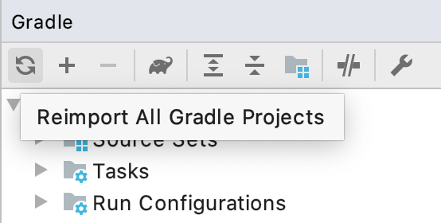
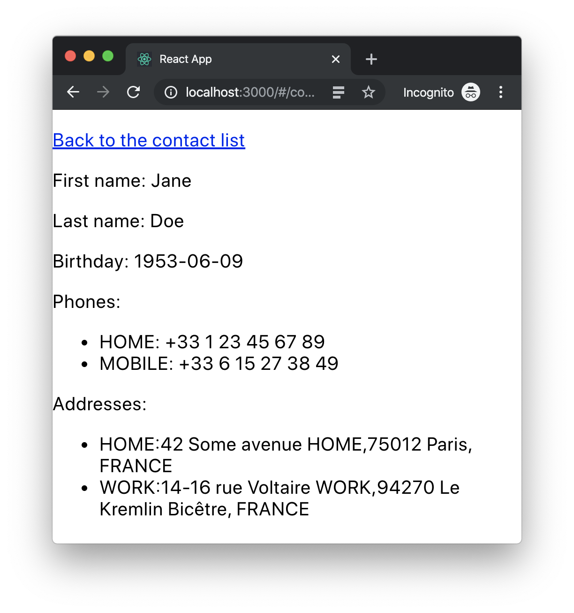
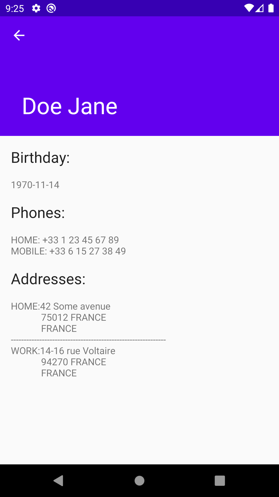

= Kotlin multi-platform libraries: Klock
:toc:
:icons: font

We are at the end of this workshop, you did it! Now is the time to play with dates!
While we are waiting JetBrains to release a Kotlin/Multiplatform date API, some folks have develop their own,
like *_Klock_*.

== Enhancing the common library

Re-open the `addressbook-common` one last time!

=== Dependencies

Again, we will add a new Kotlin/Multiplatform library to our shared project.
Thus, open the Gradle build script `build.gradle.kts` and add the common dependency.

.build.gradle.kts
[source,kotlin]
----
kotlin {
  sourceSets {
    val commonMain by getting {
      dependencies {
        // ...
        implementation ("com.soywiz.korlibs.klock:klock:1.8.0") // <1>
      }
    }
  }
}
----
<1> Adds the latest version of `klock`, based on Kotlin `1.3.61`

[NOTE]
====
In one of the previous chapters we defined that our Gradle build enables an experimental feature by adding the following configuration:

.settings.gradle.kts
[source,kotlin]
----
enableFeaturePreview("GRADLE_METADATA")
----

This allows us to only define the dependency on `klock` into the common dependencies.
This is because the Gradle metadata give enough information to the Kotlin plugin
to be able to retrieve the right dependencies depending on the targeted platforms.
====

=== Usage

[CAUTION]
====
If you have some issues to get your imports for the newly imported dependency, refresh your gradle project

====

To demonstrate the use of `klock`, we will change our domain object `Contact`,
by adding a `birthday` property that randomly generate a `DateTime`.

.Contact.kt
[source,kotlin]
----
//...
@Serializable
class Contact(
    val id: String,
    val name: Name,
    val addresses: List<Address> = mutableListOf(),
    val phones: List<Phone> = mutableListOf()
) {
    val fullName: String
        get() = "${name.lastName} ${name.firstName}"

    val birthday: DateTime // <1>
        get() = DateTime(
            year = Random.nextInt(1950, 2019), // <2>
            month = Random.nextInt(1, 12), // <2>
            day = Random.nextInt(1, 28) // <2>
        )
}
//...
----
<1> Creates a new property
<2> Randomly generate a _year_, a _month_ and a _day_.

That's it, we just need to build and publish before using it across our three targets.

=== Building and publishing a new release

As always, once we have improve our library, we should build it and publish it to use it on our applications.

In the Gradle script change the version from `2.0.0` to `3.0.0`!

* For the *JVM* target

Go to the Gradle pane, in `Tasks` > `publishing`, double click on `publishToMavenLocal` to run this Gradle task.

image:res/14-2.png[gradle build, 200]

* For all the other platforms

To build your Kotlin multi-platform library go to the Gradle pane and run the task `build` in the `build` group.

image:res/14-3.png[gradle build, 200]

TIP: You can find the full code on https://github.com/romainbsl/mpp-workshop-addressbook-common[Github], on the `klock` branch.

Now we should be able to display this new property in our different applications.

== Using the new version of our Kotlin multi-platform library

In this exercise, you will see that every platforms has a different interpretation for the `DateTime` API from `klock`.
That's not bad, here this is just dates and timestamps, but in other cases it could be more difficult to grasp.

=== On our Web application

Open your Web application project.

==== Re-import the JS module

As we didn't manage publishing libraries for _Kotlin/JS_ projects we must import the new version of our Kotlin multi-platform library manually, again.

In your Web application project, remove the `addressbook-common` and `node_modules` directories.

.Kotlin multi-platform library build directory.
image:res/14-4.png[build directory,250]

To empower our web application with the Kotlin multi-platform library, we need to copy the generated *Node* module into our *React* project.

[cols="^.^55%a,^.^40%a",grid="none",frame="none"]
|===
|*From...*
|*...to*
|image:res/14-5.png[from]
|image:res/14-6.png[tob]
|===

[cols="<.^45%a,<.^55%a",grid="none",frame="none"]
|===
|image:res/14-7.png[renamed package]
|Then, rename the directory `js` to `addressbook-common`, to distinguish it from other modules.
|===

Finally, open a terminal in the directory of the web application and run the command `yarn install`, you should see something like that:

     $ yarn install
    yarn install v1.19.2
    [1/4] 🔍  Resolving packages...
    [2/4] 🚚  Fetching packages...
    [3/4] 🔗  Linking dependencies...
    [4/4] 🔨  Building fresh packages...
    ✨  Done in 16.98s.

==== Add the birthday to the view

We will show the birthday right below the contact's name.
Open the file `Contact.js`, and add the following line inside the `return` statement:

.Contact.js
[source,html]
----

First name: {contact.name.firstName}

Last name: {contact.name.lastName}

Birthday: {contact.birthday.date.toString()}
 // <1>
----
<1> Getting the `date` member from the `birthday` property, and apply the `toString()` function to format it.

==== Running the application

You can now run the Web application by using `yarn start` in your terminal.

[cols="50%,<.^50%",grid="none",frame="none"]
|===
|
|Yeah, its there!
|===

TIP: You can find the full code of this exercise on the branch `klock-usage`

Now let's get to the iOS part.

=== On our iOS application

Open your *_Xcode_* project, _iOS AddressBook_.

Again, no configuration here.
Indeed, previously we have configured our *_Xcode_* project to get the `addressbook-common.framework`
file directly into the build directory of our Kotlin multi-platform project, thus at every build we change our *_iOS_* dependency.

We just have to get the `DetailViewController.swift` to update our birthday `UILabel`.
You may have notice in the previous exercise a non used variable `@IBOutlet weak var birthdayLabel: UILabel!`.
Well, its time to update it!

Here the Kotlin/Native compiler has inlined the `DateTime` class to its value, a millis second timestamp.
So we need to transform that timestamp to an *_iOS_* date to be able to display it.

.DetailViewController.swift
[source,swift]
----
func displayContact(contact: Contact) {
    //...
    let date = Date(timeIntervalSince1970: contact.birthday / 1000) // <1>
    let dateFormatter = DateFormatter()
    dateFormatter.dateFormat = "yyyy-MM-dd"
    birthdayLabel.text = dateFormatter.string(from: date) // <2>
    //...
}
----
<1> Transforms the timestamp to a *_iOS_* date
<2> Displays the formatted date in the view

==== Running the application

Now, you can run the application onto an *iOS Simulator* by clicking the button image:res/run-ios.png[run,16] in *Xcode*.

[cols="^40%,<.^60%a",grid="none",frame="none"]
|===
|image:res/14-9.png[contact details,300]
| Take a look at the birthday displayed :)
|===

TIP: You can find the full code of this exercise on the branch `klock-usage`

Now let's go to the final part, *_Android_*!

=== On our Android application

Let's open our `AddressBook` project in *_Android Studio_*.

==== Adding dependencies

To be able to use our `birthday` property of type `DateTime`, we need to add `klock` as a dependency.

Open the Gradle script `build.gradle` in the `app` module, change the version of our Kotlin multi-platform library
and add a new dependency on `Kodein-DI`.

.app > build.gradle
[source,groovy]
----
dependencies {
    //...
    implementation 'com.mybusiness:addressbook-common:3.0.0' // <1>
    implementation ("com.soywiz.korlibs.klock:klock-jvm:1.8.0") // <2>
}
----
<1> Moving from version `2.0.0` to `3.0.0`.
<2> Adding the `klock` implementation for the *_JVM_* target

We now just have to update the UI.

==== Adding the birthday on the view

If you have been curious and took a look at the contact's details layout,
you may have seen the `TextView` with the id `birthdayTextView`.
So, we will give him the birthday to print on the screen, well formatted.

[source,kotlin]
----
override fun displayContact(contact: Contact) {
  //...
  birthdayTextView.text = contact.birthday.date.format("yyyy-MM-dd")
  //...
}
----

==== Running the application

Finally, run the application on an *Android* Simulator to see your changes!

[cols="^40%,<.^60%a",grid="none",frame="none"]
|===
|
|Here is our birthday :)
|===

TIP: You can find the full code of this exercise on the branch `klock-usage`

== What's next ?

Congrats ! We have finished the _Mobile Multi-Platform Kotlin Workshop_, after all.

But, do not leave, we have a last thing to learn together. :)