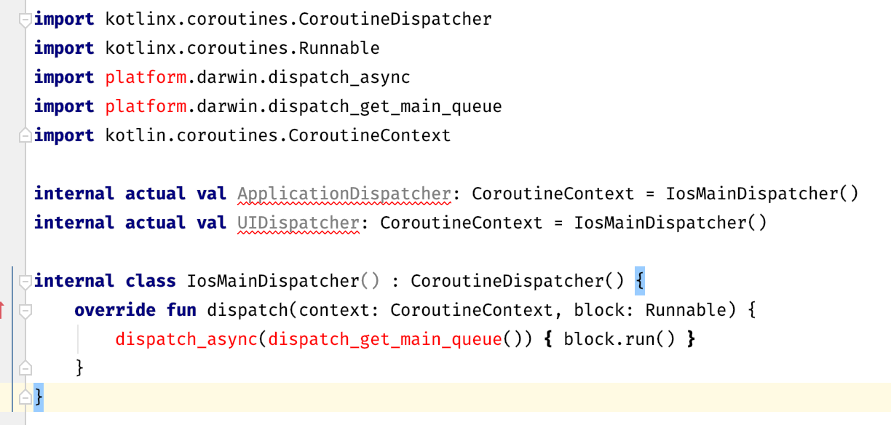

= Intermediate source sets
:toc:
:icons: font

We have seen where to put source code for *all* platform: in the *common* source set.
We have seen where to put source code for *one* platform: in the platform specific source set.
How do we write code that is shared for *some* (more than one, but not all) platforms ?

CAUTION: The way intermediate source sets currently work is very limited and leads to a sub-optimal developer experience. +
         A lot of their pain points are about to be relieved once Jetbrains released "hierarchical multiplatform" tooling, which is expected... very soon!
         Maybe even tomorrow, at KotlinConf 2019. +
         While the concepts described in this chapter are not expected to change, their implementation most probably will in the near future.

== Understanding intermediate source set

Let's say you are creating a library that targets every major platform Kotlin can target.
You will end up with a lot of source sets:

[graphviz, "source-sets-2"]
....
digraph G {
    rankdir = LR

    node [shape = box]

    androidTest, commonTest, jvmTest, jsTest, linuxX64Test, macosX64Test, mingwX64Test, iosArm32Test, iosArm64Test, iosX64Test [style = filled, color = "#c0ffc5"]

    {rank = same commonMain commonTest}

    commonMain -> commonTest

    subgraph cluster_jvmBased {
        label = "jvmBased"
        color = red
        subgraph cluster_jvm {
            style = invis
            {rank = same jvmMain jvmTest}
            jvmMain -> jvmTest
        }
        commonMain -> jvmMain
        commonTest -> jvmTest

        subgraph cluster_android {
            style = invis
            {rank = same androidMain androidTest}
            androidMain -> androidTest
        }
    }
    commonMain -> androidMain
    commonTest -> androidTest

    subgraph cluster_js {
        label = "js"
        color = red
        {rank = same jsMain jsTest}
        jsMain -> jsTest
    }
    commonMain -> jsMain
    commonTest -> jsTest

    subgraph cluster_native {
            label = "native"

        subgraph cluster_host {
            label = "host"
            color = red

            subgraph cluster_linuxX64 {
                style = invis
                {rank = same linuxX64Main linuxX64Test}
                linuxX64Main -> linuxX64Test
            }
            commonMain -> linuxX64Main
            commonTest -> linuxX64Test

            subgraph cluster_macosX64 {
                style = invis
                {rank = same macosX64Main macosX64Test}
                macosX64Main -> macosX64Test
            }
            commonMain -> macosX64Main
            commonTest -> macosX64Test

            subgraph cluster_mingwX64 {
                style = invis
                {rank = same mingwX64Main mingwX64Test}
                mingwX64Main -> mingwX64Test
            }
            commonMain -> mingwX64Main
            commonTest -> mingwX64Test
        }

        subgraph cluster_ios {
            label = "ios"
            color = red

            subgraph cluster_iosArm32 {
                style = invis
                {rank = same iosArm32Main iosArm32Test}
                iosArm32Main -> iosArm32Test
            }
            commonMain -> iosArm32Main
            commonTest -> iosArm32Test

            subgraph cluster_iosArm64 {
                style = invis
                {rank = same iosArm64Main iosArm64Test}
                iosArm64Main -> iosArm64Test
            }
            commonMain -> iosArm64Main
            commonTest -> iosArm64Test

            subgraph cluster_iosX64 {
                style = invis
                {rank = same iosX64Main iosX64Test}
                iosX64Main -> iosX64Test
            }
            commonMain -> iosX64Main
            commonTest -> iosX64Test
        }
    }
}
....

Now, when you are writing `expect` statements, you have to write 9 corresponding `actual` statements !

As you can see, we can group the various targets:

- The `jvmBased` group contains all targets that are running on JVM-like VMs: `android`, and `jvm`
- The `js` group contains the only target that runs with JavaScript: `js`
- The `ios` group contains all iOS targets: `iosX64`, `iosArm32`, and `iosArm64`
- The `host` group contains all native developer host targets: `linuxX64`, `macosX64`, `mingwX64`
- The `native` group contains all native targets: both `host` and `iOS` groups.

It is pretty easy to see that, in the vast majority of cases, the `actual` statements are going to be the same for an entire group.
It is very unlikely that an `actual` statement will vary between `iosArm32` & `iosArm64`.

It would be really great if we could write these `actual` statements only once... +
...Well, of course we can! That's what intermediate source sets are for: provide source that are common to some (not all) platforms.

[graphviz, "source-sets-3"]
....
digraph G {
    rankdir = LR
    newrank = true

    node [shape = box]

    {rank = same commonMain commonTest}
    {rank = same jvmBasedMain jvmBasedTest}
    {rank = same nativeMain nativeTest}
    {rank = same hostMain hostTest}
    {rank = same iosMain iosTest}

    androidTest, jvmBasedTest, commonTest, jvmTest, jsTest, nativeTest, hostTest, linuxX64Test, macosX64Test, mingwX64Test, iosTest, iosArm32Test, iosArm64Test, iosX64Test [style = filled, color = "#c0ffc5"]

    commonMain -> commonTest

    subgraph cluster_jvmBased {
        color = red

        subgraph cluster_jvm {
            style = invis
            {rank = same jvmMain jvmTest}
            jvmMain -> jvmTest
        }
        jvmBasedMain -> jvmMain
        jvmBasedTest -> jvmTest

        subgraph cluster_android {
            style = invis
            {rank = same androidMain androidTest}
            androidMain -> androidTest
        }
        jvmBasedMain -> androidMain
        jvmBasedTest -> androidTest
    }
    commonMain -> jvmBasedMain
    commonTest -> jvmBasedTest

    subgraph cluster_js {
        color = red
        {rank = same jsMain jsTest}
        jsMain -> jsTest
    }
    commonMain -> jsMain
    commonTest -> jsTest

    subgraph cluster_native {
        nativeMain -> nativeTest

        subgraph cluster_host {
            color = red
            hostMain -> hostTest

            subgraph cluster_linuxX64 {
                style = invis
                {rank = same linuxX64Main linuxX64Test}
                linuxX64Main -> linuxX64Test
            }
            hostMain -> linuxX64Main
            hostTest -> linuxX64Test

            subgraph cluster_macosX64 {
                style = invis
                {rank = same macosX64Main macosX64Test}
                macosX64Main -> macosX64Test
            }
            hostMain -> macosX64Main
            hostTest -> macosX64Test

            subgraph cluster_mingwX64 {
                style = invis
                {rank = same mingwX64Main mingwX64Test}
                mingwX64Main -> mingwX64Test
            }
            hostMain -> mingwX64Main
            hostTest -> mingwX64Test
        }
        nativeMain -> hostMain
        nativeTest -> hostTest

        subgraph cluster_ios {
            color = red
            iosMain -> iosTest

            subgraph cluster_iosArm32 {
                style = invis
                {rank = same iosArm32Main iosArm32Test}
                iosArm32Main -> iosArm32Test
            }
            iosMain -> iosArm32Main
            iosTest -> iosArm32Test

            subgraph cluster_iosArm64 {
                style = invis
                {rank = same iosArm64Main iosArm64Test}
                iosArm64Main -> iosArm64Test
            }
            iosMain -> iosArm64Main
            iosTest -> iosArm64Test

            subgraph cluster_iosX64 {
                style = invis
                {rank = same iosX64Main iosX64Test}
                iosX64Main -> iosX64Test
            }
            iosMain -> iosX64Main
            iosTest -> iosX64Test
        }
        nativeMain -> iosMain
        nativeTest -> iosTest
    }

    commonMain -> nativeMain
    commonTest -> nativeTest

    {rank = same linuxX64Main jsMain jvmMain androidMain}
}
....

== Creating intermediate source sets

The above example is an "extreme" case, where you target all platforms.

Let's get back to our mobile only project and create an intermediate source set for iOS.
That way, we will be able to compile for all three iOS targets with only one source set.

Creating a source set is not enough, you must link it in the hierarchy.
To configure an `iOSMain` intermediate source set, you need to:

- Create the `iOSMain` source set.
- Configure the `iOSMain` source set to depend on the `commonMain` source set.
- Configure all three platform iOS targets main source sets to depend on the `iOSMain` source set.

The same goes for the `iOSTest` source set, with this additional step:

- Configure the `iOSTest` source set to depend on the `iOSMain` source set.

Here is an example for the targets the `iOS` group:

.build.gradle.kts
[source,kotlin]
----
kotlin {
    configure(listOf(iosX64(), iosArm64(), iosArm32())) { //<1>
        binaries {
            framework {
                baseName = "AddressBookCommon"
            }
        }
    }

    //...
    sourceSets {
        val commonMain by getting {
            dependencies {
                implementation(kotlin("stdlib-common"))
                implementation(coroutines("-common"))
                implementation(serialization("-common"))
                implementation(ktorClient("core"))
                implementation(ktorClient("json"))
                implementation(ktorClient("serialization"))
            }
        }
        val commonTest by getting {
            dependencies {
                implementation(kotlin("test-common"))
                implementation(kotlin("test-annotations-common"))
            }
        }

        val iosMain by creating { //<2>
            dependsOn(commonMain) //<3>

            dependencies { //<4>
                implementation(coroutines("-native"))
                implementation(serialization("-native"))
                implementation(ktorClient("core-native"))
                implementation(ktorClient("json-native"))
                implementation(ktorClient("serialization-native"))
                implementation(ktorClient("ios"))
            }
        }

        val iosTest by creating { //<2>
            dependsOn(commonTest) //<3>
            dependsOn(iosMain) //<5>
        }

        listOf("iosX64", "iosArm64", "iosArm32").forEach {
            getByName("${it}Main") { //<6>
                dependsOn(iosMain)
            }
            getByName("${it}Test") { //<7>
                dependsOn(iosTest)
            }
        }

    }
}
----
<1> Adds all three iOS targets, and configures their corresponding framework
<2> Creates a new source set...
<3> ...and configures its parent source set(s).
<4> Configures this source sets (and all source sets depending on it) dependencies.
<5> The test source set must depend on its main counterpart.
<6> Configures all iOS platforms main source sets to depend on `iosMain`
<7> Configures all iOS platforms test source sets to depend on `iosTest`

We already have the `src/iosMain` and `src/iOSTest` directories in our structure, but while they used to reflect the `iosX64` target, they now represent an intermediate source set.

WARNING: If you added the `packForXcode` custom task from chapter 3, you need to modify the target name (the argument to the `getByName` method) from `"ios"` to `"iosX64"`.
         We will see in the next chapter how to pack for all iOS targets.

There you are, you did not change your source structure, but you are now compiling for all three iOS targets!

== The intermediate shared source problem

CAUTION: Once again, this is supposed to be fixed with the "hierarchical multiplatform" feature that should be released very soon.

Open the `dispatcherIos.kt` source file in the `iosMain` source set.
The IDE now shows an error.

Don't worry, nothing's actually broken...
In fact, everything still compiles and works fine.
It's only the IDE that fails to recognize this as correct code.

This is because *an intermediate source set does not have an associated platform*.
In fact, the compilers themselves do not care about the directory structure, they just compile the files in the directories that the gradle plugin tells them to look for sources. +
The IDE, on the other hand, associates the platform SDK and standard library to each platform source set, but cannot know which platform to associate to an intermediate source set.

This is even more complex: there is no platform to associate to our `iOS` intermediate source set.
There is no `iOS` platform. +
There are three platforms that could be associated to this source set: `iosX64`, `iosArm64`, and `iosArm32`.
Granted, they are very close, but to the IDE and the native compiler, they are totally different targets.
What the IDE should associate to this source set is the _intersection_ of the three platforms.

At the time of writing, *the IDE wrongly associates the _common_ target to all intermediate source sets*. +
This means that, while the iOS specific code do compile and behaves as expected, the IDE shows errors because it does not see a `dispatch_async` function in the common SDK.

=== A horrible workaround

There is a workaround, but it is quite a horrible hack, and renders the developer experience a bit difficult.
It consists in maintaining two different gradle configurations: one to develop, and one to deploy.

