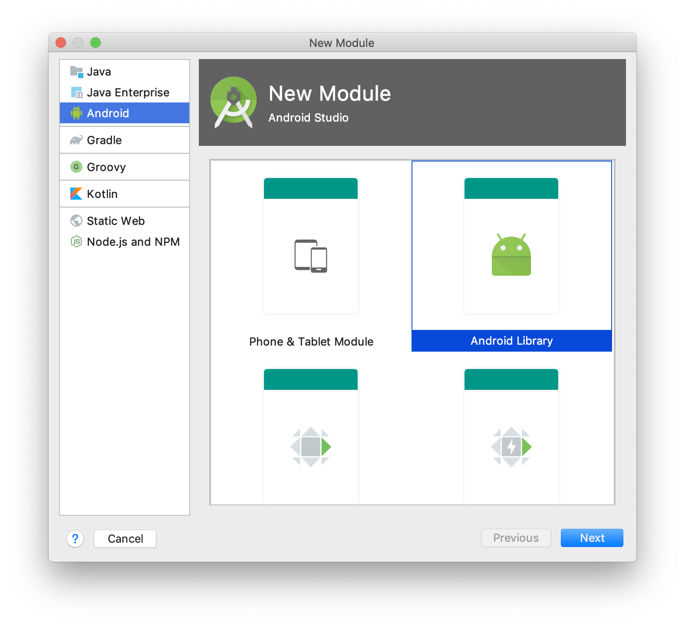

= Bonus: Access to iOS & Android SDKs
:toc:
:icons: font

So far, we've seen how to develop the shared business part of your application in one project.
But what if your library needs to access platform specific APIs, such as GPS location, or contact list & details?

You need to access the platform's APIs. +
You already have access to the platform's APIs when targetting iOS & JS.
Android is a little bit trickier.

TIP: Kotlin/Multiplatform also allows you to develop your entire application in Kotlin.
     You can develop your Android, iOS & Web app, completely in Kotlin!

- By targetting any of the three `iOS` platforms you already have access to the Cocoa-touch APIs.
- By targetting JavaScript, you already have access to the DOM & HTML5 APIs.

Let's see how we can access the Android APIs.

== Adding the Android SDK

There are three ways you can include the Android SDK into your multiplatform project.
Each have benefits and limitations.

=== Adding an Android only module

[cols="a,a", options="header"]
|===
| Benefits
| Drawbacks
|
- Very simple, no project "invasion".
- Can embed resources (images, XMLs, etc.).
|
- Cannot contain `actual` declarations.
|===

This is by far the easier solution, but its main limitation comes from the fact that you cannot have an `expect` declaration in a module, and a corresponding `actual` declaration in another module.

You should use this approach if your business code does not uses platform specific features (such as GPS location, contact access, etc.).

[cols="65%,<.^35%a",grid="none",frame="none"]
|===
|
|Create a new Android Library module
|image:res/17-2.png[creation wizard,600]
|Configure its name and properties.
|===

Since the Android plugin does not understand Gradle script Kotlin, we need to add a few more steps:

- Delete the newly created `build.gradle` file.
  Add the following to below the `plugins` block in your `build.gradle.kts` file:
+
.build.gradle.kts
[source,kotlin]
----
buildscript {
    repositories {
        google()
    }
    dependencies {
        classpath("com.android.tools.build:gradle:3.5.2")
    }
}
----
- Delete the newly created `settings.gradle` file.
  Add the following at the end your `settings.gradle.kts` file:
+
.settings.gradle.kts
[source,kotlin]
----
include(":adressbook-android") // or whatever the name of your module is
----

Finaly, we need to add the library as a dependency to our newly created android module. +
At the end of the `dependency` block of its `build.gradle` file, add the dependency:

.settings.gradle.kts
[source,groovy]
----
dependencies {
    implementation rootProject
}
----

TIP: If you are creating a new Android module for Android specific client code, then you should probably create an iOS Kotlin/Native specific module for the same type of code for iOS.

NOTE: Because you applied the Android plugin to project module, IntelliJ will likely create a bunch of `.iml` files to the directory structure.
      There's nothing you can do unless accept this pollution.

=== Adding the Android JAR as a dependency

[cols="a,a", options="header"]
|===
| Benefits
| Drawbacks
|
- Very little Gradle "invasion".
- Can contain `actual` declarations.
|
- Cannot embed resources (images, XMLs, etc.) or declare Manifest.
- Manual SDK management
|===

By adding the Android SDK directly as a dependency, you can generated a simple JAR that compile against the Android SDK.
However, your library will still be considered a simple JVM library.
As such, you cannot use all the power of the Android toolchain and embed resources or declare a manifest.

First, create a `gradle.properties` root file if you haven't already (see previous chapter).
In this file, add the following property:

.gradle.properties
[source,properties]
----
androidSdk = /path/to/your/Android/sdk
----

Then, add the jar dependency to your `androidMain` source set:

.build.gradle.kts
[source,kotlin]
----
kotlin {
    //...
    sourceSets {
        //...
        val androidMain by getting {
            dependencies {
                //...

                val androidSdk: String by project
                copileOnly(files("$androidSdk/platforms/android-28/android.jar"))
            }
        }
    }
}
----

=== Android the Android plugin to the mix

[cols="a,a", options="header"]
|===
| Benefits
| Drawbacks
|
- Can contain `actual` declarations.
- Can embed resources (images, XMLs, etc.) or declare Manifest.
|
- High Gradle and project source architecture "invasion".
|===

The fact is that the `android` gradle plugin wasn't created to play well with Kotlin/Multiplatform.
The Jetbrains team have tried their best to make the Kotlin/Multiplatform Gradle plugin to play well with Android, but their are compromises they had to make.

First, add the following to your `settings.gradle.kts` file:

.settings.gradle.kts
[source,kotlin]
----
pluginManagement {
    repositories {
        gradlePluginPortal()
        google()
    }
    resolutionStrategy {
        eachPlugin {
            if (requested.id.id == "com.android.library")
                useModule("com.android.tools.build:gradle:${requested.version}")
        }
    }
}
----

Then, in your `build.gradle.kts` add the android plugins:

IMPORTANT: Order of plugin declaration *is important*.

.build.gradle.kts
[source,kotlin]
----
plugins {
    id("com.android.library") version "3.5.2" //<1>
    kotlin("multiplatform") version "1.3.50"
    kotlin("android.extensions") version "1.3.50" //<2>
    kotlin("plugin.serialization") version "1.3.50"
    `maven-publish`
}
----
<1> The Android plugin
<2> Kotlin android synthetic extensions

Add the Android specific configuration block:

.build.gradle.kts
[source,kotlin]
----
android {
    compileSdkVersion(28)
    defaultConfig {
        minSdkVersion(15)
        sourceSets.getByName("main").manifest.srcFile("src/androidMain/AndroidManifest.xml")
    }
}
----

Add the Google repository:

.build.gradle.kts
[source,kotlin]
----
repositories {
    jcenter()
    google() //<1>
    maven(url = "https://kotlin.bintray.com/kotlinx")
    maven(url = "https://dl.bintray.com/jetbrains/kotlin-native-dependencies")
}
----
<1> The Google repository

Finaly, instead of a `jvm("android")` target, declare an `android` target:

.build.gradle.kts
[source,kotlin]
----
kotlin {
    android {
        compilations.all {
            kotlinOptions {
                jvmTarget = "1.8"
            }
        }
    }
    //...
}
----

NOTE: Because you applied the Android plugin to project module, IntelliJ will likely create a bunch of `.iml` files to the directory structure.
      There's nothing you can do unless accept this pollution.

Now you can port part of your application (or all of it) in your project.

== Write your entire application in Kotlin

=== Write an iOS screen in Kotlin

You can write part of your iOS application (or even all of it) in Kotlin.

Here's an example of the first screen of the application in Kotlin:

.build.gradle.kts
[source,kotlin]
----
package com.mybusiness.ios

import com.mybusiness.di.CommonInjector
import com.mybusiness.model.Contact
import com.mybusiness.presentation.ContactList
import com.mybusiness.presentation.ContactListPresenter
import platform.Foundation.NSIndexPath
import platform.UIKit.*
import platform.darwin.NSInteger

class MasterViewController: UITableViewController(), ContactList.View {

    private var contactList: List<Contact> = emptyList()
    private lateinit var presenter: ContactListPresenter
//    var detailViewController: DetailViewController? = nil

    override fun viewDidLoad() {
        super.viewDidLoad()
        presenter = CommonInjector.contactListPresenter()
    }

    override fun viewWillAppear(animated: Boolean) {
        super.viewWillAppear(animated)
        presenter.attachView(this)
    }

    override fun viewWillDisappear(animated: Boolean) {
        super.viewWillDisappear(animated)
        presenter.detachView()
    }

    override fun displayContactList(contactList: List<Contact>) {
        this.contactList = contactList
        tableView.reloadData()
    }

    override fun prepareForSegue(segue: UIStoryboardSegue, sender: Any?) {
        if (segue.identifier == "showDetail") {
            tableView.indexPathForSelectedRow()?.let { indexPath ->
                val contact = contactList[indexPath.row.toInt()]
                // Uncoment once DetailViewController is in Kotlin
//                val controller = (segue.destinationViewController as UINavigationController).topViewController as DetailViewController
//                controller.contactId = contact.id
            }
        }
    }

    override fun tableView(tableView: UITableView, numberOfRowsInSection: NSInteger): NSInteger {
        return contactList.size.toLong()
    }

    @Suppress("PARAMETER_NAME_CHANGED_ON_OVERRIDE")
    override fun tableView(tableView: UITableView, indexPath: NSIndexPath): UITableViewCell {
        val cell = tableView.dequeueReusableCellWithIdentifier("Cell", indexPath)
        val contact = contactList[indexPath.row.toInt()]
        cell.textLabel!!.text = contact.fullName
        return cell
    }
}
----

=== Write a JS screen in Kotlin

Using the https://github.com/JetBrains/kotlin-wrappers/tree/master/kotlin-react[Kotlin React Wrapper], you can write your web app entirely in Kotlin!

Here's an example of the first screen of the application in Kotlin:

.build.gradle.kts
[source,kotlin]
----
package com.mybusiness.js

import com.mybusiness.di.CommonInjector
import com.mybusiness.model.Contact
import com.mybusiness.presentation.ContactList
import react.RProps
import react.dom.li
import react.dom.ul
import react.functionalComponent
import react.router.dom.routeLink
import react.useEffect
import react.useState

val ContactList = functionalComponent<RProps> {

    val (presenter, _) = useState { CommonInjector.contactListPresenter() }

    val (contacts, setContacts) = useState(emptyList<Contact>())

    useEffect(emptyList()) {
        presenter.attachView(object : ContactList.View {
            override fun displayContactList(contactList: List<Contact>) {
                setContacts(contactList)
            }
        })
    }

    ul {
        contacts.forEach {
            li {
                routeLink(to = "/contact/${it.id}") {
                    +it.fullName
                }
            }
        }
    }

}
----
