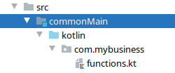

= Introduction
Salomon BRYS
:toc:
:icons: font

== Your first test

To start, we'll write some code that is common to all platform.

First, in `commonMain/kotlin`, let's create a package and a kotlin source file:

[TIP]
====
At the moment, if you want to create a package, you need to manually create the directory structure.

image:2-2.png[new directory]
====

Let's write our first multiplatform function:

.functions.kt
[source,kotlin]
----
package com.mybusiness

fun addition(left: Int, right: Int): Int {
    return left + right
}
----

Now that we have our first function, we can test it.
Let's create the appropriate test file:

image:2-3.png[test file]

.functionsTest.kt
[source,kotlin]
----
import com.mybusiness.*
import kotlin.test.*

@Test
fun testSimpleAddition() {
    assertEquals(5, addition(2, 3))
}

@Test
fun testNegativeAddition() {
    assertEquals(-1, addition(2, -3))
}
----

Let