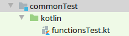
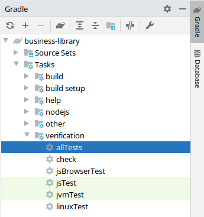

= Write your first test
:toc:
:icons: font

One of the core benefits of Kotlin/Multiplatform is the ability to test once and gain confidence in your code on all platforms at once.

To demonstrate that, let's design our first unit test.

== Writing it

To start, we'll write some code that is common to all platforms.

First, in `commonMain/kotlin`, let's create a package and a kotlin source file:

image:res/2-1.png[source directory structure]

[TIP]
====
At the moment, if you want to create a package, you need to manually create the directory structure.

image:res/2-2.png[new directory]
====

Let's write our first multiplatform function:

.functions.kt
[source,kotlin]
----
package com.mybusiness

fun addition(left: Int, right: Int): Int {
    return left + right
}
----

Now that we have our first function, we can test it.
Let's create the appropriate test file:

.functionsTest.kt
[source,kotlin]
----
import com.mybusiness.*
import kotlin.test.*

class AdditionTests {
    @Test
    fun testSimpleAddition() {
        assertEquals(5, addition(2, 3))
    }

    @Test
    fun testNegativeAddition() {
        assertEquals(-1, addition(2, -3))
    }
}
----

As you can see, testing works much like JUnit.
Nothing new under the sun!

Now, all that remain is to run our tests.

== Running it

In the Gradle pane, open `Tasks` > `verification` and double click ont `allTests` to run the `allTests` Gradle task.

Look at the command line result, you should find that gradle has run some tasks, more importantly you should see the following ones: `jsTest`, `jvmTest` & `linuxTest` (or `macosTest`, or `mingwTest`).
This means that the tests were compiled by the three different compilers and run on three different targets.

In fact, let's see all testing in action.
Add this at the end of your Gradle build file:

.build.gradle.kts
[source,kotlin]
----
afterEvaluate {
    tasks.withType<AbstractTestTask>().forEach {
        it.testLogging {
            events("passed", "skipped", "failed")
        }
    }
}
----

Rerun the `allTests` task and... nothing happens.
Everything is "up to date": because the code has not change, Gradle does not rerun the tests.
You first need to run the `clean` task (in the `build` group), then rerun the `allTests` task.

Lo and behold:

.allTests result
----
...
> Task :jsBrowserTest
AdditionTests.testSimpleAddition PASSED
AdditionTests.testNegativeAddition PASSED
...
> Task :jvmTest
AdditionTests > testSimpleAddition PASSED
AdditionTests > testNegativeAddition PASSED
...
> Task :linuxTest
AdditionTests.testSimpleAddition PASSED
AdditionTests.testNegativeAddition PASSED
----

NOTE: You may have noticed that even if you defined an iOS target there is nothing showed here.
      This is because Kotlin/Multiplatform plugin does not support running tests on other platform than the host platforms.
      We will see how to go around this in a following chapter.

Now try to change one of the two tests to fail, and see what happens when you run them.
Unsurprisingly, all three test task fail.

TIP: Gradle generated an HTML report with a link at the end.
     Open it in a browser to see what went wrong ;)

TIP: As you can see, when running the `allTests` task runs, well, all tests.
     The Kotlin/JVM is the fastest and most reliable compiler so, most of the time, running the `jvmTest` task will be faster and give results easier to understand.
     Only once all tests have been proven correct in the JVM, you should start running `allTests` to proof your code on each other targeted platform.
