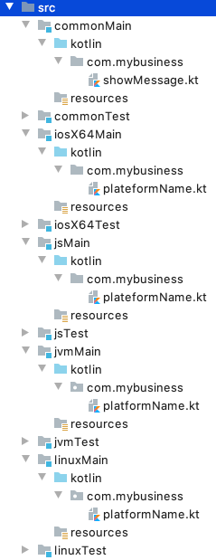

= Platform specific behaviors
Salomon BRYS
:toc:
:icons: font

== What is ``expect``ed must ``actual``y exist

In some specific cases the common code cannot be shared, often due to platform's internal infrastructure or definition.
Take dates, for example. Their definition isn't the same on JVM, iOS or JavaScript, thus we should be able to provide a sort of bridge for each platform.
Another example: the coroutines cannot be used in the same way on Android and iOS as iOS doesn't allow (yet) multithreading in a coroutine context, so we should be able to work with every specifics of each platform in our common code.

That's why Kotlin/Multiplatform provides a way to define an `expect`/`actual` mechanism.
In the common code, we define the ``expect``ed behaviors, allowing us to provide the `actual` behavior in each targeted platform.

The expectation [`expect`] code will be defined in the common module:

- `commonMain`

[source,kotlin]
----
expect fun logMessage(message: String)
----

And the implementation [`actual`] will be defined for each targeted platform as:

- `jsMain`

[source,kotlin]
----
actual fun logMessage(message: String) = console.log(message)
----

- `iosX64Main`

[source,kotlin]
----
actual fun logMessage(message: String) = NSLog(message)
----

- `jvmMain` (here Android)

[source,kotlin]
----
actual fun logMessage(message: String) = Log.d("[APP]", message)
----

- `linuxMain`

[source,kotlin]
----
actual fun logMessage(message: String) = printf("%s\n", message)
----

== Write your first multi-platform code!

In this section we will prepare our common code to be executable and testable for each targeted platform.

To show you how it works, and how yo play with the `expect`/`actual` behavior, we will use a simple example.
For each targeted platform, we will print on the screen/console a message, with a specific part, different for each platform.

.Example of a platform specific message
[source]
----
Hello KotlinConf, Kotlin/Multiplatform is awesome! <1>
We are running on Android! <2>
----
<1> Common message for every platform
<2> Platform specific message, for *_Android_* is this case

*Let's code!*

=== [expect] common shared code

This is where you will write most of your code in a Kotlin/Multiplatform project. The goal is to put a maximum effort in here, to avoid code duplication.

First, create a new file `src/commonMain/kotlin/com.mybusiness/showMessage.kt`, and add the following code:

.commonMain > kotlin > com.mybusiness/showMessage.kt
[source,kotlin]
----
package com.mybusiness

fun sayHelloKotlinConf() =
    """
    |Hello KotlinConf, Kotlin/Multiplatform is awesome!
    |We are running on ${ platformName() }
    """.trimMargin()

expect fun platformName(): String
----

Do you notice something weird ?

Indeed, IntelliJ will show you some errors on the `platformName()` function.
This is because we've used the `expect` keyword without defining any `actual` behavior yet.

[TIP]
====
If you put your cursor on the function name you'll see the following tooltip
image:3-1.png[expect/actual error]
====

To fix this error we will need to provide an `actual` function `platformName()` for every targeted platform.

=== [actual] platform specific code

Following the previous section you'll have to provide an `actual` function `platformName()` for each of the platform you are targeting.
Meaning, you'll have to create a file `showMessage.kt` for each platform:

[IMPORTANT]
====
1. You must define your `actual` members into the same package as the ``expect``ed behavior
2. Your `actual` members shouldn't be in a file with the same name as your `expect` members, otherwise your could have conflict at build time.

[cols="2", grid="none", frame="none"]
|====
^|image:ok.png[OK]
^|image:nok.png[NOT OK]
|
``src/commonMain/kotlin/com.mybusiness/showMessage.kt``
``src/jvmMain/kotlin/com.mybusiness/platformName.kt``
|
``src/commonMain/kotlin/com.mybusiness/showMessage.kt``
``src/jvmMain/kotlin/com.mybusiness/showMessage.kt``
|====
====

.jvmMain > kotlin > com.mybusiness/platformName.kt
[source,kotlin]
----
package com.mybusiness
actual fun platformName(): String = "Android"
----

.jsMain > kotlin > com.mybusiness/platformName.kt
[source,kotlin]
----
package com.mybusiness
actual fun platformName(): String = "JavaScript"
----

.linuxMain > kotlin > com.mybusiness/platformName.kt
[source,kotlin]
----
package com.mybusiness
actual fun platformName(): String = "Linux"
----

.iosX64Main > kotlin > com.mybusiness/platformName.kt
[source,kotlin]
----
package com.mybusiness
actual fun platformName(): String = "iOS"
----

[TIP]
====
You can use the *Context Actions* in IntelliJ (Linux/Windows `Alt + Return` - MacOS `Option + Return`)

image:3-2.png[expect/actual context actions]
====

Now, you should have the following source map

[TIP]
====
In IntelliJ you can quickly spot `expect`/`actual` members with the gutter icons

image:3-3.png[expect gutter icon]

image:3-4.png[actual gutter icon]
====

=== Testing your multi-platform library

To empower our example we should provide tests for each of the targeted platform.
Our test environment is already configured, though we just have to write a test for our `sayHelloKotlinConf()`
function, for every platform.

[NOTE]
====
Reminder: Every source set is divide into two parts, *_Main_* and *_Test_*.

Here we will work on the *_Test_* part
====

.jvmTest > kotlin > SayHelloKotlinConfTest.kt
[source,kotlin]
----
class SayHelloKotlinConfTest {
    @Test
    fun testSayHelloAndroid() {
        assertEquals(
            """
            |Hello KotlinConf, Kotlin/Multiplatform is awesome!
            |We are running on Android
            """.trimMargin(), sayHelloKotlinConf()
        )
    }
}
----

.jsTest > kotlin > SayHelloKotlinConfTest.kt
[source,kotlin]
----
class SayHelloKotlinConfTest {
    @Test
    fun testSayHelloJS() {
        assertEquals(
            """
            |Hello KotlinConf, Kotlin/Multiplatform is awesome!
            |We are running on JavaScript
            """.trimMargin(), sayHelloKotlinConf()
        )
    }
}
----

.linuxTest > kotlin > SayHelloKotlinConfTest.kt
[source,kotlin]
----
class SayHelloKotlinConfTest {
    @Test
    fun testSayHelloLinux() {
        assertEquals(
            """
            |Hello KotlinConf, Kotlin/Multiplatform is awesome!
            |We are running on Linux
            """.trimMargin(), sayHelloKotlinConf()
        )
    }
}
----

.iosX64Test > kotlin > SayHelloKotlinConfTest.kt
[source,kotlin]
----
class SayHelloKotlinConfTest {
    @Test
    fun testSayHelloIOS() {
        assertEquals(
            """
            |Hello KotlinConf, Kotlin/Multiplatform is awesome!
            |We are running on iOS
            """.trimMargin(), sayHelloKotlinConf()
        )
    }
}
----

You can run all your tests with Gradle.

In the Gradle pane, double click on `Tasks` > `verification` > `allTests` to run the `allTests` Gradle task.

You should have the following output:

.Gradle AllTest task
[source]
----
...
> Task :jsBrowserTest
SayHelloKotlinConfTest.testSayHelloJS PASSED
...
> Task :jvmTest
SayHelloKotlinConfTest > testSayHelloAndroid PASSED
...
> Task :linuxTest
SayHelloKotlinConfTest.testSayHelloLinux PASSED
...
----

==== The iOS special case

    TODO ?

=== Building your multi-platform library

Now you can prepare your library to be used on different platform by building it with Gradle.

In the Gradle pane, double click on `Tasks` > `build` > `build` to run the `build` Gradle task.

You should see a `build` directory appearing in your project tree:

image:3-7.png[build directory]

In the next section, we will see how to use our multi-platform library within specific platform, as *Android*, *iOS* and *JavaScript*.