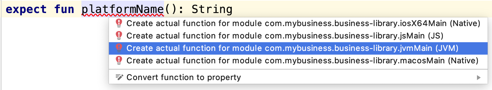
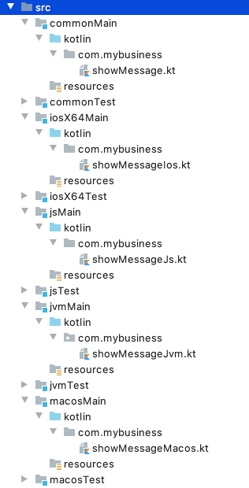
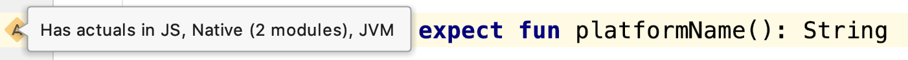
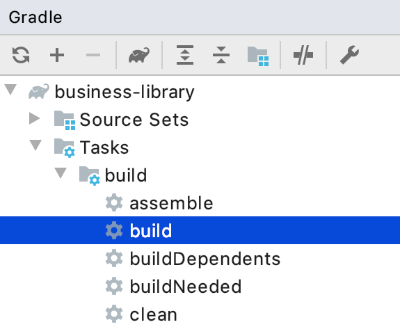
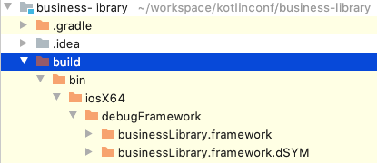

= Platform specific behaviors
Salomon BRYS & Romain BOISSELLE
:toc:
:icons: font

== What is ``expect``ed must ``actual``y exist

In some specific cases the common code cannot be shared, often due to platform's internal infrastructure or definition.
Take dates, for example. Their definition isn't the same on *_JVM_*, *_iOS_* or *_JavaScript_*, thus we should be able to provide a sort of bridge for each platform.
Another example: the coroutines cannot be used in the same way on *_Android_* and *_iOS_*, as *_iOS_* doesn't allow (yet) multithreading in a coroutine context. So we should be able to work with every specifics of each platform in our common code.

That's why Kotlin/Multiplatform provides a way to define an `expect`/`actual` mechanism.
In the common code, we define the ``expect``ed behaviors, allowing us to provide the `actual` behavior in each targeted platform.

*_The expectation [`expect`] code will be defined in the common module_*

- `commonMain`

[source,kotlin]
----
expect fun logMessage(message: String)
----

*_And the implementation [`actual`] will be defined for each targeted platform_*

- `jsMain`

[source,kotlin]
----
actual fun logMessage(message: String) = console.log(message)
----

- `iosX64Main`

[source,kotlin]
----
actual fun logMessage(message: String) = NSLog(message)
----

- `jvmMain`

[source,kotlin]
----
actual fun logMessage(message: String) = Logger.getLogger("App").log(Level.INFO, message)
----

- `linuxMain`

[source,kotlin]
----
actual fun logMessage(message: String) = printf("%s\n", message)
----

== Write your first multi-platform code!

In this section we will prepare our common code to be executable and testable for each targeted platform.

To show you how it works, and how yo play with the `expect`/`actual` mechanism, we will use a simple example.
For each targeted platform, we will print on the screen/console a message, with a specific part, different for each platform.

.Example of a platform specific message
[source]
----
Hello KotlinConf, Kotlin/Multiplatform is awesome! <1>
We are running on JVM! <2>
----
<1> Common message for every platform
<2> Platform specific message, for the *_JVM_* is this case

*Let's code!*

=== [expect] common shared code

This is where you will write most of your code in a Kotlin/Multiplatform project. The goal is to put a maximum effort in here, to avoid code duplication.

First, create a new file `src/commonMain/kotlin/com.mybusiness/showMessage.kt`, and add the following code:

.commonMain > kotlin > com.mybusiness/showMessage.kt
[source,kotlin]
----
package com.mybusiness

fun sayHelloKotlinConf() =
    """
    |Hello KotlinConf, Kotlin/Multiplatform is awesome!
    |We are running on ${ platformName() }
    """.trimMargin()

expect fun platformName(): String
----

Do you notice something weird ?

Indeed, IntelliJ will show you some errors on the `platformName()` function.
This is because we've used the `expect` keyword without defining any `actual` behavior yet.

[TIP]
====
If you put your cursor on the function name you'll see the following tooltip

image:res/3-1.png[expect/actual error]
====

To fix this error we will need to provide an `actual` implementation for the  `platformName()` function, for every targeted platform.

=== [actual] platform specific code

Following the previous section you'll have to provide an `actual` function `platformName()` for each of the platform you are targeting.
Meaning, you'll have to create a new kotlin file for each platform:

[IMPORTANT]
====
1. You must define your `actual` members into the same package as the ``expect``ed behavior
2. Your `actual` members shouldn't be in a file with the same name as your `expect` members, otherwise your could have conflicts at build time.

[cols="2", grid="none", frame="none"]
|====
^|
^|
|
``src/commonMain/kotlin/com.mybusiness/showMessage.kt``
``src/jvmMain/kotlin/com.mybusiness/showMessageJvm.kt``
|
``src/commonMain/kotlin/com.mybusiness/showMessage.kt``
``src/jvmMain/kotlin/com.mybusiness/showMessage.kt``
|====
====

NOTE: By convention, the naming of the files that contains `actual` definition is `[expect filename][platform].kt`

.jvmMain > kotlin > com.mybusiness/showMessageJvm.kt
[source,kotlin]
----
package com.mybusiness
actual fun platformName(): String = "JVM"
----

.jsMain > kotlin > com.mybusiness/showMessageJs.kt
[source,kotlin]
----
package com.mybusiness
actual fun platformName(): String = "JavaScript"
----

.linuxMain > kotlin > com.mybusiness/showMessageLinux.kt
[source,kotlin]
----
package com.mybusiness
actual fun platformName(): String = "Linux"
----

.iosX64Main > kotlin > com.mybusiness/showMessageIos.kt
[source,kotlin]
----
package com.mybusiness
actual fun platformName(): String = "iOS"
----

[TIP]
====
You can use the *Context Actions* in IntelliJ (Linux/Windows `Alt + Return` - MacOS `Option + Return`)

====

Now, you should have the following source map

[TIP]
====
In IntelliJ you can quickly spot `expect`/`actual` members with the gutter icons

image:res/3-4.png[actual gutter icon]
====

=== Testing your multi-platform library

To empower our example, we should provide some tests for each of the targeted platform.
Our test environment is already configured, so we just have to write a test for our `sayHelloKotlinConf()`
function, on every platform.

[NOTE]
====
Reminder: Every source set is divide into two parts, *_Main_* and *_Test_*.

Here we will work on the *_Test_* part
====

==== Testing the common code

Add a class `SayHelloKotlinConfTest` for the common *_Test_* module.

.commonTest > kotlin > SayHelloKotlinConfTest.kt
[source,kotlin]
----
import com.mybusiness.sayHelloKotlinConf
import kotlin.test.*

class SayHelloKotlinConfTest {
    @Test
    fun testSayHelloCommon() {
        assertEquals(
            "Hello KotlinConf, Kotlin/Multiplatform is awesome!",
            sayHelloKotlinConf().lines().first()
        )
    }
}
----

==== Testing the platform specific code

Add a test class `SayHelloKotlinConfTest` for each platform specific *_Test_* module.

[IMPORTANT]
====
As for the `expect`/`actual` files, your platform specific test classes cannot be named as the common test class.

[cols="2", grid="none", frame="none"]
|====
^|
^|
|
``src/commonTest/kotlin/SayHelloKotlinConfTest.kt``
``src/jvmTest/kotlin/SayHelloKotlinConfJvmTest.kt``
|
``src/commonTest/kotlin/SayHelloKotlinConfTest.kt``
``src/jvmTest/kotlin/SayHelloKotlinConfTest.kt``
|====
====

.jvmTest > kotlin > SayHelloKotlinConfJvmTest.kt
[source,kotlin]
----
import com.mybusiness.sayHelloKotlinConf
import kotlin.test.*

class SayHelloKotlinConfJvmTest {
    @Test
    fun testSayHelloJvm() {
        assertEquals(
            "We are running on JVM",
            sayHelloKotlinConf().lines().last()
        )
    }
}
----

.jsTest > kotlin > SayHelloKotlinConfJsTest.kt
[source,kotlin]
----
import com.mybusiness.sayHelloKotlinConf
import kotlin.test.*

class SayHelloKotlinConfJsTest {
    @Test
    fun testSayHelloJs() {
        assertEquals(
            "We are running on JavaScript",
            sayHelloKotlinConf().lines().last()
        )
    }
}
----

.linuxTest > kotlin > SayHelloKotlinConfLinuxTest.kt
[source,kotlin]
----
import com.mybusiness.sayHelloKotlinConf
import kotlin.test.*

class SayHelloKotlinConfLinuxTest {
    @Test
    fun testSayHelloLinux() {
        assertEquals(
            "We are running on Linux",
            sayHelloKotlinConf().lines().last()
        )
    }
}
----

.iosX64Test > kotlin > SayHelloKotlinConfIosTest.kt
[source,kotlin]
----
import com.mybusiness.sayHelloKotlinConf
import kotlin.test.*

class SayHelloKotlinConfIosTest {
    @Test
    fun testSayHelloIos() {
        assertEquals(
            "We are running on iOS",
            sayHelloKotlinConf().lines().last()
        )
    }
}
----

You can now run all your tests with Gradle.

In the Gradle pane, double click on `Tasks` > `verification` > `allTests` to run the `allTests` Gradle task.

You should have the following output:

.Gradle AllTest task
[source]
----
...
SayHelloKotlinConfTest.testSayHelloCommon PASSED
SayHelloKotlinConfJsTest.testSayHelloJs PASSED
...
SayHelloKotlinConfTest > testSayHelloCommon PASSED
SayHelloKotlinConfJvmTest > testSayHelloJvm PASSED
...
SayHelloKotlinConfTest.testSayHelloCommon PASSED
SayHelloKotlinConfLinuxTest.testSayHelloLinux PASSED
...
----

Cool, right ?

==== The iOS special case

WARNING: This part is for MacOS users that have already installed https://developer.apple.com/xcode/[*_XCode_*]

As we already saw, by default, the Kotlin/Multiplatform doesn't run the task `iosTest`.
So we need to manually define it with the following block at the end of our Gradle build.

.build.gradle.kts
[source,kotlin]
----
val iosTest: Task by tasks.creating { <1>
    val testExecutable = kotlin.targets
              .getByName<KotlinNativeTarget>("iosX64").binaries.getTest("DEBUG") <2>

    dependsOn(testExecutable.linkTaskName) <3>
    group = JavaBasePlugin.VERIFICATION_GROUP
    description = "Runs tests for target 'ios' on an iOS simulator"

    doLast { <4>
        exec {
            val device = project.findProperty("iosDevice")?.toString() ?: "iPhone 8" <5>
            commandLine( "xcrun", "simctl", "spawn",
                        "--standalone", device, testExecutable.outputFile.absolutePath) <6>
        }
    }
}

tasks.getByName("allTests").dependsOn(iosTest) <7>
----
<1> Create a new task named `iosTest`
<2> Find the compiled executable for the source set `iosX64` defined earlier
<3> The new task *must* depends on the executable compilation task
<4> This block is the part of the task that will be executed each time we call `iosTest`
<5> Define a targeted iPhone simulator to execute the tests on
<6> Execute a command that will spawn the iPhone simulator and run our tests
<7> Set the `iosTest` task as part of the test chain

Now you can rerun your task `allTests` and you will see new lines printed.

.Gradle AllTest task
[source]
----
...
> Task :iosTest
...
[==========] Running 2 tests from 2 test cases.
[----------] Global test environment set-up.
[----------] 1 tests from SayHelloKotlinConfTest
[ RUN      ] SayHelloKotlinConfTest.testSayHelloCommon
[       OK ] SayHelloKotlinConfTest.testSayHelloCommon (0 ms)
[----------] 1 tests from SayHelloKotlinConfTest (0 ms total)
[----------] 1 tests from SayHelloKotlinConfIosTest
[ RUN      ] SayHelloKotlinConfIosTest.testSayHelloIos
[       OK ] SayHelloKotlinConfIosTest.testSayHelloIos (0 ms)
[----------] 1 tests from SayHelloKotlinConfIosTest (0 ms total)
[----------] Global test environment tear-down
[==========] 2 tests from 2 test cases ran. (0 ms total)
[  PASSED  ] 2 tests.
...
----

=== Building your multi-platform library

Before going further, we need to prepare our multi-platform library by building and publishing it with Gradle.

In your Gradle build file `build.gradle.kts` add the plugin `maven-publish` and change the version of your library, `1.0.0` be proud :)

.build.gradle.kts > plugin
[source,kotlin]
----
plugins {
    ...
    `maven-publish`
}
...
version = "1.0.0"
----

In the Gradle pane, you should see a new group, named `publishing`, if not hint the refresh button

Then, double click on `Tasks` > `publishing` > `publishToMavenLocal` to run the `publishToMavenLocal` Gradle task.

.If your open a terminal and run the following command you could see that your library has been published locally.
[source]
----
 $ ls .m2/repository/com/mybusiness/
business-library-iosx64
business-library-js
business-library-jvm
business-library-macos
business-library-metadata

 $ ls .m2/repository/com/mybusiness/business-library-jvm
1.0.0
maven-metadata-local.xml

 $ ls .m2/repository/com/mybusiness/business-library-jvm/1.0.0
business-library-jvm-1.0.0-sources.jar
business-library-jvm-1.0.0.jar
business-library-jvm-1.0.0.pom
----

NOTE: On a real world project, you would have published your library on a remote repository (maven / bintray / etc)

==== The iOS special case

Building libraries for *_iOS_* is also a special case in our build script.
In fact, to be able to use our common library in *_XCode_*, we need to build a *_framework_* file.

To do so, we have to modify our Gradle build script in two places.
In the `target` definition for *_iOS_* we need to add the following block of code:

.build.gradle.kts > kotlin
[source,kotlin]
----
kotlin {
    ...
    iosX64 {
        binaries {
            framework { <1>
                baseName = "businessLibrary" <2>
            }
        }
    }
    ...
}
----
<1> define that the output binaries must be a *_framework_* file
<2> with the name `businessLibrary`

[NOTE]
====
If you run the Gradle task `build` you'll find the `businessLibrary.framework` in your build directory

====

To use this newly generated *_framework_* file in *_XCode_* we need to provide a new Gradle task to copy
the file into a shared place.

Open your `build.gradle.kts` file and put the following block at the end.

.build.gradle.kts
[source,kotlin]
----
...
val packForXcode by tasks.creating(Sync::class) { <1>
    /// selecting the right configuration for the iOS
    /// framework depending on the environment
    /// variables set by Xcode build
    val mode = System.getenv("CONFIGURATION") ?: "DEBUG"
    val framework = kotlin.targets
        .getByName<KotlinNativeTarget>("iosX64")
        .binaries.getFramework(mode)
    inputs.property("mode", mode)

    dependsOn(framework.linkTask) <2>

    val targetDir = File(buildDir, "xcode-frameworks")
    from({ framework.outputDirectory }) <3>
    into(targetDir) <4>
}

tasks.getByName("build").dependsOn(packForXcode) <5>
----
<1> Create a new task to make the framework available for *_XCode_*
<2> The new task depends on the fact that the framework has been built
<3> Move the built framework from the build directory
<4> To a new location (could/should be a remote path)
<5> Set the `packForXcode` task as part of the `build` task

Now after running the Gradle task `build`, by double clicking on `Tasks` > `build` > `build`, you should see the following build tree:

image:res/3-8.png[build directory]

=== What's next ?

In the next section, we will see how to use our multi-platform library within specific platform, as *_Android_*, *_iOS_* and *_JavaScript_*.