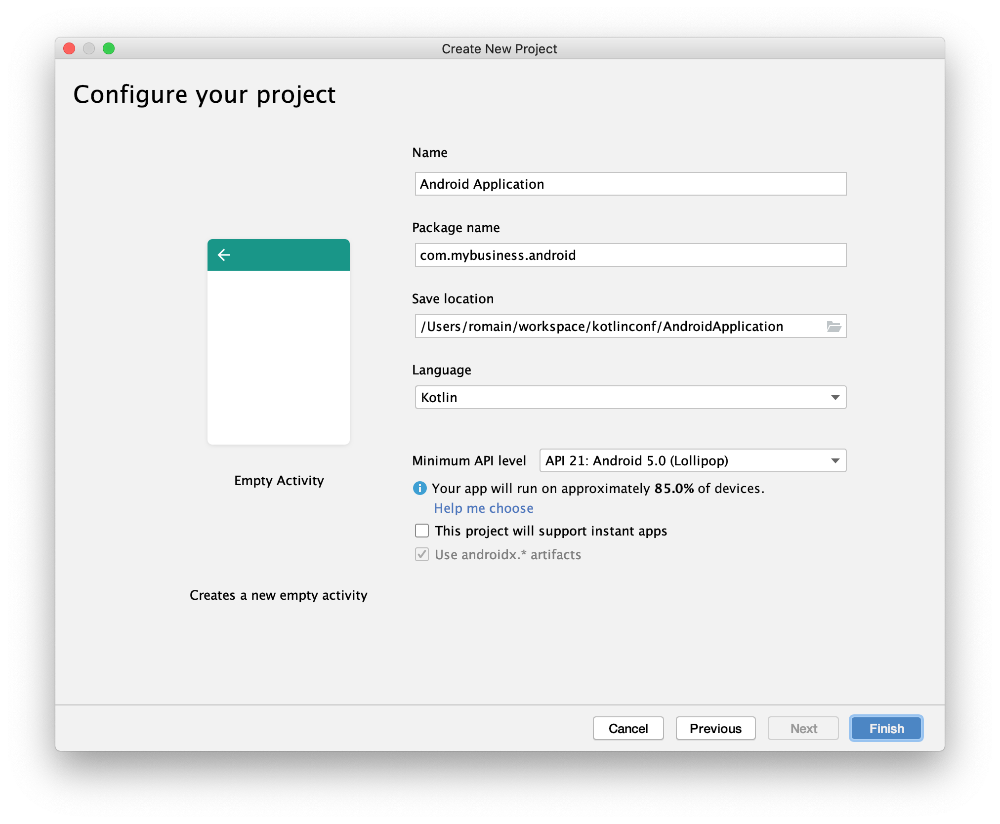
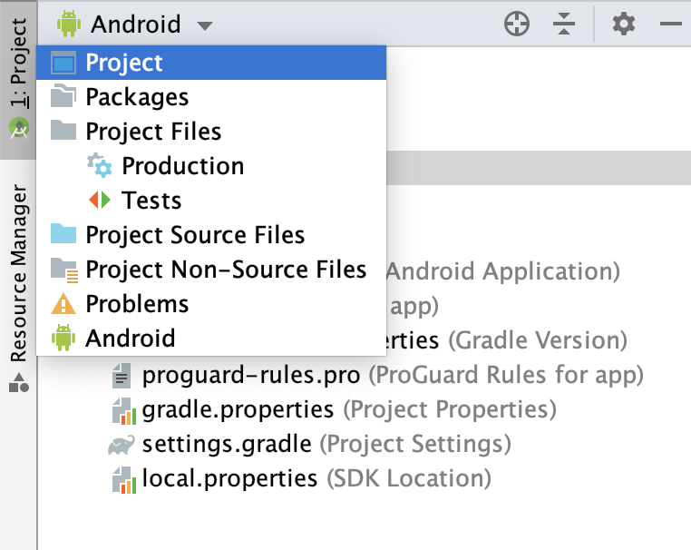
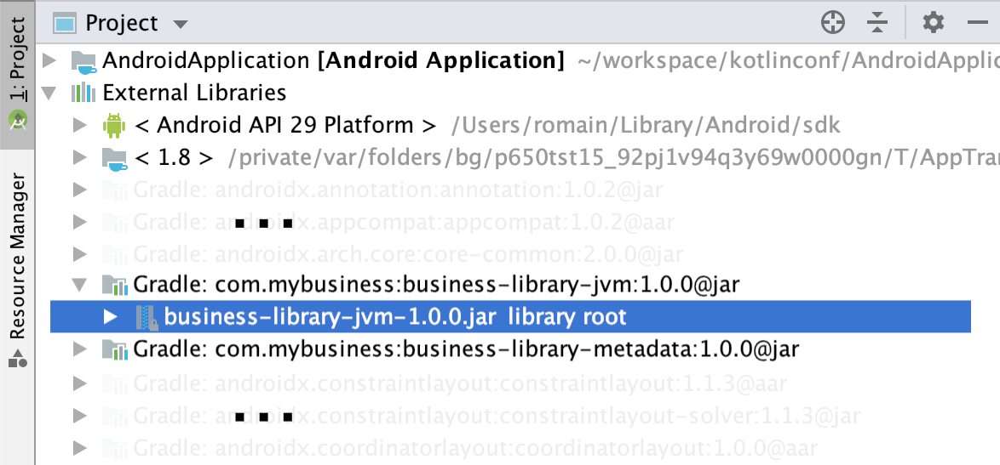
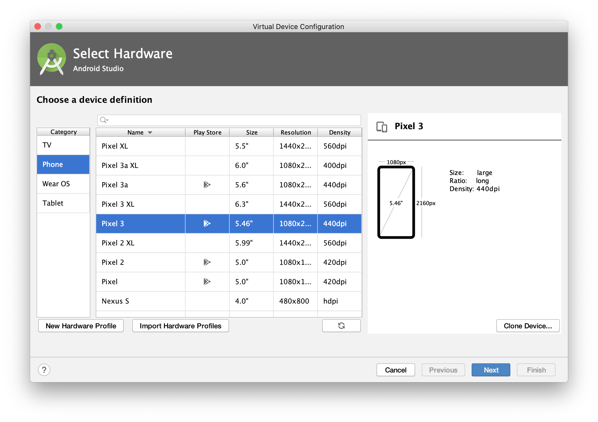
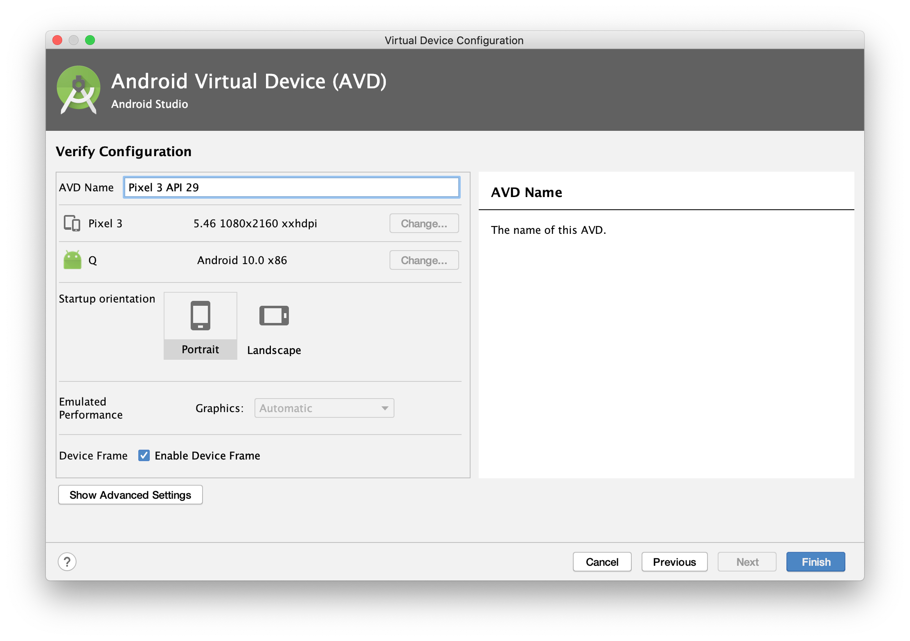

=  Using you Kotlin multi-platform library on Android
Salomon BRYS & Romain BOISSELLE
:toc:
:icons: font

We will start by the simplest way to use a Kotlin multi-platform library.
The first target of Kotlin was the *JVM*, thus its the easiest integration, so we will be using our library on *_Android_*.

== Project Creation Wizard

By now you should have installed https://developer.android.com/studio[Android Studio].
Open it and create a new project:

image:res/4-1.png[creation wizard,600]

Choose a project template: *Empty Activity*.

image:res/4-2.png[project template,600]

Then, set the application details

- package name: `com.mybusiness.android`
- uet your project location
- choose Kotlin as the language
- set the minimum API level: `API 21: Android 5.0`

Click the *Finish* button, you now have an empty *_Android_* application, with one screen, ready to display a `Hello World!`.
Before running our app we will change the configuration and the code to integrate our Kotlin multi-platform library.

== Gradle configuration

You can see that there are two files named `build.gradle`:

- one for the project build configuration
- one for the *_Android_* application build configuration

We will focus on the second one: `build.gradle (Module: app)`

WARNING: *_Android Studio_* generates the `build.gradle` files, in Groovy, not Kotlin.

The generated file `build.gradle` is made of three parts:

. The *plugins* needed to build an Android application with Kotlin
+
[source,groovy]
----
apply plugin: 'com.android.application'
apply plugin: 'kotlin-android'
apply plugin: 'kotlin-android-extensions'
----

. The *android configuration*, under `android{ ... }`
+
This is the Gradle configuration to build any Android application defining
which SDK to use to build the app,
which minimum API version the app should be compatible with, etc.

. The *dependencies*, under `dependencies { ... }`
+
This part contains the definition of all the libraries that we will use to develop our application.
This is where we will bound the application with our Kotlin multi-platform library.
+
Remember, in the previous step we have built and published our library on *_Maven Local_*,
thus we need to add *_Maven Local_* to the Gradle configuration.
+
.app > build.gradle > repositories
[source,groovy]
----
repositories {
    mavenLocal()
}
----
+
Then, add the following dependency to your `build.gradle` into the `app` module
+
.app > build.gradle > dependencies
[source,groovy]
----

dependencies {
    // implementations
    ...
    implementation 'com.mybusiness:business-library-jvm:1.0.0'
    ...
    // testImplementation
    // androidTestImplementation
}
----
+
[cols="^,^,^"]
|=======
| dependency group | dependency name | version
| `com.mybusiness` | `business-library-jvm` | `1.0.0`
|=======
+
---
+
By default, your project view is set to *Android*, but you can change it to be on a *Project* view
+

+
Then, you should see your Kotlin multi-platform library as an external dependency:
+

// TODO NOTE: Metadata

== Using your Kotlin multi-platform library

Now that we are ready to use our library we need to prepare our main application activity.

[IMPORTANT]
====
There are some build issues when using Kotlin multi-platform libraries in an *_Android_* project.

If you get this kind of errors while building your application

    > More than one file was found with OS independent path ‘META-INF/business-library.kotlin_module’

You will need to exclude `kotlin_module` files in your `build.gradle`:

.app > build.gradle > android
[source,groovy]
----
android {
    ...
    packagingOptions {
        exclude 'META-INF/*.kotlin_module'
    }
    ...
}
----
====

=== The generated project

The template used to generate our current project has created an *Empty Activity*, with two files:

- an _XML_ file (`res/layout/activity_main.xml`) defining the view and the components that will be displayed on the screen

.res/layout/activity_main.xml
[source,xml]
----
<?xml version="1.0" encoding="utf-8"?>
<androidx.constraintlayout.widget.ConstraintLayout xmlns:android="http://schemas.android.com/apk/res/android"
    xmlns:app="http://schemas.android.com/apk/res-auto"
    xmlns:tools="http://schemas.android.com/tools"
    android:layout_width="match_parent"
    android:layout_height="match_parent"
    tools:context=".MainActivity">

    <TextView
        android:layout_width="wrap_content"
        android:layout_height="wrap_content"
        app:layout_constraintBottom_toBottomOf="parent"
        app:layout_constraintLeft_toLeftOf="parent"
        app:layout_constraintRight_toRightOf="parent"
        app:layout_constraintTop_toTopOf="parent" />

</androidx.constraintlayout.widget.ConstraintLayout>
----

- a _Kotlin_ file (`com.mybusiness.android.MainActivity.kt`) defining the code behind the scene,
where we write the actions that will be applied on the displayed screen

.com.mybusiness.android.MainActivity
[source,kotlin]
----
class MainActivity : AppCompatActivity() {
    override fun onCreate(savedInstanceState: Bundle?) {
        super.onCreate(savedInstanceState)
        setContentView(R.layout.activity_main)
    }
}
----

=== Modifying the code

What we want is to display in the `TextView` the message from `sayHelloKotlinConf()` in our Kotlin multi-platform library.

First, we need to change the `TextView` in the _XML_ file

.res/layout/activity_main.xml
[source,xml]
----
    ...
    <TextView
        android:id="@+id/mainTextView" <1>
        android:layout_width="wrap_content"
        android:layout_height="wrap_content"
        android:textSize="40sp" <2>
        android:textAlignment="center" <3>
        app:layout_constraintBottom_toBottomOf="parent"
        app:layout_constraintLeft_toLeftOf="parent"
        app:layout_constraintRight_toRightOf="parent"
        app:layout_constraintTop_toTopOf="parent" />
    ...
----
<1> Give a unique ID to the `TextView` to be able to call it from our Kotlin code
<2> Set the text to a bigger size
<3> Center the text on the screen

Then, we need to change the Kotlin code to display our message in the `TextView`

.com.mybusiness.android.MainActivity
[source,kotlin]
----
import com.mybusiness.sayHelloKotlinConf <1>

class MainActivity : AppCompatActivity() {
    override fun onCreate(savedInstanceState: Bundle?) {
        super.onCreate(savedInstanceState)
        setContentView(R.layout.activity_main)

        mainTextView.text = sayHelloKotlinConf() <2>
    }
}
----
<1> import the Kotlin multi-platform library package (can be done automatically by *_Android Studio_*)
<2> set the text of the `TextView` with the function `sayHelloKotlinConf()` from our Kotlin multi-platform library

[NOTE]
====
The `TextView` can be called in the code behind because:

- we explicitly named it in the _XML_ with `android:id="@+id/mainTextView"`
- we ,or auto import, added `import kotlinx.android.synthetic.main.activity_main.*`
====

== Run the application in an Android Simulator

To run and test your application locally you need to configure an _Android Virtual Device_.

=== Android Virtual Device Manager

If you don't have any configured device like in the following screenshot

image:res/4-6.png[device configuration,640]

Open the *Android Virtual Device Manager* in the *No devices* dropdown

image:res/4-7.png[device configuration dropdown,240]

image:res/4-8.png[device wizard,480]
Click on *+ Create a Virtual Device...*

Select a targeted hardware (here the *_Google Pixel 3_*)

image:res/4-10.png[select software,480]
Select the targeted Android version (here *_Android 10_*)

NOTE: if you don't have the SDK already, click on *Download*.

Click *Finish* and close the *AVD Manager*

=== Run the application

image:res/4-12.png[run the app, 480]
Run the application by clicking on 

An Android simulator will open with the following screen:

image:res/4-13.png[final result,360]

Here we go ! We can see, displayed on the screen:

- the common message: `Hello KotlinConf, Kotlin/Multiplatform is awesome! We are running on`
- the *JVM* specific message: `JVM`

== What's next ?
In the next step we will see how to do the same with *_XCode_* for the *_iOS_* platform.