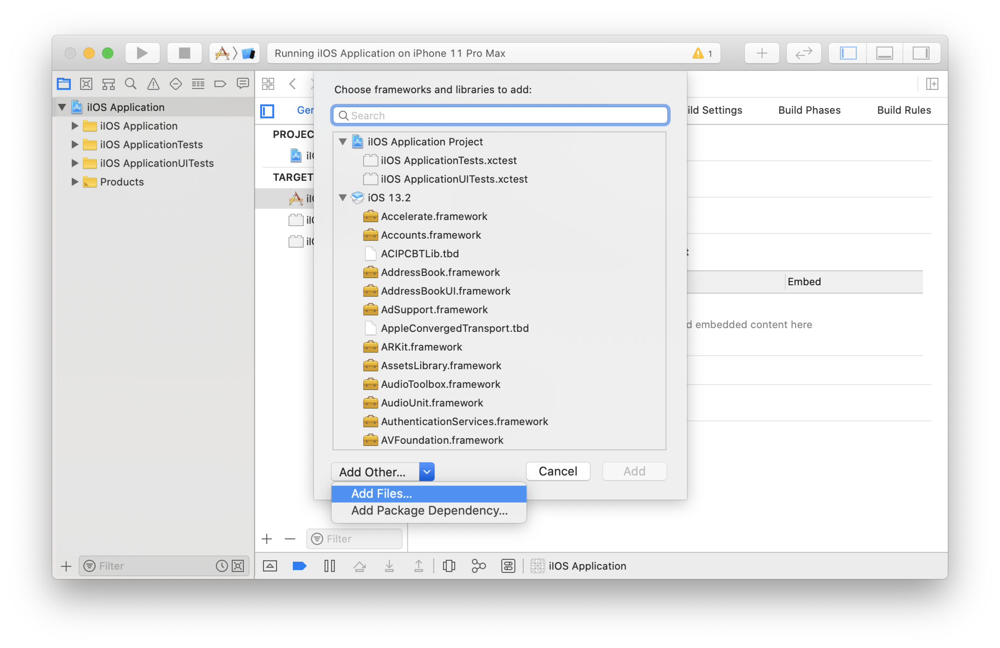
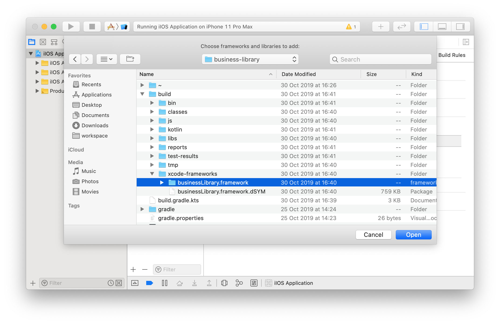
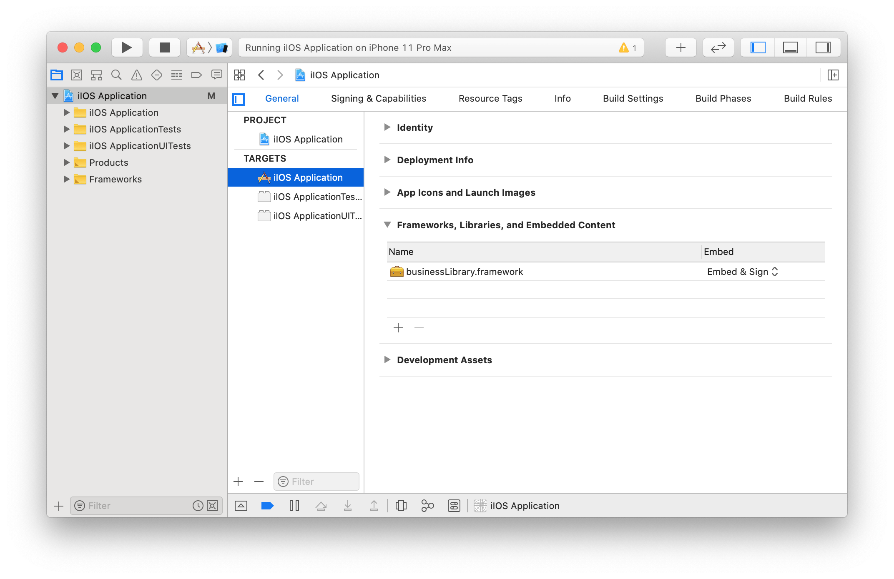
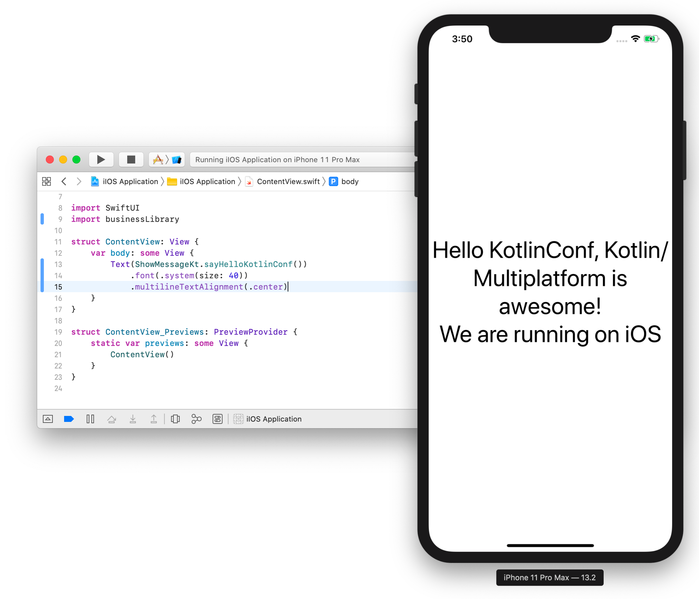

= Using your Kotlin multi-platform library on iOS
Salomon BRYS & Romain BOISSELLE
:toc:
:icons: font

Now that we have a working *_Android_* application, we will try, and succeed, to use our Kotlin multi-platform library on *_iOS_*.

IMPORTANT: You will be able to fulfill this part only if you have a MacOS computer.
           Otherwise, consider either following up with your neighbor, or skipping this chapter.

== Project Creation Wizard

By now you should have installed https://developer.apple.com/xcode/[Xcode].
Open it and create a new project:

[cols="65%,<.^35%a",grid="none",frame="none"]
|===
|image:res/5-1.png[create project]
|*Create a new Xcode project* ...
|image:res/5-2.png[project template]
|Choose the project template:

*Single View App*
|image:res/5-3.png[project details]
|Enter the details of your application:

- Product Name: `iOS Application`
- Organization identifier: `com.mybusiness.ios`
- Language: *_Swift_*
- User Interface: *_SwiftUI_*

|image:res/5-4.png[project location]
|Choose the location of your *_iOS_* project
|image:res/5-5.png[generated project]
|Check the good configuration by clicking on image:res/run-ios.png[run ios,32] to run the app
|===

Your *_Xcode_* environment is ready!

== Adding your Kotlin multi-platform library to Xcode

Remember, while we were building our Kotlin multi-platform library, we added a build step named `packForXcode`.
This task should have built and published the `framework` needed by *_Xcode_* to consume our library with *_iOS_* in a specific directory.

.Kotlin multi-platform library build directory.
image:res/3-8.png[build directory]

To be able to use your newly generated `framework` you need to get you *_Xcode_* instance, and manually add it to the configuration.

[cols="65%,<.^35%a",grid="none",frame="none"]
|===
|image:res/5-6.png[project settings]
|Open your project settings, on the *General* tab. Then, in *Framework, Libraries and Embedded Content* click the `+` button
|
|We need to find our `framework`, so click on *Add Other...*, then *Add Files...*
|
|Browse to your `framework` and click *Open*
|
|You now see your `framework`, added to the configuration
|===

Right now, if you try to build your application, it will fail. You also need to tell to *_Xcode_* where to look for the `framework`.

[grid="none",frame="none"]
|===
|Open your project settings, on the *Build Settings* tab, with the filters *All* and *Combined* activated.

Then find the *Search Paths* section
|image:res/5-10.png[project build settings]
|Add the directory that contains your built `framework` to *Framework Search Paths*.
|image:res/5-11.png[add search path]
|===

Now that we have configured our project we will be able to use our Kotlin multi-platform library in Swift.

== Using your Kotlin multi-platform library in Swift

=== Modifying the code

By using *_SwiftUI_* we do not need to change the view through an *_XML_*, or whatever view configuration files *_Xcode_* can work with.

Here we will only change one file, `ContentView.swift` to import our common code, and display our specific message to the screen.

[NOTE]
====
.Reminder

In our Kotlin multi-platform library we have defined the iOS target to be built as a `framework` named *_businessLibrary_*
[source,kotlin]
.build.gradle.kts
----
kotlin {
    iosX64 {
        binaries {
            framework {
                baseName = "businessLibrary"
            }
        }
    }
}
----
====

.iOS Application > ContentView.swift
[source,swift]
----
import SwiftUI
import businessLibrary //<1>

struct ContentView: View {
    var body: some View {
        Text(ShowMessageKt.sayHelloKotlinConf()) //<2>
            .font(.system(size: 40))
            .multilineTextAlignment(.center)
    }
}
----
<1> import the Kotlin multi-platform library package named as *_businessLibrary_*.
<2> call the `sayHelloKotlinConf()` function defined in the `ShowMessageKt` class.

=== Running the app

NOTE: Contrary to *Android Studio* there is no need to manually configure an *_iOS_* simulator.
      *Xcode* already provides simulators.

Run the *_iOS_* application by clicking on the image:res/run-ios.png[run ios, 32] button.

Here we are ! We can see, displayed on the screen:

- the common message: `Hello KotlinConf, Kotlin/Multiplatform is awesome!`
- the *_iOS_* specific message: `We are running on iOS`

== What's next ?
In the next step we will see how to use our Kotlin multi-platform library on the Web, with *_Kotlin/JS_*.
