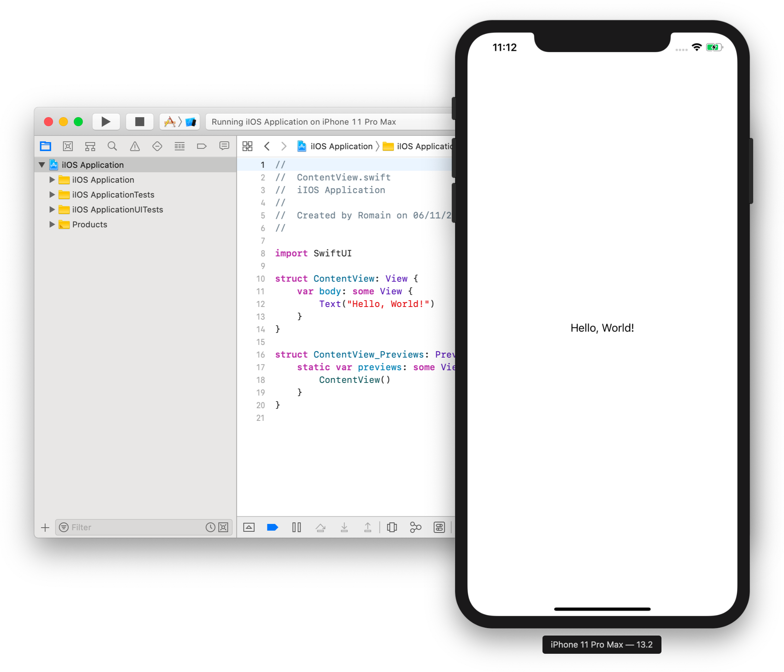
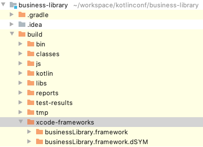

= Using your Kotlin multi-platform library on iOS
Salomon BRYS & Romain BOISSELLE
:toc:
:icons: font

Now that we have a working *_Android_* application, we will try, and succeed, the use of our Kotlin multi-platform library on *_iOS_*.

IMPORTANT: You'll be able to fulfill this part only if you have a MacOS computer. Otherwise, consider following up with your neighbor :)

== Project Creation Wizard

By now you should have installed https://developer.apple.com/xcode/[Xcode].
Open it and create a new project:

[cols="65%,<.^35%a",grid="none",frame="none"]
|===
|image:res/5-1.png[create project]
|*Create a new Xcode project* ...
|image:res/5-2.png[project template]
|Choose the project template:

*Single View App*
|image:res/5-3.png[project details]
|Enter the details of your application:

- Product Name: `iOS Application`
- Organization identifier: `com.mybusiness.ios`
- Language: *_Swift_*
- User Interface: *_SwiftUI_*

|image:res/5-4.png[project location]
|Choose the location of your *_iOS_* project
|
|Check the good configuration by clicking on image:res/run-ios.png[run ios,32] to run the app
|===

Your *_Xcode_* environment is ready!

== Adding your Kotlin multi-platform library to Xcode

Remember, while we were building our Kotlin multi-platform library, we added a build step named `packForXcode`.
This task should have built and published the `framework` needed by *_Xcode_* to consume our library with *_iOS_* in a specific directory.

.Kotlin multi-platform library build directory.

