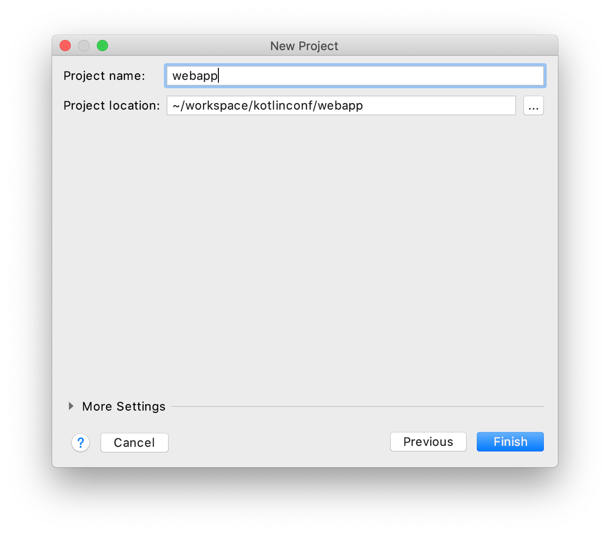
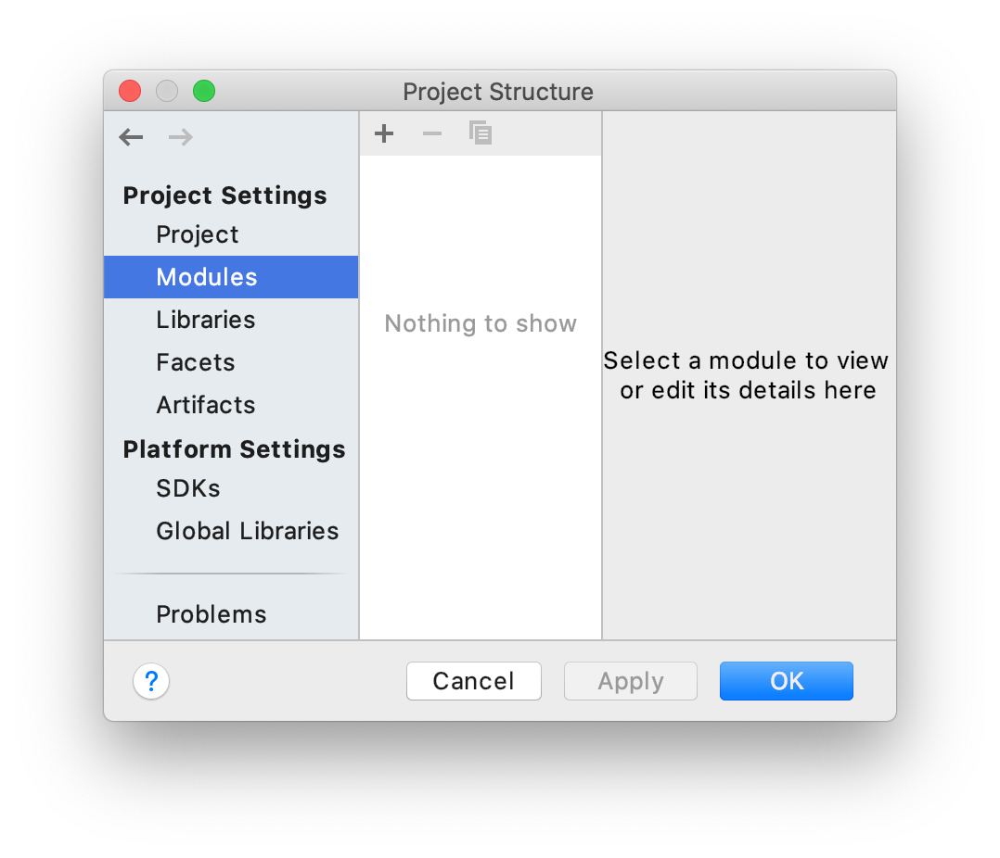
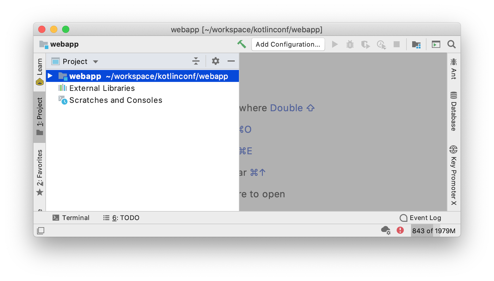
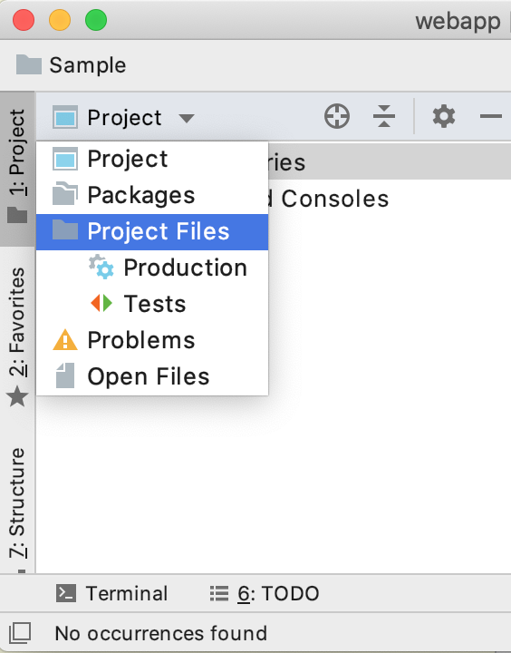
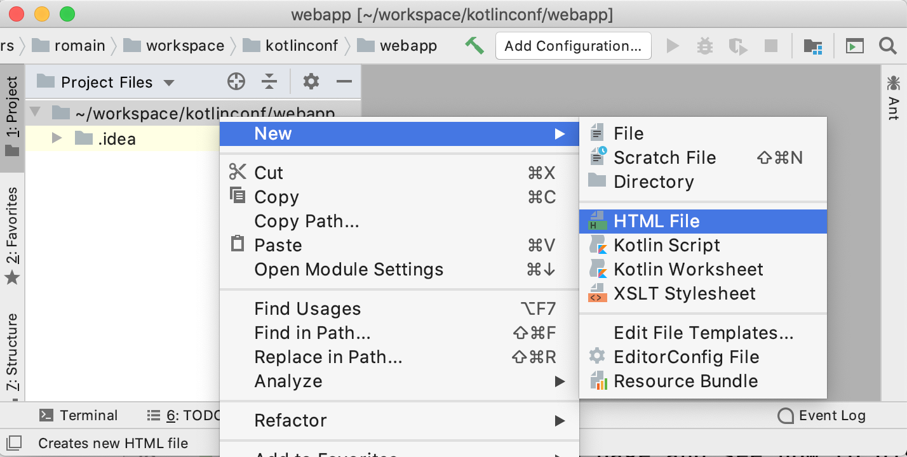
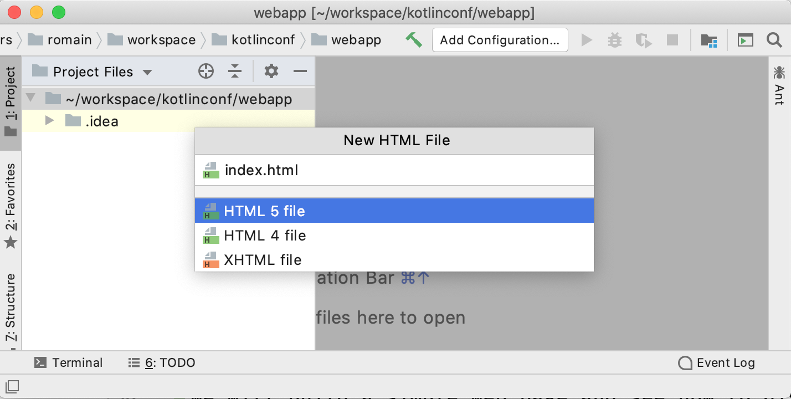
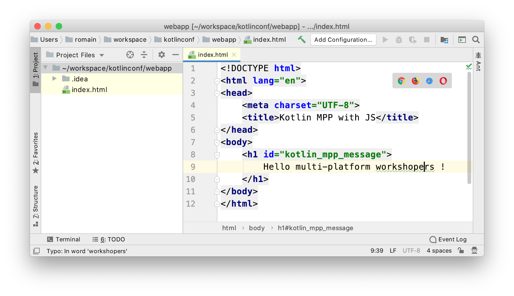
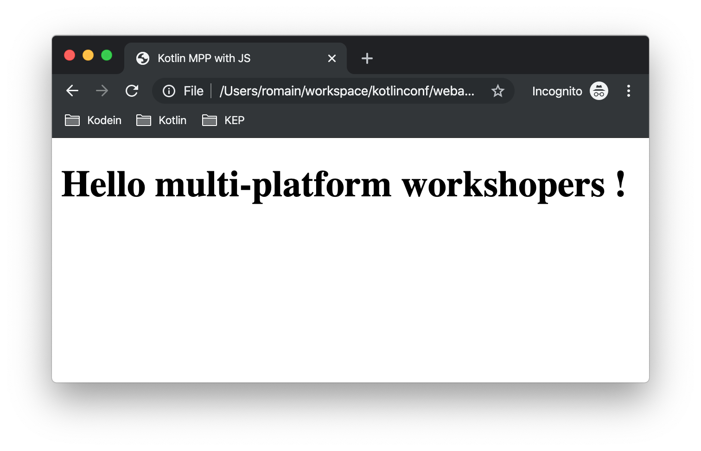

= Using you multi-platform library on the Web
Salomon BRYS & Romain BOISSELLE
:toc:
:icons: font

Finally, after running our Kotlin multi-platform library on *_Android_* and *_iOS_*, we only have to make it work on the Web.
To do so, we will create a simple *_JavaScript_* project.

== Project Creation Wizard

For the simplicity of this workshop, we will use *_IntelliJ Community/Ultimate_* to create our project.

NOTE: The IntelliJ Ultimate Edition have more facilities to create project, so we will see both usage.

[cols="^50%a,^50%a",grid="none",frame="none"]
|===
|_Community Edition_
|_Ultimate Edition_
|image:res/6-1.png[create project community edition]
|image:res/6-2.png[create project ultimate edition]
|Create a new _Empty Project_
|Create a new _Static Web_ project
|===

[cols="^65%,<.^35%a",grid="none",frame="none"]
|===
|
|Set name and location for your project
|_Community Edition_
|
|
|_Press the *OK* button to create an empty project_
|===

Then, you will have a shiny project ready to build your web application :).

[cols="^50%a,^50%a",grid="none",frame="none"]
|===
|_Community Edition_
|_Ultimate Edition_
|image:res/6-5.png[project community edition]
|
|
[NOTE]
====
You should switch from *Project* view to *Project Files* view by using the above menu

====
|
|===

//NOTE: From here, everything will be the same, that you are using IntelliJ Community or Ultimate.

== Running a simple web page

Before reaching our goal to use Kotlin multi-platform code with *_JavaScript_*,
we will build a simple web page and see how to display it into our browser.

To do so, we will create a new HTML file in our project, and add some HTML to it.

[cols="^65%,<.^35%a",grid="none",frame="none"]
|===
|
|*Right-click* on the project/path, then click on *New* > *HTML File*
|
|Name your file: *index.html*
|===

Finally, add the following code to your *index.html*

.index.html
[source,html]
----
<!DOCTYPE html>
<html lang="en">
<head>
    <meta charset="UTF-8">
    <title>Kotlin MPP with JS</title>
</head>
<body>
    <h1 id="kotlin_mpp_message">
        Hello multi-platform workshopers!
    </h1>
</body>
</html>
----

[cols="^65%,<.^35%a",grid="none",frame="none"]
|===
|
|
Run the page in a browser by clicking on the tooltip bar
in the top right corner of the editor image:res/6-11.png[tooltip,100]
|===

Now we can see our web page.

== Integrating your Kotlin multi-platform library

=== Add the JavaScript modules

Remember, in the Kotlin multi-platform library chapter we have built our project to generate binaries for all our targets, including *_JavaScript_*.
If you go back to this project, and browse the `/build` directory you will find a `js` sub-directory.

[cols="^35%,<.^65%a",grid="none",frame="none"]
|===
|image:res/6-13.png[build js]
|
The files that will get our attention are `business-library.js` and `kotlin.js`.

* `kotiln.js` contains the JS part of the Kotlin standard library
* `business-library.js` is our Kotlin multi-platform library, that rely on `kotlin.js`

So, we will need to import both modules in our project.
|===

To import the libraries into our project we can use the command line to copy them, depending on where you have set your projects locations.

* On Linux / MacOS, open a terminal.
+
.Create a `/libraries` directory for your project.
[source,shell script]
----
mkdir workspace/kotlinconf/webapp/libraries
----
+
.Copy the `kotlin.js` file.
[source,shell script]
----
cp workspace/kotlinconf/business-library/build/js/packages_imported/kotlin/1.3.50/kotlin.js workspace/kotlinconf/webapp/libraries
----
+
.Copy the `business-library.js` file.
[source,shell script]
----
cp workspace/kotlinconf/business-library/build/js/packages/business-library/kotlin/business-library.js workspace/kotlinconf/webapp/libraries
----
* On Windows, open a terminal.
+
.Create a `/libraries` directory for your project.
[source,shell script]
----
mkdir C:\workspace\kotlinconf\webapp\libraries
----
+
.Copy the `kotlin.js` file.
[source,shell script]
----
copy C:\workspace\kotlinconf\business-library\build\js\packages_imported\kotlin\1.3.50\kotlin.js C:\workspace\kotlinconf\webapp\libraries
----
+
.Copy the `business-library.js` file.
[source,shell script]
----
copy C:\workspace\kotlinconf\business-library\build\js\packages\business-library\kotlin\business-library.js C:\workspace\kotlinconf\webapp\libraries
----

You should now see the libraries in your project hierarchy.

image:res/6-14.png[project hierarchy,300]

=== Use your Kotlin multi-platform code

