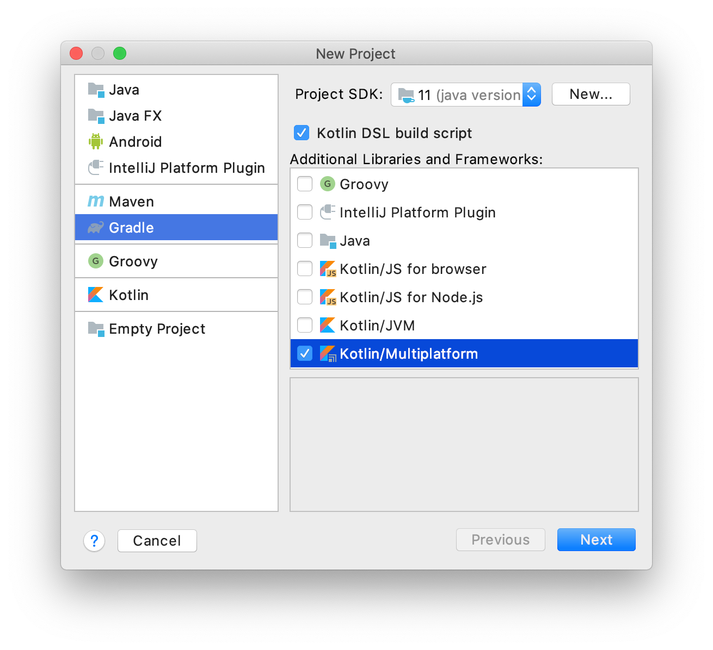
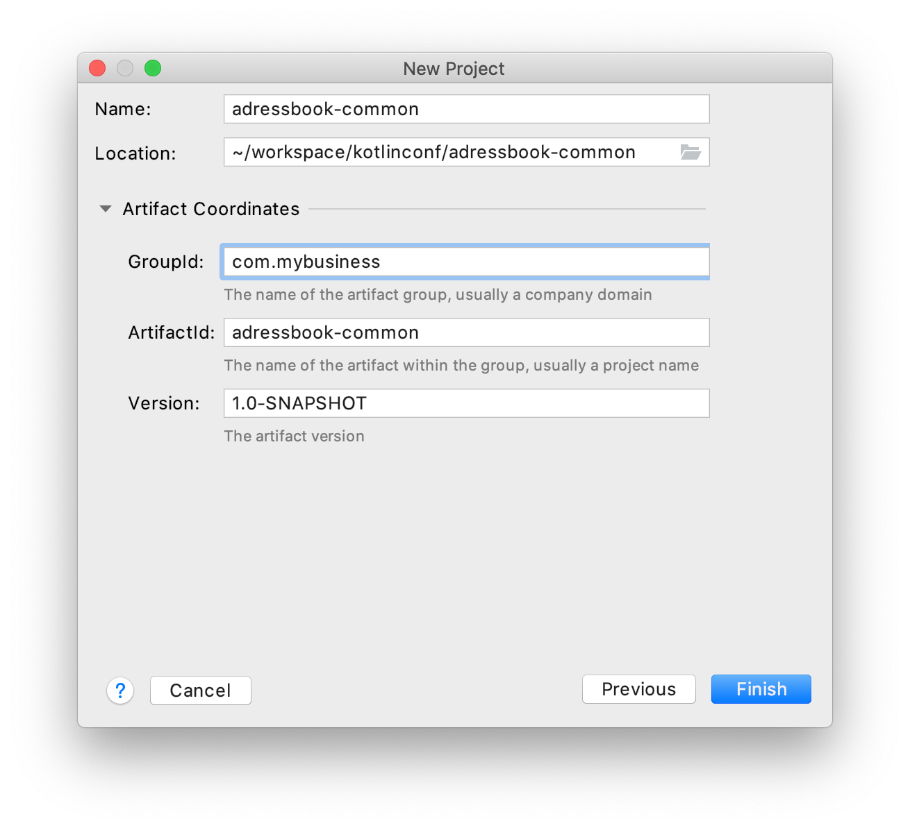
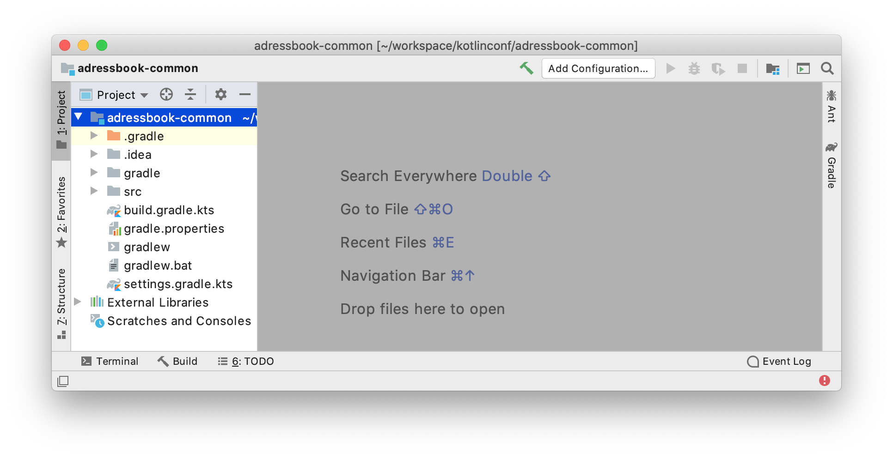
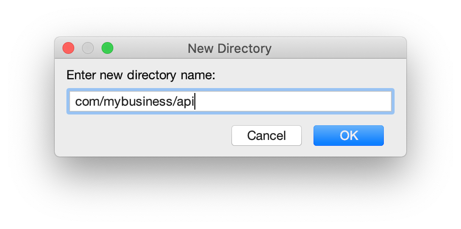

= Address book - Building the common library
:toc:
:icons: font

As in the first part of this workshop, we will start by building our common library.
This one will be more complete, as we would like it to handle as much logic as possible.

Thus, after creating the project, we will put in it the following parts:

- The Gradle configuration for every targets (_JVM_ for *_Android_*, _Native_ for *_iOS_* and *_JavaScript_*).
- The business domain objects
- The backend API interfaces
- The MVP pattern, to handle API calls and view updates.

Each of those steps will be defined in the common code, and shared between every targeted platforms!

== Project creation

Open IntelliJ IDEA and create a new project:

[cols="65%,<.^35%a",grid="none",frame="none"]
|===
|
|*Create a new Gradle project*
|
|
*Fulfill your project's details:*

- Name: `addressbook-common`
- Group ID: `com.mybusiness`
- Artifact ID: `addressbook-common`
|
|*Your project is ready!*
|===

[IMPORTANT]
====
To avoid any misconfiguration issue you should change the Gradle Wrapper's properties right now.

Go the the newly created file `gradle-wrapper.properties` under `/addressbook-common/gradle/wrapper/`
and change the property `distributionUrl` with the value `https\://services.gradle.org/distributions/gradle-5.6.1-bin.zip`

.gradle-wrapper.properties
[source,properties]
----
distributionBase=GRADLE_USER_HOME
distributionPath=wrapper/dists
distributionUrl=https\://services.gradle.org/distributions/gradle-5.6.1-bin.zip
zipStoreBase=GRADLE_USER_HOME
zipStorePath=wrapper/dists
----

The Gradle wrapper should upgrade itself within the next Gradle action.
====

== Gradle configuration

Now, we will take some time to explain the gradle configuration, as it is the heavy part of Kotlin multi-platform projects.

=== Plugins configuration

As we saw earlier, we will need multiple Gradle plugins to achieve our Kotlin multi-platform project.

We already saw that in order to create a Kotlin multi-platform project we have to use the plugin `org.jetbrains.kotlin.multiplatform`.

Plus, our multi-platform application will need to call a backend API, thus should be able to serialize and de-serialize data.
So, we also have to use *Kotlinx.Serialization* with the `serialization` plugin.

Finally, as in the previous exercise, we will need the `maven-publish` plugin to be able to publish locally our library.

NOTE: Note that we won't cover how to deploy binaries for *Native* or *_JavaScript_* targets.

==== Enabling the `GRADLE_METADATA` feature

Before configuring our plugins, we will add some configuration to be able to depends on `Kotlin/Native` libraries.

[WARNING]
====
If, in your directory hierarchy, you have a file named `settings.gradle`, it should be renamed as `settings.gradle.kts``

To do so, either *right-click* on the file, then click on *Refactor* > *Rename...*, or use the keyboard shortcut *Shift+F6*.

Inside the file `settings.gradle.kts`, replace:

`rootProject.name = 'addressbook-common'` by `rootProject.name = "addressbook-common"`

Simple quote are from _Groovy_.
====

Go to the `settings.gradle.kts` file and add the following lines:

.settings.gradle.kts
[source,kotlin]
----
enableFeaturePreview("GRADLE_METADATA")
----

Now, go to the `build.gradle.kts` file and replace the `plugins` and `repositories` sections by the following lines:

.build.gradle.kts
[source,kotlin]
----
plugins {
    kotlin("multiplatform") version "1.3.61" // <1>
    kotlin("plugin.serialization") version "1.3.61" // <2>
    `maven-publish`
}

group = "com.mybusiness"
version = "1.0.0-SNAPSHOT"

repositories {
    jcenter()
    maven(url = "https://kotlin.bintray.com/kotlinx") // <3>
    maven(url = "https://dl.bintray.com/jetbrains/kotlin-native-dependencies") // <4>
}
----
<1> Using the *Kotlin/Multiplatform* plugin
<2> Using the *Kotlinx.Serialization* plugin
<3> Needed to resolve Kotlinx dependencies (e.g. Coroutines & Serialization)
<4> Needed to resolve Native dependencies

=== Targets configuration

As before, we will target the three environments that are the *_JVM_*, *_iOS_* and the *_Web_*.

Open the `build.gradle.kts` file and add the following code into the `kotlin` block:

.build.gradle.kts
[source,kotlin]
----
kotlin {
    jvm("android") { // <1>
        val main by compilations.getting {
            kotlinOptions {
                jvmTarget = "1.8"
            }
        }
    }

    iosX64("ios") { // <2>
        binaries {
            framework { // <3>
                baseName = "AddressBookCommon" // <4>
            }
        }
    }

    js { browser() } // <5>
}
----
<1> Sets the *_JVM_* target, named *android* as we will build an *_Android_* afterwards.
<2> Sets the *_iOS_* target, named *ios* to simplify usage of the target
<3> Defines that the output binaries for *_iOS_*, must be a *_framework_* file...
<4> ...with the name `AddressBookCommon`
<5> Sets the *_JavaScript_* target, packaged for a browser usage.

[NOTE]
====
*_Android_* is running on a JVM, so it's just a JVM target. As we could have different JVM targets we can specify it,
and as we know for sure that we want to target *_Android_*, we will name it in the target declaration *android*.
====

=== Source sets and dependencies

In this section we will define all the dependencies needed for our Kotlin multi-platform common code.

There are three main dependencies that we will need to develop and use the Kotlin multi-platform library:

* *Ktor client*
+
Like for our backend API, we will use *Ktor* to empower our HTTP calls on the client side.
We will have to use multiple implementations to be able to make some HTTP calls, as:
+
- an HTTP engine (_OkHttp_ for *_Android_* / _NSURLSession_ for *_iOS_* / _Fetch_ for *_JavaScript_*)
- a JSON implementation to be able to serialize and de-serialize the requests/responses payloads.
- a serialization interface to render JSON into domain objects (using *Kotlinx.Serialization*)

* *Kotlinx.Serialization*
+
To serialize and de-serialize our HTTP calls content, we will use a Kotlin multi-platform library, develop by JetBrains, *Kotlinx.Serialization*.

* *Kotlinx.Coroutines*
+
As *Ktor* is an asynchronous framework, and it is based on coroutines, we need to use coroutines context to wrap our HTTP calls.

To avoid code redundancy, we will prepare some shortcuts to declare the dependencies:

.build.gradle.kts - source sets code block
[source,kotlin]
----
kotlin {
// ...
        sourceSets {
        // Versions
        val ktorVersion = "1.2.6"
        val coroutinesVersion = "1.3.2"
        val serializationVersion = "0.14.0"
        // Shortcuts
        fun kotlinx(module: String, version: String)
            = "org.jetbrains.kotlinx:kotlinx-$module:$version" // <1>
        fun coroutines(module: String = "")
            = kotlinx("coroutines-core$module", coroutinesVersion) // <2>
        fun serialization(module: String = "")
            = kotlinx("serialization-runtime$module", serializationVersion) // <3>
        fun ktorClient(module: String, version: String
            = ktorVersion) = "io.ktor:ktor-client-$module:$version" // <4>
    }
}
----
<1> Builds the dependency name for any *kotlinx* module with its version
<2> Builds the dependency name for any *coroutines-core* module
<3> Builds the dependency name for any *serialization-runtime* module
<4> Builds the dependency name for any *ktor-client* module

==== *_Common_*

In this part, we will declare the transverse dependencies for all of our targeted platforms.

Add the following lines to the `build.gradle.kts` file, in the `kotlin > sourceSets` block:

.build.gradle.kts
[source,kotlin]
----
kotlin {
// ...
        sourceSets {
        // ...
        val commonMain by getting {
            dependencies {
                // Kotlin
                implementation(kotlin("stdlib-common")) // <1>
                // Kotlinx
                implementation(coroutines("-common")) // <2>
                implementation(serialization("-common")) // <3>
                // Ktor client
                implementation(ktorClient("core")) // <4>
                implementation(ktorClient("json")) // <5>
                implementation(ktorClient("serialization")) // <6>
            }
        }
        // ...
    }
}
----
<1> Kotlin Standard Library for Kotlin multi-platform common projects.
<2> Kotlinx.Coroutines API for Kotlin multi-platform common library.
<3> Kotlinx.Serialization API for Kotlin multi-platform common library.
<4> Common API to use Ktor client on Kotlin multi-platform projects.
<5> Common API to use Json Serializers on Kotlin multi-platform projects.
<6> Common API to use Kotlinx.Serialization with Ktor client on Kotlin multi-platform projects.

==== Targeted platforms

Now that we have defined our common dependencies, we need to define the dependencies for each targeted platforms of our Kotlin multi-platform library.

In fact, in our case, it is very simple as each platforms need to import the corresponding implementation of each API dependencies defined in the common module.

Add the following lines to the `build.gradle.kts` file, in the `kotlin > sourceSets` block:

.build.gradle.kts
[source,kotlin]
----
kotlin {
// ...
        sourceSets {
        // ...
         val androidMain by getting {
            dependencies {
                // Kotlin
                implementation(kotlin("stdlib")) // <1>
                // Kotlinx
                implementation(coroutines()) // <2>
                implementation(serialization()) // <3>
                // Ktor client
                implementation(ktorClient("core-jvm")) // <4>
                implementation(ktorClient("json-jvm")) // <5>
                implementation(ktorClient("serialization-jvm")) // <6>
                implementation(ktorClient("okhttp")) // <7>
            }
        }

         val iosMain by getting {
            dependencies {
                // Kotlinx
                implementation(coroutines("-native")) // <2>
                implementation(serialization("-native")) // <3>
                // Ktor client
                implementation(ktorClient("core-native")) // <4>
                implementation(ktorClient("json-native")) // <5>
                implementation(ktorClient("serialization-native")) // <6>
                implementation(ktorClient("ios")) // <7>
            }
        }

         val jsMain by getting {
            dependencies {
                // Kotlin
                implementation(kotlin("stdlib-js")) // <1>
                // Kotlinx
                implementation(coroutines("-js")) // <2>
                implementation(serialization("-js")) // <3>
                // Ktor client
                implementation(ktorClient("core-js")) // <4>
                implementation(ktorClient("json-js")) // <5>
                implementation(ktorClient("serialization-js")) // <6>
                implementation(ktorClient("js")) // <7>
            }
        }
        // ...
    }
}
----
<1> Kotlin Standard Library for the target.
<2> Kotlinx.Coroutines implementation for the target.
<3> Kotlinx.Serialization implementation for the target.
<4> Implementation of Ktor client for the target.
<5> Implementation of Json Serializers for the target.
<6> Implementation of Kotlinx.Serialization with Ktor client for the target.
<7> Specific HTTP client engine for the target, used by Ktor for making HTTP calls.

[NOTE]
====
Remember:

* the names of the source sets depends on the targets, thus
- `android` target will have the source sets `androidMain` and `andrdoidTest`.
- `ios` target will have the source sets `iosMain` and `iosTest`.
- `js` target will have the source sets `jsMain` and `jsTest`.
* we do not need to declare the Kotlin Standard Library for native project, as it is included by the native compiler.
====

==== The iOS special case

Building libraries for *_iOS_* is also a special case in our build script.
In fact, to be able to use our common library in *_Xcode_*, we need to build a *_framework_* file.

To obtain this *_framework_* file, add the following block at the end of your Gradle build file:

.build.gradle.kts
[source,kotlin]
----
//...
val packForXcode by tasks.creating(Sync::class) { //<1>
    val mode = System.getenv("CONFIGURATION") ?: "DEBUG" //<2>
    val framework = kotlin.targets
        .getByName<org.jetbrains.kotlin.gradle.plugin.mpp.KotlinNativeTarget>("ios")
        .binaries.getFramework(mode)
    inputs.property("mode", mode)

    dependsOn(framework.linkTask) //<3>

    val targetDir = File(buildDir, "xcode-frameworks")
    from({ framework.outputDirectory }) //<4>
    into(targetDir) //<5>
}

tasks.getByName("assemble").dependsOn(packForXcode) //<6>
----
<1> Creates a new task to make the framework available for *_Xcode_*
<2> Selects the right configuration depending on the environment variables set by Xcode build
<3> The new task depends on the fact that the framework has been built
<4> Moves the built framework from the build directory...
<5> ...to a new location (could/should be a remote path)
<6> Sets the `packForXcode` task as part of the `build` task

Let's keep the configuration aside and start coding :)

== Defining the domain objects

First thing, we will create the domain objects needed to manage an *Address Book*.
Here is a class diagram of our data model:

// TODO use graphviz
image:res/8-4.png[class diagram,350]

Those data classes will be used to send/receive data to/from the backend API.
To be able to do so, we should defined them as serializable, using *Kotlinx.Serialization*.

In `commonMain/kotlin`, create the package `com.mybusiness.model` and the Kotlin source file `Contact.kt`:

image:res/8-5.png[source directory structure,300]

[TIP]
====
[cols="40%,<.^60%a",grid="none",frame="none"]
|===
|image:res/8-6.png[new directory]
|At the moment, if you want to create a package, you need to manually create the directory structure.
|===
====

Then add the following data classes with the right import.

.Contact.kt
[source,kotlin]
----
import kotlinx.serialization.Serializable

@Serializable // <1>
data class Contact(
    val id: String,
    val name: Name,
    val addresses: List<Address> = mutableListOf(),
    val phones: List<Phone> = mutableListOf()
) {
    val fullName: String
        get() = "${name.lastName} ${name.firstName}"
}

@Serializable // <1>
data class Name(
    val firstName: String,
    val lastName: String
)

@Serializable // <1>
data class Address(
    val type: Type,
    val street: String,
    val postalCode: String,
    val city: String,
    val country: String
) {
    enum class Type(val displayedName: String) { HOME("HOME"), WORK("WORK"), OTHER("OTHER") }
}

@Serializable // <1>
data class Phone(
    val type: Type,
    val number: String
) {
    enum class Type(val displayedName: String) { HOME("HOME"), WORK("WORK"), MOBILE("MOBILE"), OTHER("OTHER") }
}
----
<1> Makes the data classes serializable

WARNING: the collections must be initialized, otherwise you could get some serialization exceptions.

== Reaching the backend API

NOTE: In this section you will learn how to use the *Ktor client* API and how to serialize and de-serialize data with *Kotlinx.Serialization*.

Now that our data model is ready, we can implement the interface between the client and the backend API to retrieve data.

Let's start by creating a new package `api` and a Kotlin source file `ContactApi`, still in `commonMain/kotlin`:

image:res/8-7.png[source directory structure,300]

[TIP]
====
[cols="40%,<.^60%a",grid="none",frame="none"]
|===
|
|To create a package aside of an existing one, you need to create it with its full path
|===
====

=== Creating the HTTP client

First, to reach our API we have to declare an HTTP client:

.ContactApi.kt
[source,kotlin]
----
const val LOCALHOST = "127.0.0.1" // <1>
expect fun apiBaseUrl(): String // <2>

class ContactApi {
    private val client = HttpClient { // <3>
        install(JsonFeature) { // <4>
            serializer = KotlinxSerializer() // <5>
        }
    }
}
----
<1> Declares a constant for the API host IP (localhost, as our backend API is running on our local machine)
<2> An `expect` function will help define specific host IP (e.g. Android Simulator reach the local machine through `10.0.2.2`)
<3> Creates the *Ktor* HTTP client.
<4> Defines that the HTTP client will work with JSON.
<5> Register *Kotlinx.Serialization* to serialize and de-serialize JSON

TIP: Every import in `ContactApi.kt` should come from `io.ktor.client` or `kotlinx.serialization``

==== `apiBaseUrl()` actual implementation

We have defined an `expect` function in our code,
thus we must define an `actual` behaviors foreach targeted platforms to be able to compile our project.

For each targets, create a kotlin source file named `[ContactApi][platform].kt`, and add the right implementation for `apiBaseUrl()`.

.androidMain > kotlin > com.mybusiness.api/ContactApiAndroid.kt
[source,kotlin]
----
actual fun apiBaseUrl(): String = "10.0.2.2" // <1>
----
<1> On an *_Android_* emulator `127.0.0.1` refers to the device itself.
To access your actual machine you need to use `10.0.2.2`

.iosMain > kotlin > com.mybusiness.api/ContactApiIos.kt
[source,kotlin]
----
actual fun apiBaseUrl() = LOCALHOST // <1>
----
<1> No special case here, your machine can be reached on `127.0.0.1`

.jsMain > kotlin > com.mybusiness.api/ContactApiJs.kt
[source,kotlin]
----
actual fun apiBaseUrl() = LOCALHOST // <1>
----
<1> No special case here, your machine can be reached on `127.0.0.1`

=== Creating the APIs interfaces

Before writing our interfaces to reach each endpoints of the backend API,
we will declare an _extension function_ to wrap the API url definition.

.ContactApi.kt
[source,kotlin]
----
class ContactApi {
  //...
  private fun HttpRequestBuilder.apiUrl(path: String = "/") {
        url {
            host = apiBaseUrl() // <1>
            port = 8042 // <2>
            protocol = URLProtocol.HTTP
            encodedPath = "/api/contacts$path" // <3>
        }
    }
}
----
<1> Calling the `expect` function to get the right IP address to reach the backend API
<2> Port of our backend API
<3> Dynamic endpoint path, starting from "/api/contacts"

==== GET - Retrieve the contacts from the backend API

If you remember the previous section, we have ran a *Ktor* server. This server defines 4 endpoints:

- _GET_ `/api/contacts`: Retrieves a list of all the contacts
- _GET_ `/api/contacts/{id}`: Retrieves a contact, identified by its `id`
- _PUT_ `/api/contacts`: Creates a new contact
- _POST_ `/api/contacts/{id}`: Updates a contact, identified by its `id`

So, we will provide interfaces for each one of those 4 endpoints, thus we will see how to send/receive data classes through an HTTP client.

===== Get a list of contacts

Let's start with the simplest case, retrieving a list of `Contact`. Create a `getAllContacts` function that returns a `List<Contact>`.
As the *Ktor* `HttpClient` works asynchronously with Kotlin coroutines, we need to define our function as ``suspend``able.

.ContactApi.kt
[source,kotlin]
----
class ContactApi {
    //...
    suspend fun getAllContacts(): List<Contact> { // <1>
        return Json.nonstrict.parse( // <2>
            Contact.serializer().list, // <3>
            client.get { // <4>
                apiUrl() // <5>
            }
        )
    }
}
----
<1> Defines a `suspend` function that returns a `List<Contact>`.
<2> Uses the `Json.nonstrict.parse` function from *Kotlinx.Serialization* to transfrom Json to `Contact` data class.
<3> Register the serializer generated on `Contact` by the `kotlinx.serialization` plugin.
<4> Calls the backend API...
<5> ...on the path `/api/contacts/`

===== Get a specific contact by its `id`

Getting the list of all the contacts available on the backend just gives us the `id`, `firstname` and `lastname` of the contacts.
So, we should be able to get the detailed information for a contact giving its `id`.

.ContactApi.kt
[source,kotlin]
----
class ContactApi {
  //...
  suspend fun getContactById(contactId: String): Contact { // <1>
        return Json.nonstrict.parse( // <2>
            Contact.serializer(), // <3>
            client.get { // <4>
                apiUrl("/$contactId") // <5>
            }
        )
    }
}
----
<1> Defines a `suspend` function that wait for a `String` as parameter and returns a `Contact`.
<2> Uses the `Json.nonstrict.parse` function from *Kotlinx.Serialization* to transfrom Json to `Contact` data class.
<3> Register the serializer generated on `Contact` by the `kotlinx.serialization` plugin.
<4> Calls the backend API...
<5> ...on the path `/api/contacts/{id}`, by passing the `contactId` received by the current function.

==== PUT - Create a contact on the backend API

Now that we can retrieve data from the backend API, we should be able to create some contacts.
The backend API as an endpoint for that. We have to call the path `/api/contacts/` on the HTTP verb _PUT_,
with a body containing a `Contact` transformed into JSON.

Here is how to do it:

.ContactApi.kt
[source,kotlin]
----
class ContactApi {
    //...
    suspend fun putContact(contact: Contact): String { // <1>
        return Json.nonstrict.parse( // <2>
            (StringSerializer to StringSerializer).map, // <3>
            client.put { // <4>
                apiUrl() // <5>
                method = HttpMethod.Put // <6>
                body = TextContent(Json.stringify(Contact.serializer(), contact), // <7>
                    contentType = ContentType.Application.Json)
            }
        ).values.first()
    }
}
----
<1> Defines a `suspend` function that wait for a `Contact` as parameter and returns a `String`.
<2> Uses the `Json.nonstrict.parse` function from *Kotlinx.Serialization* to transfrom Json to a `Map<String, String>`.
<3> Register an existing serializer from *Kotlinx.Serialization* to get a `Map<String, String>`.
<4> Calls the backend API...
<5> ... on the path `/api/contacts/`...
<6> ... with the HTTP verb _PUT_.
<7> Sets the `contact` in the body of the HTTP Request, using the serializer generated on `Contact` by the `kotlinx.serialization` plugin.

==== POST - Update a contact on the backend API

Finally, we have to be able to update an existing contact on the backend. Of course, their is an endpoint for that too.
We can update a contact by calling the bakend API on `/api/contacts/{id}`,
where `id` is a dynamic parameter that depends on the contact that we want to update.
Plus, we must pass the new data of the `Contact` to update, in a JSON shape.

Here is how to do it:

.ContactApi.kt
[source,kotlin]
----
class ContactApi {
    //...
    suspend fun postContact(contact: Contact): Boolean { // <1>
        val response = client.call { // <2>
            apiUrl("/${contact.id}") // <3>
            method = HttpMethod.Post // <4>
            body = TextContent(Json.stringify(Contact.serializer(), contact), // <5>
                contentType = ContentType.Application.Json)
        }.response // <6>

        return response.status == HttpStatusCode.OK
    }
}
----
<1> Defines a `suspend` function that wait for a `Contact` as parameter and returns a `String`.
<2> Declares a HTTP client call
<3> Sets the URL for the client call to `/api/contacts/{id}`, by passing the `Contact::id`, from the `Contact` received by the current function.
<4> Sets the HTTP verb to be used as _POST_.
<5> Sets the `contact` in the body of the HTTP Request, using the serializer generated on `Contact` by the `kotlinx.serialization` plugin.
<6> Trigger the HTTP request and wait for the response.