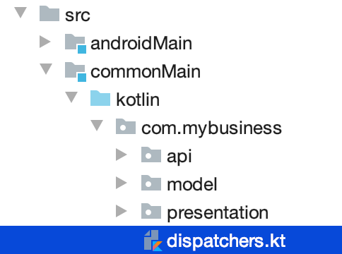

= Address book - Building the common library
:toc:
:icons: font

As in the first part of this workshop, we will start by building our common library.
This one will be more complete, as we would like it to handle as much logic as possible.

Thus, after creating the project, we will put in it the following parts:

- The Gradle configuration for every targeted platform (_JVM_ for *_Android_*, _Native_ for *_iOS_* and *_JavaScript_*).
- The business domain objects
- The backend API interfaces
- The MVP pattern, to handle API calls and view updates.

Each of those steps will be defined in the common code, and shared between every targeted platform!

== Project creation

Open IntelliJ IDEA and create a new project:

[cols="65%,<.^35%a",grid="none",frame="none"]
|===
|image:res/8-1.png[create project]
|*Create a new Gradle project*
|image:res/8-2.png[project details]
|
*Fulfill your project details:*

- Name: `addressbook-common`
- Group ID: `com.mybusiness`
- Artifact ID: `addressbook-common`
|image:res/8-3.png[project ready]
|*Your project is ready!*
|===

[IMPORTANT]
====
To avoid any misconfiguration issues you should change the Gradle Wrapper properties right now.

Go the the newly created file `gradle-wrapper.properties` under `/addressbook-common/gradle/wrapper/`
and change the property `distributionUrl` with the value `https\://services.gradle.org/distributions/gradle-5.6.1-bin.zip`

.gradle-wrapper.properties
[source,properties]
----
distributionBase=GRADLE_USER_HOME
distributionPath=wrapper/dists
distributionUrl=https\://services.gradle.org/distributions/gradle-5.6.1-bin.zip
zipStoreBase=GRADLE_USER_HOME
zipStorePath=wrapper/dists
----

The Gradle wrapper should upgrade itself within the next Gradle action.
====

== Gradle configuration

Now, we will take some time to explain the gradle configuration, as it is the heavy part of Kotlin multi-platform projects.
Also, we will see a new way to define Gradle plugins.

=== Plugins

As we saw earlier, we will need multiple Gradle plugins to achieve our Kotlin multi-platform project.

We already saw that in order to create a Kotlin multi-platform project we have to use the plugin `org.jetbrains.kotlin.multiplatform`.

Our multi-platform application will need to call a backend API, thus should be able to serialize and de-serialize data.
So, we also have to use *Kotlinx.Serialization* with the `serialization` plugin.

Finally, as in the previous exercise, we will need the `maven-publish` plugin to be able to publish locally our library.

NOTE: Note that we won't cover how to deploy binaries for *Native* or *_JavaScript_* targets.

==== Plugin management

Before configuring our plugins, we will configure the plugin management that will allow us to define plugins,
without taking care of the version, or where should Gradle get the plugins while using them.

Go to the `settings.gradle.kts` file and add the following lines:

.settings.gradle.kts
[source,kotlin]
----
val kotlinVersion = "1.3.50" // <1>

pluginManagement {
    resolutionStrategy {
        eachPlugin {
            when (requested.id.id) {
                "org.jetbrains.kotlin.multiplatform"
                  -> useModule("org.jetbrains.kotlin:kotlin-gradle-plugin:$kotlinVersion") // <2>
                "org.jetbrains.kotlin.plugin.serialization"
                  -> useModule("org.jetbrains.kotlin:kotlin-serialization:$kotlinVersion") // <3>
            }
        }
    }
}

enableFeaturePreview("GRADLE_METADATA") // <4>
----
<1> Set the targeted Kotlin version for your project.
<2> While using the Kotlin `multiplatform` plugin, say where to get it
<3> While using the Kotlin `serialization` plugin, say where to get it
<4> Enables the `GRADLE_METADATA` feature, to be able to depends on `Kotlin/Native` libraries

Now, go to the `build.gradle.kts` file and replace the `plugins` and `repositories` sections by the following lines:

.build.gradle.kts
[source,kotlin]
----
plugins {
    id("org.jetbrains.kotlin.multiplatform") // <1>
    id("org.jetbrains.kotlin.plugin.serialization") // <2>
    `maven-publish`
}

group = "com.mybusiness"
version = "1.0-SNAPSHOT"

repositories {
    jcenter()
    maven(url = "https://kotlin.bintray.com/kotlinx") // <3>
    maven(url = "https://dl.bintray.com/jetbrains/kotlin-native-dependencies") // <4>
}
----
<1> Use the *Kotlin/Multiplatform* plugin
<2> Use the *Kotlinx.Serialization* plugin
<3> Needed to resolve Kotlinx dependencies (e.g. Coroutines & Serialization)
<4> Needed to resolve Native dependencies

=== Targets

As before, we will target the 3 environments that are the *_JVM_*, *_iOS_* and the *_Web_*.

Open the `build.gradle.kts` file and add the following code into the `kotlin` block:

.build.gradle.kts
[source,kotlin]
----
kotlin {
    jvm("android") // <1>

    //select iOS target platform depending on the Xcode environment variables
    val iOSTarget: (String, org.jetbrains.kotlin.gradle.plugin.mpp.KotlinNativeTarget.() -> Unit)
            -> org.jetbrains.kotlin.gradle.plugin.mpp.KotlinNativeTarget =
        if (System.getenv("SDK_NAME")?.startsWith("iphoneos") == true)
            ::iosArm64
        else
            ::iosX64

    iOSTarget("ios") { // <2>
        binaries {
            framework { // <3>
                baseName = "AddressBookCommon" // <4>
            }
        }
    }

    js { browser() } // <5>
}
----
<1> Set the *_JVM_* target, named *android* as we will build an *_Android_* afterwards.
<2> Set the *_iOS_* target, named *ios* to simplify usage of the target
<3> Define that the output binaries for *_iOS_*, must be a *_framework_* file...
<4> ...with the name `AddressBookCommon`
<5> Set the *_JavaScript_* target, packaged for a browser usage.

[NOTE]
====
*_Android_* is running on a JVM, so it's just a JVM target. As we could have different JVM target we can specify it,
and as we know for sure that we want to target *_Android_*, we will name it in the target declaration *android*.

TIP: Since Kotlin 1.3.60, there is new targets for *_Android_* native.
====

NOTE: *_iOS_* can have multiple target, depending on your Xcode environment. Here `iosArm64` is for *iphonesimulator*.

=== Source sets and dependencies

In this section we will define all de dependencies needed for our Kotlin multi-platform common code.

There are 3 main dependencies that we will need to develop and use the Kotlin multi-platform library:

* *Ktor client*
+
Like for our backend API, we will use *Ktor* to empower our HTTP calls on the client side.
We will have to use multiple implementations to be able to make some HTTP calls, as:
+
- an HTTP engine (_Apache_ for the *_JVM_* / _NSURLSession_ for the *_iOS_* / _Fetch_ for the *_JavaScript_*)
- a JSON implementation to be able to serialize and de-serialize the requests/responses payloads.
- a serialization interface to render JSON into domain objects (using *Kotlinx.Serialization*)

* *Kotlinx.Serialization*
+
To serialize and de-serialize our HTTP calls content, we will use a Kotlin multi-platform library, develop by JetBrains, *Kotlinx.Serialization*.

* *Kotlinx.Coroutines*
+
As *Ktor* is an asynchronous framework, and it is based on coroutines, we need to use coroutines context to wrap our HTTP calls.

To avoid code redondance. we will prepare some shortcuts to declare the dependencies:

.build.gradle.kts - source sets code block
[source,kotlin]
----
kotlin {
// ...
        sourceSets {
        // Versions
        val ktorVersion = "1.2.5"
        val coroutinesVersion = "1.3.2"
        val serializationVersion = "0.13.0"
        // Shortcuts
        fun kotlinx(module: String, version: String)
            = "org.jetbrains.kotlinx:kotlinx-$module:$version" // <1>
        fun coroutines(module: String = "")
            = kotlinx("coroutines-core$module", coroutinesVersion) // <2>
        fun serialization(module: String = "")
            = kotlinx("serialization-runtime$module", serializationVersion) // <3>
        fun ktorClient(module: String, version: String
            = ktorVersion) = "io.ktor:ktor-client-$module:$version" // <4>
    }
}
----
<1> Build the dependency name for any *kotlinx* module with its version
<2> Build the dependency name for any *coroutines-core* module
<3> Build the dependency name for any *serialization-runtime* module
<4> Build the dependency name for any *ktor-client* module

==== *_Common_*

In this part, we will declare the transverse dependencies for all of our targeted platforms.

Add the following lines to the `build.gradle.kts` file, in the `kotlin > sourceSets` block:

.build.gradle.kts
[source,kotlin]
----
kotlin {
// ...
        sourceSets {
        // ...
        val commonMain by getting {
            dependencies {
                // Kotlin
                implementation(kotlin("stdlib-common")) // <1>
                // Kotlinx
                implementation(coroutines("-common")) // <2>
                implementation(serialization("-common")) // <3>
                // Ktor client
                implementation(ktorClient("core")) // <4>
                implementation(ktorClient("json")) // <5>
                implementation(ktorClient("serialization")) // <6>
            }
        }
        // ...
    }
}
----
<1> Kotlin Standard Library for Kotlin multi-platform common projects.
<2> Kotlinx.Coroutines API for Kotlin multi-platform common library.
<3> Kotlinx.Serialization API for Kotlin multi-platform common library.
<4> Common API to use Ktor client on Kotlin multi-platform projects.
<5> Common API to use Json Serializers on Kotlin multi-platform projects.
<6> Common API to use Kotlinx.Serialization with Ktor client on Kotlin multi-platform projects.

==== Targeted platform

Now that we have defined our common dependencies, we need to define the dependencies for each targeted platform of our Kotlin multi-platform library.

In fact, in our case, it is very simple as each platform need to import the corresponding implementation of each API dependencies defined in the common module.

Add the following lines to the `build.gradle.kts` file, in the `kotlin > sourceSets` block:

.build.gradle.kts
[source,kotlin]
----
kotlin {
// ...
        sourceSets {
        // ...
         val androidMain by getting {
            dependencies {
                // Kotlin
                implementation(kotlin("stdlib")) // <1>
                // Kotlinx
                implementation(coroutines()) // <2>
                implementation(serialization()) // <3>
                // Ktor client
                implementation(ktorClient("core-jvm")) // <4>
                implementation(ktorClient("json-jvm")) // <5>
                implementation(ktorClient("serialization-jvm")) // <6>
                implementation(ktorClient("apache")) // <7>
            }
        }

         val iosMain by getting {
            dependencies {
                // Kotlinx
                implementation(coroutines("-native")) // <2>
                implementation(serialization("-native")) // <3>
                // Ktor client
                implementation(ktorClient("core-native")) // <4>
                implementation(ktorClient("json-native")) // <5>
                implementation(ktorClient("serialization-native")) // <6>
                implementation(ktorClient("ios")) // <7>
            }
        }

         val jsMain by getting {
            dependencies {
                // Kotlin
                implementation(kotlin("stdlib-js")) // <1>
                // Kotlinx
                implementation(coroutines("-js")) // <2>
                implementation(serialization("-js")) // <3>
                // Ktor client
                implementation(ktorClient("core-js")) // <4>
                implementation(ktorClient("json-js")) // <5>
                implementation(ktorClient("serialization-js")) // <6>
                implementation(ktorClient("js")) // <7>
            }
        }
        // ...
    }
}
----
<1> Kotlin Standard Library for the targeted platform.
<2> Kotlinx.Coroutines implementation for the targeted platform.
<3> Kotlinx.Serialization implementation for the targeted platform.
<4> Implementation of Ktor client for the targeted platform.
<5> Implementation of Json Serializers for the targeted platform.
<6> Implementation of Kotlinx.Serialization with Ktor client for the targeted platform.
<7> Specific HTTP client engine for the targeted platform, used by Ktor for making HTTP calls.

[NOTE]
====
Remember:

* the names of the source sets depends on the targets, thus
- `android` target will have the source sets `androidMain` and `andrdoidTest`.
- `ios` target will have the source sets `iosMain` and `iosTest`.
- `js` target will have the source sets `jsMain` and `jsTest`.
* we do not need to declare the Kotlin Standard Library for native project, as it is included by the native compiler.
====

Let's keep the configuration aside and start coding :)

== Defining the domain objects

First thing, we will create the domain objects needed to manage an address book.
Here is a class diagram of our data model:

// TODO use graphviz
image:res/8-4.png[class diagram,350]

Those data classes will be used to send/receive data to/from the backend API.
To be able to do so, we should defined them as serializable, using *Kotlinx.Serialization*.

In `commonMain/kotlin`, create the package `com.mybusiness.model` and the Kotlin source file `Contact.kt`:

image:res/8-5.png[source directory structure,300]

[TIP]
====
[cols="40%,<.^60%a",grid="none",frame="none"]
|===
|image:res/8-6.png[new directory]
|At the moment, if you want to create a package, you need to manually create the directory structure.
|===
====

Then add the following data classes with the right import.

.Contact.kt
[source,kotlin]
----
import kotlinx.serialization.Serializable

@Serializable // <1>
data class Contact(
    val id: String,
    val name: Name,
    val addresses: List<Address> = mutableListOf(),
    val phones: List<Phone> = mutableListOf()
) {
    val fullName: String
        get() = "${name.lastName} ${name.firstName}"
}

@Serializable // <1>
data class Name(
    val firstName: String,
    val lastName: String
)

@Serializable // <1>
data class Address(
    val type: Type,
    val street: String,
    val postalCode: String,
    val city: String,
    val country: String
) {
    enum class Type { HOME, WORK, OTHER }
}

@Serializable // <1>
data class Phone(
    val type: Type,
    val number: String
) {
    enum class Type { HOME, WORK, MOBILE, OTHER }
}
----
<1> Make the data classes serializable

WARNING: the collections must be initialized, otherwise you could get some serialization exceptions.

== Reaching the backend API

NOTE: In this section you will learn how to use the *Ktor client* API and how to serialize and de-serialize data with *Kotlinx.Serialization*.

Now that our data model is ready, we can implement the interface between the client and the backend API to retrieve data.

Let's start by creating a new package `api` and a Kotlin source file `ContactApi`, still in `commonMain/kotlin`:

image:res/8-7.png[source directory structure,300]

[TIP]
====
[cols="40%,<.^60%a",grid="none",frame="none"]
|===
|image:res/8-8.png[new directory]
|To create a package aside of an existing one, you need to create with its full path
|===
====

=== Creating the HTTP client

First, to reach our API we have to declare an HTTP client:

.ContactApi.kt
[source,kotlin]
----
const val LOCALHOST = "127.0.0.1" // <1>
expect fun apiBaseUrl(): String // <2>

class ContactApi {
    private val client = HttpClient { // <3>
        install(JsonFeature) { // <4>
            serializer = KotlinxSerializer() // <5>
        }
    }
}
----
<1> Declare a constant for the API host IP (localhost, as our backend API is running on our local machine)
<2> An `expect` function will help define specific host IP (e.g. Android Simulator reach the local machine through `10.0.2.2`)
<3> Create the *Ktor* HTTP client.
<4> Define that the HTTP client will work with JSON.
<5> Register *Kotlinx.Serialization* to serialize and de-serialize JSON

TIP: Every import in `ContactApi.kt` should come from `io.ktor.client` or `kotlinx.serialization``

=== Creating the APIs interfaces

Before writing our interfaces to reach each endpoints on the backend API,
we will declare an Extension Function to wrap the API url definition.

.ContactApi.kt
[source,kotlin]
----
class ContactApi {
  //...
  private fun HttpRequestBuilder.apiUrl(path: String = "/") {
        url {
            host = apiBaseUrl() // <1>
            port = 8042 // <2>
            protocol = URLProtocol.HTTP
            encodedPath = "/api/contacts$path" // <3>
        }
    }
}
----
<1> Calling the `expect` function to get the right IP address to reach the backend API
<2> Port of our backend API
<3> Dynamic endpoint path, starting from "/api/contacts"

==== GET - Retrieve the contacts from the backend API

If you remember the previous section, we have ran a *Ktor* server. This server defines 4 endpoints:

- _GET_ `/api/contacts`: Retrieve a list of all the contacts
- _GET_ `/api/contacts/{id}`: Retrieve a contact, identified by its Id
- _PUT_ `/api/contacts`: Create a new contact
- _POST_ `/api/contacts/{id}`: Update a contact, identified by its Id

So, we will provide interfaces for each one of those 4 endpoints, thus we will see how to send/receive data classes through an HTTP client.

===== Get a list of contacts

Let's start with the simplest case, retrieving a list of `Contact`. Create a `getAllContacts` function that returns a `List<Contact>`.
As the *Ktor* `HttpClient` works asynchronously with Kotlin coroutines, we need to define our function as ``suspend``able.

.ContactApi.kt
[source,kotlin]
----
class ContactApi {
    //...
    suspend fun getAllContacts(): List<Contact> { // <1>
        return Json.parse( // <2>
            Contact.serializer().list, // <3>
            client.get { // <4>
                apiUrl() // <5>
            }
        )
    }
}
----
<1> Define a `suspend` function that returns a `List<Contact>`.
<2> Use the `Json.parse` function from *Kotlinx.Serialization* to transfrom Json to `Contact` data class.
<3> Register the serializer generated on `Contact` by the `kotlinx.serialization` plugin.
<4> Call the backend API...
<5>... on the path `/api/contacts/`.

===== Get a specific contact by its Id

Getting the list of all the contacts available on the backend just give us the `id`, `firstname` and `lastname` of the contacts.
So, we should be able to get the detailed information for a contact giving its `id`.

.ContactApi.kt
[source,kotlin]
----
class ContactApi {
  //...
  suspend fun getContactById(contactId: String): Contact { // <1>
        return Json.parse( // <2>
            Contact.serializer(), // <3>
            client.get { // <4>
                apiUrl("/$contactId") // <5>
            }
        )
    }
}
----
<1> Define a `suspend` function that wait for a `String` as parameter and returns a `Contact`.
<2> Use the `Json.parse` function from *Kotlinx.Serialization* to transfrom Json to `Contact` data class.
<3> Register the serializer generated on `Contact` by the `kotlinx.serialization` plugin.
<4> Call the backend API...
<5>... on the path `/api/contacts/{id}`, by passing the `contactId` received by the current function.

==== PUT - Create contacts on the backend API

Now that we can retrieve data from the backend API, we should be able to create some contacts.
The backend API as an endpoint for that. We have to call the path `/api/contacts/` on the HTTP verb _PUT_,
with a body containing a `Contact` transformed into JSON.

Here is how to do it:

.ContactApi.kt
[source,kotlin]
----
class ContactApi {
    //...
    suspend fun putContact(contactEntity: Contact): String { // <1>
        return Json.parse( // <2>
            (StringSerializer to StringSerializer).map, // <3>
            client.put { // <4>
                apiUrl() // <5>
                method = HttpMethod.Put // <6>
                body = TextContent(Json.stringify(Contact.serializer(), contactEntity), // <7>
                    contentType = ContentType.Application.Json)
            }
        ).values.first()
    }
}
----
<1> Define a `suspend` function that wait for a `Contact` as parameter and returns a `String`.
<2> Use the `Json.parse` function from *Kotlinx.Serialization* to transfrom Json to a `Map<String, String>`.
<3> Register an existing serializer from *Kotlinx.Serialization* to get a `Map<String, String>`.
<4> Call the backend API...
<5> ... on the path `/api/contacts/`...
<6> ... with the HTTP verb _PUT_.
<7> Set the `contactEntity` in the body of the HTTP Request, using the serializer generated on `Contact` by the `kotlinx.serialization` plugin.

==== POST - Update contacts on the backend API

Finally, we have to be able to update an existing contact on the backend. Of course, their is an endpoint for that.
We can update a contact by calling the bakend API on `/api/contacts/{id}`,
where `id` is a dynamic parameter that depends on the contact that we want to update.
Plus, we must pass the new data of the `Contact` to update, in a JSON shape.

Here is how to do it:

.ContactApi.kt
[source,kotlin]
----
class ContactApi {
    //...
    suspend fun postContact(contactEntity: Contact): Boolean { // <1>
        val response = client.call { // <2>
            apiUrl("/${contactEntity.id}") // <3>
            method = HttpMethod.Post // <4>
            body = TextContent(Json.stringify(Contact.serializer(), contactEntity), // <5>
                contentType = ContentType.Application.Json)
        }.response // <6>

        return response.status == HttpStatusCode.OK
    }
}
----
<1> Define a `suspend` function that wait for a `Contact` as parameter and returns a `String`.
<2> Declare a HTTP client call
<3> Set the URL for the client call to `/api/contacts/{id}`, by passing the `Contact::id`, from the `Contact` received by the current function.
<4> Set the HTTP verb to be used as _POST_.
<5> Set the `contactEntity` in the body of the HTTP Request, using the serializer generated on `Contact` by the `kotlinx.serialization` plugin.
<6> Trigger the HTTP request and wait for the response.

== Going further with the MVP pattern

Do you remember that we are working on a Kotlin multi-platform project ? Right!

By now, we should be able to use our business logic on every targeted platform, and make some HTTP calls to render our data.
Not so fast! Before that, we will add some more logic in ou Kotlin multi-platform library, with the _MVP pattern_,

=== What is the MVP pattern ?

**M**odel-**V**iew-**P**resenter is a design pattern that help you decouple the business logic from the view of your application.
This can be represented by the following schema:

[cols="^40%,<.^60%a",grid="none",frame="none"]
|===
|image:res/mvp.png[mvp pattern, 250]
|
The *Model* is responsible for carrying the the data model, and how the data are manipulated/read/stored.

The *Presenter* is responsible to:

- access the data from the Model or update them.
- serve the data to the View (generally the UI), and accept interactions from the View

The *View* is an interface that needs to be implemented by the UI classes, that interact with the Presenter to update or get new data.
|===

Well, we can also implement this pattern in our Kotlin multi-platform library to maximize the code sharing for our project.

=== Implementing the MVP pattern

Let's assume that our different applications would have a Master/Detail flow.
The master view would show us a list of contacts, and by clicking on a contact, we will display its details on a new view.

This give us two use cases to implement; One where we will retrieve the list of contacts from the backend API and display it on the main view.
And one where we will retrieve a contact with its details from the backend API, according to its Id, and display it on another view.

Don't forget that we also have to provide a view to create or update an existing contact, and then send the creation/modification to the backend API.
This is our third use case.

==== Architecture for the MVP pattern

Before we implement our different use cases, we have to take a step back, and prepare the architecture of our MVP implementation.
Indeed, without spoiling, we can tell that our different *Presenter*s will certainly have the same shape.

For example, they all have to attach the view at their initialization and detach the view when this one will be destroyed.
Also, they all have to call the backend API in the background, and then update the UI in the main thread of the app.
This where the coroutines step inside our scope. In the same way that presenter needs to be detached from the view while its destroyed,
the coroutine jobs also needs to be cancelled.

That is why we need to define some architectural classes, to make our code clearer and robust.

Let's create a new package `presentation` and a Kotlin source file `base.kt`, still in `commonMain/kotlin`:

image:res/8-9.png[source directory structure,300]

[TIP]
====
[cols="40%,<.^60%a",grid="none",frame="none"]
|===
|image:res/8-10.png[new directory]
|To create a package aside of an existing one, you need to create with its full path
|===
====

First of all we will create a `CoroutineScope` that will be carrying our `CoroutineContext` and the `Job`to run, or cancel if the view is detached.

.base.kt
[source,kotlin]
----
import kotlinx.coroutines.CoroutineScope
import kotlinx.coroutines.Job
import kotlin.coroutines.CoroutineContext

class PresenterCoroutineScope(
    context: CoroutineContext // <1>
) : CoroutineScope { // <2>

    private var cancellableJob = Job() // <3>
    override val coroutineContext: CoroutineContext = context + cancellableJob // <4>

    fun viewDetached() { // <5>
        cancellableJob.cancel()
    }
}
----
<1> Pass as parameter of the constructor a `CoroutineContext` (either background or UI context).
<2> Extend the `CoroutineScope`.
<3> Create a Job, that will be responsible of the execution code, and is cancellable at any time.
<4> _Override_ the `CoroutineContext` by combining the current context and the cancellable job.
<5> If a view is detached from the *Presenter*, call this to cancel the job, and avoid leaks.

Now we can create the base class for any *Presenter* of our project.

.base.kt
[source,kotlin]
----
abstract class BasePresenter<T>(private val coroutineContext: CoroutineContext) { // <1>
    protected var view: T? = null // <2>
    protected lateinit var scope: PresenterCoroutineScope // <3>

    fun attachView(view: T) { // <4>
        this.view = view
        scope = PresenterCoroutineScope(coroutineContext)
    }

    fun detachView() { // <5>
        view = null
        scope.viewDetached()
    }
}
----
<1> `T` represents the type of the *View* that is bind to the *Presenter*
<2> Declare the *View* bind to the *Presenter*. This will be used to send data to the *View* when the *Presenter* needs to send update to the UI.
<3> Declare the `CoroutineScope` that will manage code execution in the background (calling the backend API for example)
<4> Use this to attach the view to the *Presenter* and create the `CoroutineScope`
<5> Use this when you do not need the *View* anymore, avoiding leaks in your application.

For each of the use cases, we have to define two interfaces.
Those interfaces will be the contract that the *View* and the *Presenter* have to respect.
Also, we will create an implementation for each *Presenter*s' contract that will work with the backend API and interact with the *View*.

==== Coroutine contexts definition

Previously, we have defined that our *Presenter* will execute some business logic into a given `CoroutineScope`, to avoid blocking the main thread.
Thus, we should define a coroutine context on which our background processes will be executed, but we should also provide a coroutine context that will allow the *Presenter* to interact with the *View*.

In `commonMain/kotlin`, create a new Kotlin source file `dispatchers.kt`:

In this source file, we will put two dispatchers, one for background work (`ApplicationDispatcher`) and one for UI interaction (`UIDispatcher`).

[IMPORTANT]
====
You may know that coroutines does not work in the same way depending on the platform we are running.
For example, on *_iOS_* every coroutines are running on the main thread. This will be fixed in future version.

However, for that reason our dispatchers will be defined as ``expect``ed properties, and must be explicitly declare for each platform.
====

Open the `dispatchers.kt` file and add the following lines:

.dispatchers.kt
[source,kotlin]
----
import kotlin.coroutines.CoroutineContext

internal expect val ApplicationDispatcher: CoroutineContext // <1>
internal expect val UIDispatcher: CoroutineContext // <2>
----
<1> To execute code in the background of the application.
<2> To execute code in the foreground of the application and interact with the UI.

That's it. You are all set up to implement the MVP pattern for our three use cases.

==== Use case 1: retrieving a list of contacts

In the `presentation` package, create a new Kotlin source file `ContactList.kt`, still in the `commonMain` module:

image:res/8-12.png[source directory structure,300]

* The contract
+
.ContactList.kt
[source,kotlin]
----
class ContactList {
    interface Presenter {
        fun getContactList() // <1>
    }
    interface View {
        fun displayContactList(contactList: List<Contact>) // <2>
    }
}
----
<1> Function called by the *View* to retrieve all the contacts from the backend.
<2> Function called by the *Presenter* when the data are ready to be displayed.

* The presenter implementation
+
.ContactList.kt
[source,kotlin]
----
class ContactListPresenter(
    private val contactApi: ContactApi, // <1>
    coroutineContext: CoroutineContext = ApplicationDispatcher // <2>
) : ContactList.Presenter, BasePresenter<ContactList.View>(coroutineContext) { // <3>
    override fun getContactList() {
        scope.launch { // <4>
            val contactList = contactApi.getAllContacts()
            launch(UIDispatcher) { // <5>
                view?.displayContactList(contactList) // <6>
            }
        }
    }
}
----
<1> To reach the backend API we need a reference of a `ContactApi` instance.
<2> As the `ContactApi` functions are suspendable, we need a coroutine context to execute them.
<3> We implement `ContactList.Presenter` to respect the contract, and extend `BasePresenter`.
<4> Launch a coroutine on `BasePresenter.scope` which runs on the coroutine context `ApplicationDispatcher`.
<5> After executing the API call we launch another coroutine in which we can interact with the UI, using the result of the API call.
<6> Update the UI.

==== Use case 2: getting the detail of a contact

In the `presentation` package, create a new Kotlin source file `ContactDetail.kt`, still in the `commonMain` module:

image:res/8-13.png[source directory structure,300]

* The contract
+
.ContactDetail.kt
[source,kotlin]
----
class ContactDetail {
    interface Presenter {
        fun getContact(contactId: String) // <1>
    }
    interface View {
        fun displayContact(contact: Contact) // <2>
    }
}
----
<1> Function called by the *View* to retrieve all the details of a contact, giving its Id.
<2> Function called by the *Presenter* when the data are ready to be displayed.

* The presenter implementation
+
.ContactDetail.kt
[source,kotlin]
----
class ContactDetailPresenter(
    private val contactApi: ContactApi, // <1>
    coroutineContext: CoroutineContext = ApplicationDispatcher // <2>
) : ContactDetail.Presenter, BasePresenter<ContactDetail.View>(coroutineContext) { // <3>
    override fun getContact(contactId: String) {
        scope.launch { // <4>
            val contact = contactApi.getContactById(contactId)
            launch(UIDispatcher) { // <5>
                view?.displayContact(contact) // <6>
            }
        }
    }
}
----
<1> To reach the backend API we need a reference of a `ContactApi` instance.
<2> As the `ContactApi` functions are suspendable, we need a coroutine context to execute them.
<3> We implement `ContactList.Presenter` to respect the contract, and extend `BasePresenter`.
<4> Launch a coroutine on `BasePresenter.scope` which runs on the coroutine context `ApplicationDispatcher`.
<5> After executing the API call we launch another coroutine in which we can interact with the UI, using the result of the API call.
<6> Update the UI.

==== Use case 3: creating or updating a contact

In the `presentation` package, create a new Kotlin source file `ContactCreateUpdate.kt`, still in the `commonMain` module:

image:res/8-14.png[source directory structure,300]

* The contract
+
.ContactCreateUpdate.kt
[source,kotlin]
----
class ContactCreationUpdate {
    interface Presenter {
        fun updateOrCreateContact(contact: Contact) // <1>
    }
    interface View {
        fun updateOrCreationSucceed() // <2>
        fun updateOrCreationFails() // <3>
    }
}
----
<1> Function called by the *View* to create or update a contact on the backend.
<2> Function called by the *Presenter* when the data are ready to be displayed.

* The presenter implementation
+
.ContactCreateUpdate.kt
[source,kotlin]
----
class ContactCreationUpdatePresenterImpl(
    private val contactApi: ContactApi, // <1>
    coroutineContext: CoroutineContext = ApplicationDispatcher // <2>
) : ContactCreationUpdate.Presenter, BasePresenter<ContactCreationUpdate.View>(coroutineContext) { // <3>
    override fun updateOrCreateContact(contact: Contact) {
        scope.launch { // <4>
            try {
                if (contact.id == "-1") contactApi.putContact(contact) // <5>
                else contactApi.postContact(contact) // <5>

                launch(UIDispatcher) { view?.updateOrCreationSucceed() } // <6>
            } catch (e: Exception) {
                launch(UIDispatcher) { view?.updateOrCreationFails() } // <6>
            }
        }
    }
}
----
<1> To reach the backend API we need a reference of a `ContactApi` instance.
<2> As the `ContactApi` functions are suspendable, we need a coroutine context to execute them.
<3> We implement `ContactList.Presenter` to respect the contract, and extend `BasePresenter`.
<4> Launch a coroutine on `BasePresenter.scope` which runs on the coroutine context `ApplicationDispatcher`.
<5> Run the API call. Depending on the contract Id, either we create a contact, either we update a contact.
<6> Depending on if the API call gone well, or if there has been an exception, we launch a coroutine on the UI dispatcher, and send an update to the UI.

=== Defining some helpers

==== A little bit of manual Dependency Injection

To avoid creating our different objects manually, let's provide a singleton object, that will serve instances through regular functions.

Create a new package `di` and a Kotlin source file `CommonInjector.kt`:

image:res/8-15.png[source directory structure,300]

.CommonInjector.kt
[source,kotlin]
----
@ThreadLocal // <1>
object CommonInjector {
    //    API
    private val api: ContactApi by lazy { // <2>
        ContactApi()
    }
    //    Presenters
    fun contactListPresenter() = ContactListPresenter(api) // <3>
    fun contactDetailPresenter() = ContactDetailPresenter(api) // <3>
    fun contactCreationUpdatePresenter() = ContactCreationUpdatePresenter(api) // <3>
}
----
<1> Every thread gets its own instance of `CommonInjector`.
<2> Lazily instantiate a `ContactApi`.
<3> Instantiating presenters with the `ContactApi` instance.

== What's next ?

Now your Kotlin multi-platform library is all set up.
In the next chapters we will see how to enjoy our common code across the different platform that we are targeting.

Let's start with *_Android_*!