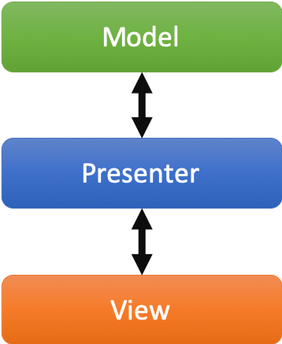
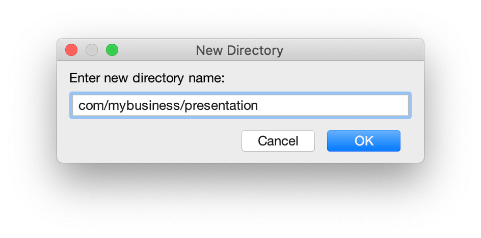
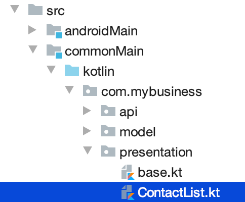
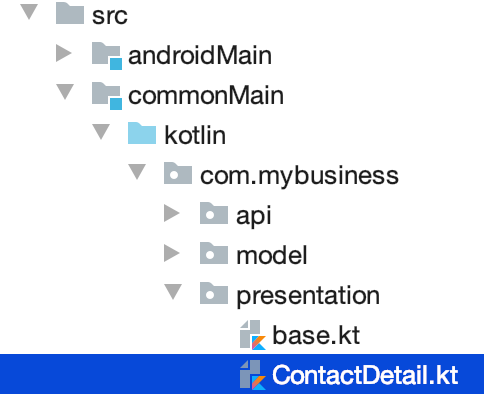
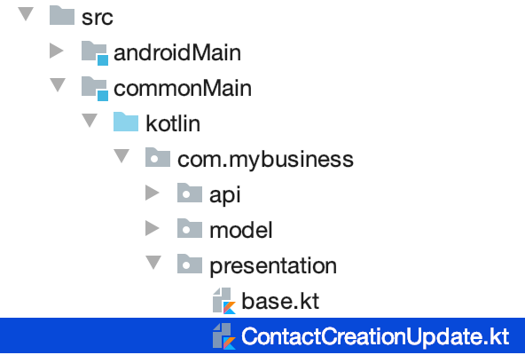
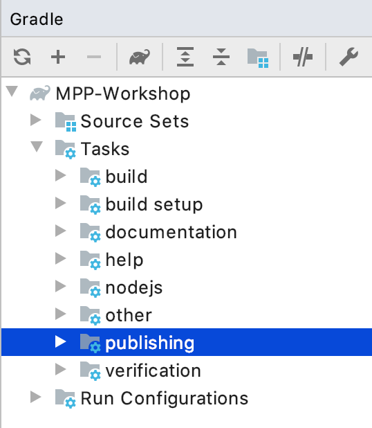

= Address book - Going further with the MVP pattern
:toc:
:icons: font

Do you remember that we are working on a Kotlin multi-platform project ? Right!

By now, we should be able to use our business logic on every targeted platforms, and make some HTTP calls to render our data.
Not so fast! Before that, we will add some more logic in ou Kotlin multi-platform library, with the _MVP pattern_.

== What is the MVP pattern ?

**M**odel-**V**iew-**P**resenter is a design pattern that help you decouple the business logic from the view of your application.
This can be represented by the following schema:

[cols="^40%,<.^60%a",grid="none",frame="none"]
|===
|
|
The *Model* is responsible for carrying the data model, and how the data are manipulated/read/stored.

The *Presenter* is responsible to:

- access the data from the Model or update them.
- serve the data to the View (generally the UI), and accept interactions from the View

The *View* is an interface that needs to be implemented by the UI classes, that interact with the Presenter to update or get new data.
|===

Well, we can also implement this pattern in our Kotlin multi-platform library to maximize code sharing in our project.

== Implementing the MVP pattern

Let's assume that our different applications would have a _Master/Detail_ flow.
The master view would show us a list of contacts, and by clicking on a contact, we will display its details on a new view.

This gives us two use cases to implement; One where we will retrieve the list of contacts from the backend API and display it on the main view.
And one where we will retrieve a contact with its details from the backend API, according to its `id`, and display it on another view.

Don't forget that we also have to provide a view to create or update an existing contact, and then send the creation/modification to the backend API.
This is our third use case.

=== Architecture for the MVP pattern

Before we implement our different use cases, we have to take a step back, and prepare the architecture of our MVP implementation.
Indeed, without spoiling, we can tell that our different presenters will certainly have the same shape.

For example, they all have to attach the view at their initialization and detach the view when this one will be destroyed.
Also, they all have to call the backend API in the background, and then update the UI in the main thread of the app.
This is where the coroutines step inside our scope.
In the same way that a presenter needs to be detached from the view while its destroyed,
the coroutine jobs also needs to be cancelled.

That is why we need to define some architectural classes, to make our code clearer and robust.

Let's create a new package `presentation` and a Kotlin source file `base.kt`, still in `commonMain/kotlin`:

image:res/9-1.png[source directory structure,300]

[TIP]
====
[cols="40%,<.^60%a",grid="none",frame="none"]
|===
|
|To create a package aside of an existing one, you need to create with its full path
|===
====

First of all we will create a `CoroutineScope` that will be carrying our `CoroutineContext` and the `Job` to run.
.base.kt
[source,kotlin]
----
import kotlinx.coroutines.CoroutineScope
import kotlinx.coroutines.Job
import kotlin.coroutines.CoroutineContext

class PresenterCoroutineScope(
    context: CoroutineContext // <1>
) : CoroutineScope { // <2>

    private var cancellableJob = Job() // <3>
    override val coroutineContext: CoroutineContext = context + cancellableJob // <4>

    fun viewDetached() { // <5>
        cancellableJob.cancel()
    }
}
----
<1> Passes a `CoroutineContext` as parameter of the constructor (either background or UI context).
<2> Extends the `CoroutineScope`.
<3> Creates a Job, that will be responsible of the execution code, and is cancellable at any time.
<4> _Overrides_ the `CoroutineContext` by combining the current context and the cancellable job.
<5> If a view is detached from the presenter, call this to cancel the job, and avoid leaks.

Now we can create the base class for any presenter of our project.

.base.kt
[source,kotlin]
----
abstract class BasePresenter<T>(private val coroutineContext: CoroutineContext) { // <1>
    protected var view: T? = null; private set // <2>
    protected lateinit var scope: PresenterCoroutineScope // <3>

    @JsName("attachView")
    fun attachView(view: T) { // <4>
        this.view = view
        scope = PresenterCoroutineScope(coroutineContext)
        onViewAttached(view)
    }

    protected open fun onViewAttached(view: T) {} // <5>

    @JsName("detachView")
    fun detachView() { // <6>
        view = null
        scope.viewDetached()
    }
}
----
<1> `T` represents the type of the view that is bind to the presenter
<2> Declares the view bind to the presenter. This will be used to send data to the view when the presenter needs to send update to the UI.
<3> Declares the `CoroutineScope` that will manage code execution in the background (calling the backend API for example)
<4> Uses this to attach the view to the presenter and create the `CoroutineScope`
<5> This function will be called while attaching the view to the presenter, we could override it to put some business logic here.
<6> Uses this when you do not need the view anymore, avoiding leaks in your application.

NOTE: We use the `@JsName` annotation to avoid that _Kotlin/JS_ compiler mangles the functions' names

For each of the use cases, we have to define two interfaces.
Those interfaces will be the contract that the view and the presenter have to respect.
Also, we will create an implementation for each presenters' contract that will work with the backend API and interact with the view.

=== Coroutines contexts definition

Previously, we have defined that our presenter will execute some business logic into a given `CoroutineScope`, to avoid blocking the main thread.
Thus, we should define a coroutine context on which our background processes will be executed, but we should also provide a coroutine context that will allow the presenter to interact with the view.
That is why we will provide coroutine dispatchers, as they determine what thread the corresponding coroutine uses for its execution.

In `commonMain/kotlin`, create a new Kotlin source file `dispatchers.kt`:

image:res/9-3.png[source directory structure,300]

In this source file, we will put two dispatchers, one for background jobs (`ApplicationDispatcher`) and one for UI interactions (`UIDispatcher`).

[IMPORTANT]
====
You may know that coroutines does not work in the same way depending on the platform we are running.
For example, on *_iOS_* every coroutines are running on the main thread (even, this would change in future version).

However, for that reason our dispatchers will be defined as ``expect``ed properties, and must be explicitly declared for each platforms.
====

Open the `dispatchers.kt` file and add the following lines:

.dispatchers.kt
[source,kotlin]
----
import kotlin.coroutines.CoroutineContext

internal expect val ApplicationDispatcher: CoroutineContext // <1>
internal expect val UIDispatcher: CoroutineContext // <2>
----
<1> To execute code in the background of the application.
<2> To execute code in the foreground of the application and interact with the UI.

==== `actual` implementation for the dispatchers

We have defined an `expect` function in our code,
thus we must define an `actual` behaviors foreach targeted platforms to be able to compile our project.

For each targets, create a kotlin source file named `[dispatchers][platform].kt`, and add the right implementation for `apiBaseUrl()`.

.androidMain > kotlin > com.mybusiness/dispatchersAndroid.kt
[source,kotlin]
----
internal actual val ApplicationDispatcher: CoroutineContext = Dispatchers.Default // <1>
internal actual val UIDispatcher: CoroutineContext = Dispatchers.Main // <2>
----
<1> Uses a shared pool of threads
<2> Uses the main thread

.iosMain > kotlin > com.mybusiness/dispatchersIos.kt
[source,kotlin]
----
import kotlinx.coroutines.CoroutineDispatcher
import kotlinx.coroutines.Runnable
import platform.darwin.dispatch_async
import platform.darwin.dispatch_get_main_queue
import kotlin.coroutines.CoroutineContext

internal actual val ApplicationDispatcher: CoroutineContext = IosMainDispatcher() // <1>
internal actual val UIDispatcher: CoroutineContext = IosMainDispatcher() // <1>

internal class IosMainDispatcher() : CoroutineDispatcher() {
    override fun dispatch(context: CoroutineContext, block: Runnable) {
        dispatch_async(dispatch_get_main_queue()) { block.run() }
    }
}
----
<1> As told before, for now the coroutines can only work on the main thread for Kotlin/Native,
thus the dispatchers for *_iOS_* will run on the same thread.

.jsMain > kotlin > com.mybusiness/dispatchersJs.kt
[source,kotlin]
----
internal actual val ApplicationDispatcher: CoroutineContext = Dispatchers.Default // <1>
internal actual val UIDispatcher: CoroutineContext = Dispatchers.Main // <2>
----
<1> Uses a shared pool of threads
<2> Uses the main thread

That's it. You are all set up to implement the MVP pattern for our three use cases.

=== Use case 1: retrieving a list of contacts

In the `presentation` package, create a new Kotlin source file `ContactList.kt`, still in the `commonMain` module:

* The contract
+
.ContactList.kt
[source,kotlin]
----
class ContactList {
    interface View {
        @JsName("displayContactList")
        fun displayContactList(contactList: List<Contact>) // <1>
    }
}
----
<1> Function called by the presenter when the data are ready to be displayed.

* The presenter implementation
+
.ContactList.kt
[source,kotlin]
----
class ContactListPresenter(
    private val contactApi: ContactApi, // <1>
    coroutineContext: CoroutineContext = ApplicationDispatcher // <2>
) : BasePresenter<ContactList.View>(coroutineContext) { // <3>
    override fun onViewAttached(view: ContactList.View) {
        scope.launch { // <4>
            val contactList = contactApi.getAllContacts()
            withContext(UIDispatcher) { // <5>
                view?.displayContactList(contactList) // <6>
            }
        }
    }
}
----
<1> To reach the backend API we need a reference of a `ContactApi` instance.
<2> As the `ContactApi` functions are suspendable, we need a coroutine context to execute them.
<3> We implement `ContactList.Presenter` to respect the contract, and extend `BasePresenter`.
<4> Launches a coroutine on `BasePresenter.scope` which runs on the coroutine context `ApplicationDispatcher`.
<5> After executing the API call we use another coroutine context in which we can interact with the UI, using the result of the API call.
<6> Updates the UI.

=== Use case 2: getting the details of a contact

In the `presentation` package, create a new Kotlin source file `ContactDetail.kt`, still in the `commonMain` module:

* The contract
+
.ContactDetail.kt
[source,kotlin]
----
class ContactDetail {
    interface View {
        @JsName("displayContact")
        fun displayContact(contact: Contact) // <1>
    }
}
----
<1> Function called by the presenter when the data are ready to be displayed.

* The presenter implementation
+
.ContactDetail.kt
[source,kotlin]
----
class ContactDetailPresenter(
    private val contactApi: ContactApi, // <1>
    coroutineContext: CoroutineContext = ApplicationDispatcher // <2>
) : BasePresenter<ContactDetail.View>(coroutineContext) { // <3>
    @JsName("getContact")
    fun getContact(contactId: String) {
        scope.launch { // <4>
            val contact = contactApi.getContactById(contactId)
            withContext(UIDispatcher) { // <5>
                view?.displayContact(contact) // <6>
            }
        }
    }
}
----
<1> To reach the backend API we need a reference of a `ContactApi` instance.
<2> As the `ContactApi` functions are suspendable, we need a coroutine context to execute them.
<3> We implement `ContactList.Presenter` to respect the contract, and extend `BasePresenter`.
<4> Launches a coroutine on `BasePresenter.scope` which runs on the coroutine context `ApplicationDispatcher`.
<5> After executing the API call we use another coroutine context in which we can interact with the UI, using the result of the API call.
<6> Updates the UI.

=== Use case 3: creating or updating a contact

In the `presentation` package, create a new Kotlin source file `ContactCreateUpdate.kt`, still in the `commonMain` module:

* The contract
+
.ContactCreateUpdate.kt
[source,kotlin]
----
class ContactCreationUpdate {
    interface Presenter {
        @JsName("updateOrCreateContact")
        fun updateOrCreateContact(contact: Contact) // <1>
    }
    interface View {
        @JsName("updateOrCreationSucceed")
        fun updateOrCreationSucceed() // <2>
        @JsName("updateOrCreationFails")
        fun updateOrCreationFails() // <3>
    }
}
----
<1> Function called by the view to create or update a contact on the backend.
<2> Function called by the presenter when the data are ready to be displayed.

* The presenter implementation
+
.ContactCreateUpdate.kt
[source,kotlin]
----
class ContactCreationUpdatePresenter(
    private val contactApi: ContactApi, // <1>
    coroutineContext: CoroutineContext = ApplicationDispatcher // <2>
) : ContactCreationUpdate.Presenter, BasePresenter<ContactCreationUpdate.View>(coroutineContext) { // <3>
    override fun updateOrCreateContact(contact: Contact) {
        scope.launch { // <4>
            try {
                if (contact.id == "-1") contactApi.putContact(contact) // <5>
                else contactApi.postContact(contact) // <5>

                withContext(UIDispatcher) { view?.updateOrCreationSucceed() } // <6>
            } catch (e: Exception) {
                withContext(UIDispatcher) { view?.updateOrCreationFails() } // <6>
            }
        }
    }
}
----
<1> To reach the backend API we need a reference of a `ContactApi` instance.
<2> As the `ContactApi` functions are suspendable, we need a coroutine context to execute them.
<3> We implement `ContactList.Presenter` to respect the contract, and extend `BasePresenter`.
<4> Launches a coroutine on `BasePresenter.scope` which runs on the coroutine context `ApplicationDispatcher`.
<5> Runs the API call. Depending on the contract `id`, either we create a contact, either we update a contact.
<6> Depending on if the API call gone well, or if there has been an exception, we use a coroutine context on the UI dispatcher, and send an update to the UI.

== Defining some helpers

=== A little bit of manual Dependency Injection

To avoid creating our different objects manually, let's provide a singleton object, that will serve instances through regular functions.

Create a new package `di` and a Kotlin source file `CommonInjector.kt`:

image:res/9-7.png[source directory structure,300]

.CommonInjector.kt
[source,kotlin]
----
@ThreadLocal // <1>
object CommonInjector {
    //    API
    private val api: ContactApi by lazy { // <2>
        ContactApi()
    }
    //    Presenters
    fun contactListPresenter() = ContactListPresenter(api) // <3>
    fun contactDetailPresenter() = ContactDetailPresenter(api) // <3>
    fun contactCreationUpdatePresenter() = ContactCreationUpdatePresenter(api) // <3>
}
----
<1> Every thread gets its own instance of `CommonInjector`.
<2> Lazily instantiate a `ContactApi`.
<3> Instantiating presenters with the `ContactApi` instance.

== Building and publishing your multi-platform library

Before going further, we need to prepare our multi-platform library by building and publishing it with Gradle.

* For the `JVM`
+
[NOTE]
====
In your Gradle build file `build.gradle.kts` we have put the plugin `maven-publish`

.build.gradle.kts > plugin
[source,kotlin]
----
plugins {
    //...
    `maven-publish`
}
----
====
+
In your Gradle script change your version from `1.0.0-SNAPSHOT` to `1.0.0`.
+
In the Gradle pane, you should see a new task group, named `publishing` (hit the refresh button if you don't).
+

+
Then, in `Tasks` > `publishing`, double click on `publishToMavenLocal` to run this Gradle task.

* For all the other platforms
+
As told before, we won't cover library publication for *_Native_* and *_JavaScript_* is this workshop.
So, to use our Kotlin multi-platform library on those platform we will generate and import them manually.

To build your Kotlin multi-platform library go to the Gradle pane and run the task `build` in the `build` group.

== What's next ?

Now your Kotlin multi-platform library is all set up.
In the next chapters we will see how to enjoy our common code across the different platforms that we are targeting.

TIP: You can find the full code on https://github.com/romainbsl/mpp-workshop-addressbook-common[Github]

Let's start with *_Android_*!
